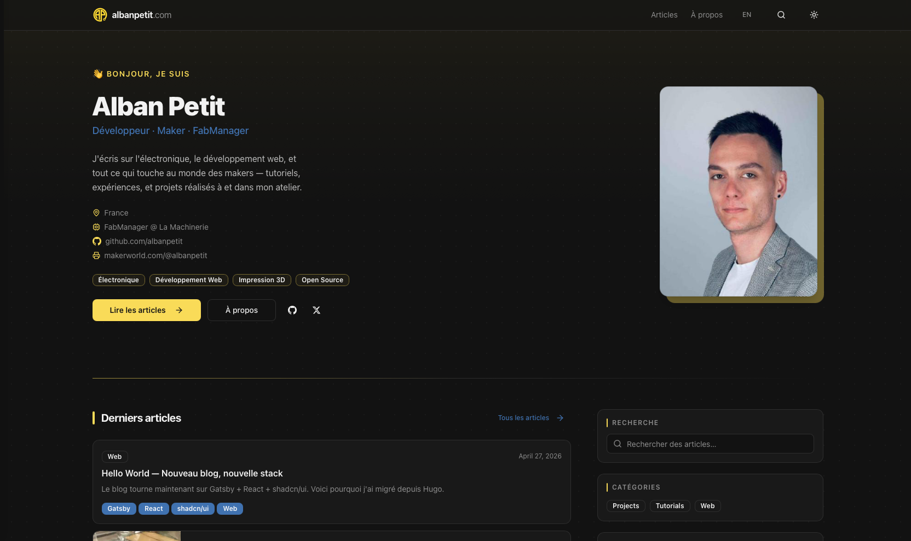

# albanpetit.com

<p align="center">
  
</p>

<p align="center">
  A bilingual personal blog covering electronics, embedded systems, web development, and maker projects.<br/>
  Built as a fully static site with Gatsby, deployed on GitHub Pages, and designed for fast reading and strong SEO.
</p>

<p align="center">
  <a href="https://albanpetit.com">albanpetit.com</a> &nbsp;·&nbsp;
  <a href="https://albanpetit.com/blog/">Blog</a> &nbsp;·&nbsp;
  <a href="https://albanpetit.com/about/">About</a>
</p>

---

## Stack

| Tool                                                                                     | Role                                        |
| ---------------------------------------------------------------------------------------- | ------------------------------------------- |
| [Gatsby 5](https://www.gatsbyjs.com/)                                                    | Static site generator (React + GraphQL)     |
| [shadcn/ui](https://ui.shadcn.com/)                                                      | Component library (Radix UI + Tailwind CSS) |
| [Tailwind CSS](https://tailwindcss.com/)                                                 | Utility-first styling                       |
| [TypeScript](https://www.typescriptlang.org/)                                            | Type safety throughout                      |
| [gatsby-transformer-remark](https://www.gatsbyjs.com/plugins/gatsby-transformer-remark/) | Markdown → HTML processing                  |
| [gatsby-plugin-image](https://www.gatsbyjs.com/plugins/gatsby-plugin-image/)             | Responsive lazy-loaded images               |
| [gatsby-plugin-react-i18next](https://github.com/microapps/gatsby-plugin-react-i18next)  | EN / FR bilingual support                   |
| [Fuse.js](https://fusejs.io/)                                                            | Client-side fuzzy search                    |
| [Giscus](https://giscus.app/)                                                            | GitHub Discussions-powered comments         |
| [GitHub Actions](https://docs.github.com/en/actions)                                     | Automated deployment to GitHub Pages        |

---

## Features

### Content

- Bilingual posts (English / French) with URL routing (`/` → EN, `/fr/` → FR); no automatic redirect — readers switch language from the header, search engines follow `hreflang`
- Tag pages and category pages, each fully bilingual
- Full-text fuzzy search across titles, descriptions, tags, and excerpts
- RSS feeds at `/rss.xml` (EN) and `/fr/rss.xml` (FR)
- Sitemap at `/sitemap-index.xml`

### Reading experience

- Reading progress bar fixed at the top of each post
- Sticky table of contents with active heading highlight (IntersectionObserver)
- Reading time estimate on every post and card
- Multi-image gallery layout — auto-detected with CSS `:has()`, no extra markup needed
- Float images with text wrapping (`float-left` / `float-right` utility classes)
- Cover images with responsive lazy loading and blur placeholder

### Design & UX

- Dark / light mode toggle persisted across sessions, following the OS preference by default and applied before first paint (no flash)
- Neutral dot-grid background texture
- Yellow accent `#F9DC58` + blue secondary `#3F72AF`
- Fully responsive (mobile-first)
- Tag filter pills on the blog listing page

### SEO

- Open Graph + Twitter Card meta tags on every page
- JSON-LD structured data — `Article` and `BreadcrumbList` on posts, `WebSite` on home
- `hreflang` alternate links for bilingual SEO
- Canonical URLs
- `noindex` on search pages, which are excluded from the sitemap with the localized 404 pages
- RSS `<link>` in the document head

### Accessibility

- Post cards are real links (keyboard, middle-click, crawlers) stretched over the card
- Visible focus ring in both themes, named mobile menu dialog
- All UI strings and `aria-label`s translated through `locales/`

### Comments

- GitHub Discussions comments via Giscus
- Automatically inherits the active dark / light theme

---

## Pages & routing

| Page             | English             | French                 |
| ---------------- | ------------------- | ---------------------- |
| Home             | `/`                 | `/fr/`                 |
| Blog listing     | `/blog/`            | `/fr/blog/`            |
| Post             | `/post/<slug>/`     | `/fr/post/<slug>/`     |
| Tag archive      | `/tag/<slug>/`      | `/fr/tag/<slug>/`      |
| Category archive | `/category/<slug>/` | `/fr/category/<slug>/` |
| About            | `/about/`           | `/fr/about/`           |
| Search           | `/search/`          | `/fr/search/`          |
| 404              | `/404/`             | `/fr/404/`             |

Pages and tags are created programmatically in `gatsby-node.ts`. Slugs are built with NFD-normalized lowercase ASCII (`slugifyTag`, `slugifyCategory` in `src/lib/tag.ts`).

---

## Getting started

**Requirements:** Node.js 22 (see `.nvmrc`)

```bash
npm install
npm run develop        # dev server at http://localhost:8000
```

Available scripts:

```bash
npm run build          # production build → public/
npm run serve          # serve the production build locally
npm run clean          # clear .cache and public/
npm run type-check     # TypeScript check without emitting
```

---

## Project structure

```
content/
  posts/              # Blog posts — one directory per post
    my-post/
      index.en.md     # English version
      index.fr.md     # French version
      cover.jpg       # Cover image (referenced as `image:` in frontmatter)
      ...             # Other post assets (diagrams, screenshots…)
  pages/              # Static pages (about.en.md, about.fr.md)
  images/             # Global shared images
locales/
  en/translation.json # All UI strings and category names — English
  fr/translation.json # All UI strings and category names — French
src/
  @types/
    i18next.d.ts      # t() returns string (matches returnNull: false)
  components/
    layout/           # Main site shell: sticky header, nav, footer
    PostCard.tsx      # Reusable post preview card (used on home, blog, search, tag, category)
    giscus.tsx        # GitHub Discussions comments widget (auto-themed)
    seo.tsx           # <head> tags: OG, Twitter Card, JSON-LD, hreflang, canonical
    ui/               # shadcn/ui primitives (Button, Badge, Card, Sheet…)
  context/
    theme.tsx         # Dark / light mode ThemeProvider (localStorage + OS preference)
  images/
    avatar.jpg        # Profile photo (home, about) — processed by StaticImage
  lib/
    tag.ts            # slugifyTag, slugifyCategory — NFD normalization helpers
                      # tagPath(tag, lang), categoryPath(cat, lang) — URL builders
    category.ts       # categoryLabel(cat, lang) — translated category name
  pages/
    index.tsx         # Home — hero, latest posts, sidebar (search/categories/tags)
    blog.tsx          # Blog listing with tag filter pills
    about.tsx         # About — photo, stats, skills, markdown content
    search.tsx        # Full-text fuzzy search (Fuse.js, client-side)
    404.tsx           # 404 page with decorative large number
  styles/
    globals.css       # Tailwind layers + prose overrides + float/gallery utilities
  templates/
    post.tsx          # Post layout: ReadingProgress, TOC, breadcrumbs, Giscus
    tag.tsx           # Tag archive
    category.tsx      # Category archive
static/
  favicon.ico
  logo.svg
  robots.txt
  CNAME               # Custom domain (albanpetit.com) for GitHub Pages
gatsby-config.ts      # Plugins, site metadata, i18n config, RSS feeds, sitemap
gatsby-node.ts        # Programmatic page creation (posts, tags, categories) + EN/FR tag pairing
tailwind.config.ts    # Tailwind config + shadcn CSS variable theme tokens
```

---

## Writing posts

Create a directory under `content/posts/<slug>/` with two Markdown files:

```
content/posts/my-post/
  index.en.md
  index.fr.md
  cover-image.jpg
  other-assets...
```

### Frontmatter reference

```yaml
---
title: My Post Title # displayed in card, post header, and <title>
slug: my-post # used to build the URL (/post/my-post/)
lang: en # en or fr — determines which language page to create
date: 2025-01-01 # publish date (ISO 8601)
lastmod: 2025-01-15 # last modified date — used in JSON-LD and sitemap
description: "Short blurb." # shown in cards and used as meta description
tags: # used for tag pages and the blog filter — same order in both languages
  - Electronics
  - Web
category: Projects # English name in both languages (Projects, Tutorials, Web…)
image: cover-image.jpg # cover image — shown in card and at top of post
---
```

All fields except `lastmod` and `image` are required. The `image` path is relative to the post directory and processed by `gatsby-plugin-image` (blur placeholder, responsive sizes, 1200×630 Open Graph crop).

**Tags across languages** — tags are translated, so the language switch pairs them by position: the first tag of `index.en.md` matches the first tag of `index.fr.md`, and so on. Keep both lists in the same order and length; `gatsby build` warns when they differ, and unpaired tag pages fall back to the blog listing.

**Categories** — write the English category name in both files: it drives the slug (`/category/projects/`, `/fr/category/projects/`). The displayed name comes from `categories` in `locales/<lang>/translation.json`; add new categories there.

**Source images** — keep originals at 2400 px on the longest side at most; Gatsby generates every display size from them.

### Image layout helpers

**Float with text wrapping** — wrap with blank lines inside the div so remark processes the image:

```markdown
<div class="float-left">


</div>

Text wraps around here…

<div class="clearfix" />
```

Use `float-right` for the same effect on the right side. The float width is fixed at 210 px.

**Gallery grid** — place multiple images in the same paragraph (consecutive lines with no blank line between them). They are automatically laid out as a responsive grid — no extra markup needed:

```markdown


```

---

## Deployment

The site deploys automatically to GitHub Pages via GitHub Actions on every push to `master`.

To trigger manually: **Actions** tab → **Deploy to GitHub Pages** → **Run workflow**.

### GitHub Actions workflow

The workflow (`.github/workflows/deploy.yml`) runs in two jobs:

1. **build** — checks out the repo, installs dependencies with `npm ci`, runs `npm run type-check`, restores the Gatsby `.cache/` and `public/` directories, runs `npm run build`, and uploads `public/` as a Pages artifact.
2. **deploy** — downloads the artifact and publishes it to GitHub Pages.

Pull requests targeting `master` run the **build** job only, so type errors and build failures surface before merging.

The Node.js version is read from `.nvmrc`; `NODE_OPTIONS=--max-old-space-size=4096` is set to handle large builds.

### DNS configuration

```
A     @    185.199.108.153
A     @    185.199.109.153
A     @    185.199.110.153
A     @    185.199.111.153
CNAME www  albanpetit.github.io
```

---

## Contribution

1. Fork the repository
2. Create a branch: `git checkout -b feat/my-feature`
3. Commit following the convention below
4. Open a Pull Request

### Commit convention

Format: `type(scope): short description`

| Type       | Usage                                       |
| ---------- | ------------------------------------------- |
| `feat`     | New feature                                 |
| `fix`      | Bug fix                                     |
| `style`    | Visual / CSS changes only                   |
| `refactor` | Code restructuring without behaviour change |
| `perf`     | Performance improvement                     |
| `chore`    | Config, tooling, maintenance                |
| `docs`     | Documentation only                          |
| `content`  | Add or update a post / content              |

Common scopes: `ui` · `prose` · `seo` · `post` · `home` · `layout` · `i18n` · `ux` · `comments` · `tags` · `categories` · `search` · `content`

```
feat(post): add reading progress bar
fix(ui): change logo to yellow
refactor: extract PostCard as shared component
chore: add .gitkeep to empty content/images directory
docs: rewrite README for Gatsby stack
content: add adxl335 accelerometer post
```

---

## Feedback

Found a bug or have a suggestion? [Open an issue](https://github.com/albanpetit/albanpetit.com/issues).
