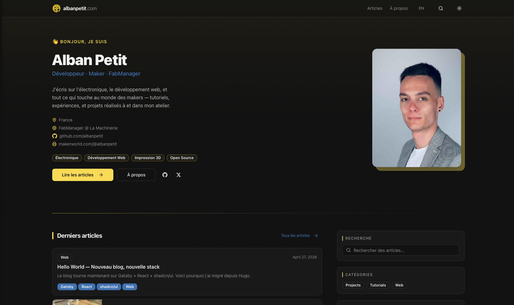

# albanpetit.com

<p align="center">
  
</p>

<p align="center">
  A bilingual personal blog covering electronics, embedded systems, web development, and maker projects.<br/>
  Built as a fully static site with Astro, deployed on GitHub Pages, and designed for fast reading and strong SEO.
</p>

<p align="center">
  <a href="https://albanpetit.com">albanpetit.com</a> &nbsp;·&nbsp;
  <a href="https://albanpetit.com/blog/">Blog</a> &nbsp;·&nbsp;
  <a href="https://albanpetit.com/about/">About</a>
</p>

> This repository is the source of my personal site, not a starter template. It's shared for transparency and so anyone spotting a bug, typo, or accessibility issue can send a fix, not to be forked into someone else's blog.

---

## Stack

| Tool                                                           | Role                                          |
| -------------------------------------------------------------- | --------------------------------------------- |
| [Astro 7](https://astro.build/)                                | Static site generator, content collections    |
| [React](https://react.dev/)                                    | Interactive islands (search, filters, menu…)  |
| [shadcn/ui](https://ui.shadcn.com/)                            | Component library (Radix UI + Tailwind CSS)   |
| [Tailwind CSS](https://tailwindcss.com/)                       | Utility-first styling                         |
| [TypeScript](https://www.typescriptlang.org/)                  | Type safety throughout                        |
| [remark / rehype](https://unifiedjs.com/)                      | Markdown → HTML (Prism, KaTeX, Mermaid)       |
| [astro:assets](https://docs.astro.build/en/guides/images/)     | Responsive, optimized images                  |
| [Fuse.js](https://fusejs.io/)                                  | Client-side fuzzy search                      |
| [Giscus](https://giscus.app/)                                  | GitHub Discussions-powered comments           |
| [Biome](https://biomejs.dev/)                                  | Linting and formatting                        |

EN / FR routing lives in `src/pages/[...lang]/`: each page is built once per language, without prefix for English and under `/fr/` for French. UI strings are in `locales/<lang>/translation.json`.

### Projects

A project is a set of posts sharing a `project` name in their front matter, the same in both languages:

```md
---
title: "Axon, part 2: the prototype"
project: Axon              # the name drives the project's address: /projects/axon/
overview: true             # optional: the project's overview
status: done               # overview only: in-progress (default) or done
---
```

- A project with **one post** shows as any other post: its card on `/projects/` leads straight to it.
- A project with **several posts** must have an **overview**, its landing page: it presents the whole project and links to its posts, and can be written early and updated along the way. Each post of the project lists the others under its header, the overview first, then the other posts oldest first.
- `/projects/<slug>/` redirects to the overview (or the only post): a stable address to share.
- The project is in progress until the overview says `status: done`.

Project posts show a "Project" badge where a category would be; tutorials keep the `Tutorials` category. Two overviews in a project, an overview outside any project, a `status` outside an overview, several posts without an overview, two project names sharing a slug, or a project in one language only (most likely a typo in its name) fail the build.

### Charts from a CSV

Put the CSV next to the post's images and add a `chart` block; [Chart.js](https://www.chartjs.org/) draws it, with the data as a table below (and in the RSS feed) plus a download link:

````md
```chart
file: ./temperatures.csv   # required, relative to the post
type: line                 # line (default), bar, scatter, pie, doughnut, or table for the table alone
title: Temperature over a day
x: hour                    # label column, the first one by default
y: [inside, outside]       # plotted columns, every other one by default
xLabel: Hour
yLabel: °C
```
````

`,`, `;` and tab delimiters and French decimals (`19,5`) are accepted; an empty cell is a gap. A typo in an option or a column name fails the build. Astro caches rendered posts: after editing only a CSV, restart with `npm run dev -- --force`.

---

## Getting started

**Requirements:** Node.js 22 (see `.nvmrc`)

The devcontainer keeps `node_modules` in a named Docker volume (reading it through the host file share makes builds crawl). After pulling changes to `package-lock.json`, run `npm ci`.

```bash
npm install
npm run dev            # dev server at http://localhost:4321
```

Available scripts:

```bash
npm run build          # production build → dist/
npm run preview        # serve the production build locally
npm run type-check     # astro check (TypeScript + .astro files)
npm run lint           # Biome lint + formatting check (run in CI)
npm run format         # apply Biome formatting
```

---

## Contributing

Not a template to build on, but fixes and small improvements (bugs, typos, accessibility, broken links…) are genuinely welcome:

1. Fork the repository
2. Create a branch: `git checkout -b fix/my-fix`
3. Run `npm run lint` and `npm run type-check`, then commit following the convention below
4. Open a Pull Request

### Commit convention

Format: `type(scope): short description`

| Type       | Usage                                       |
| ---------- | ------------------------------------------- |
| `feat`     | New feature                                 |
| `fix`      | Bug fix                                     |
| `style`    | Visual / CSS changes only                   |
| `refactor` | Code restructuring without behaviour change |
| `perf`     | Performance improvement                     |
| `chore`    | Config, tooling, maintenance                |
| `docs`     | Documentation only                          |
| `content`  | Add or update a post / content              |

Common scopes: `ui` · `prose` · `seo` · `post` · `home` · `layout` · `i18n` · `ux` · `comments` · `tags` · `categories` · `search` · `content`

```
feat(post): add reading progress bar
fix(ui): change logo to yellow
refactor: extract PostCard as shared component
chore: add .gitkeep to empty content/images directory
docs: rewrite README for Astro stack
content: add adxl335 accelerometer post
```

---

## Feedback

Found a bug or have a suggestion? [Open an issue](https://github.com/albanpetit/albanpetit.com/issues).
