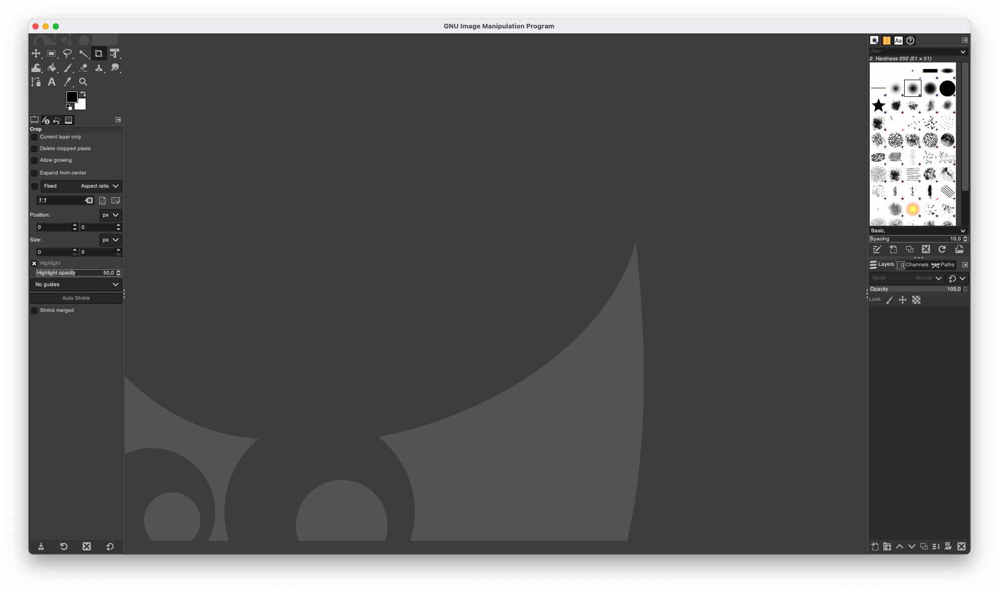

Cette mission sera découpé en deux grandes étapes, la partie concernant les logiciels en relation avec la 2D Gimp et Inkscape et la seconde sur Fusion360 un logiciel capable de faire énormément de choses mais dans notre cas il sera principalement utilise pour faire de la modélisation 3D et le rendu de cette dernière.

## Logiciel 2D
### Gimp & Trame d'imprimerie

GIMP est un éditeur graphique gratuit et open source utilisé pour la manipulation et l'édition d'images, le dessin de forme libre, le transcodage entre différents formats de fichiers image et des tâches plus spécialisées. Il n'est pas conçu pour être utilisé pour le dessin, bien que certains artistes et créateurs l'utilise pour cela. 

Dans le cadre de mon travail j'utilise parfois Gimp pour la conversion de format d'image, le recadrage, le redimensionnement d'image sans l'utilisation du terminal, [Image Magick]() me semble être une bien meilleure solution pour cela. Mais certains utilisateurs des mes applications web souhaitent parfois effectuer des modifications avant la mise en ligne de leurs images. Pour ces besoins j'utilise donc Gimp qui convient parfaitement, bien sur, des logiciels propriétaires existent également  pour cet usage, comme [Photoshop](https://www.adobe.com/products/photoshop.html) pour ne citer que le plus gros concurrent.

Ces modifications simples ne m'ont donc pas encore permis d'explorer l'ensemble des possibilités de gimp, pour cette mission je vais donc essayer d'explorer la partie des filtres de Gimp. Inkscape prendra ensuite le relai pour preparer le fichier a la fabrication avec la découpeuse laser.

#### Installation
Gimp est donc entièrement libre et opensource, le [site web](https://www.gimp.org) dispose d'une page de téléchargement proposant une version pour presque toutes les plateformes. Dans mon cas, la version apple, est meme disponible avec une version native et optimise pour les processeurs apple, voila de quoi me rendre heureux ! :tada:

> **Attention**: Une version est disponible dans l'app store mais ce n'est une version maintenu par la team GIMP, il s'agit d'une équipe indépendante de développeur.

#### Utilisation
D'abord voila le fichier original, ma conjointe, ainsi que la page d'accueil de Gimp, qui ne parait de pas grand chose, mais malgré les apparences c'est un logiciel tres performant. Bien sur, le fichier original est compresse dans ce repo pour éviter de surcharger la page, mais je travaille sur un fichier de plus grande resolution.

 

##### Ouverture d'un fichier

### Inkscape & Vectorisation

Inkscape est un éditeur de graphiques vectoriels gratuit et open source utilisé pour créer des images vectorielles, principalement au format Scalable Vector Graphics. D'autres formats peuvent être importés et exportés.

Personnellement j'utilise deja Inkscape depuis quelques années pour les découpeuses laser du fablab, le logo de ce [site](albanpetit.com) a été fait sur Inkscape. Un logiciel parfait pour entreprendre des modifications sur les fichiers vectoriels pour ensuite passer a la fabrication.