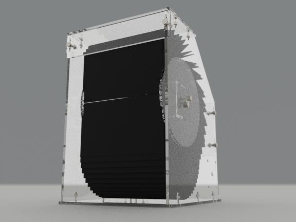
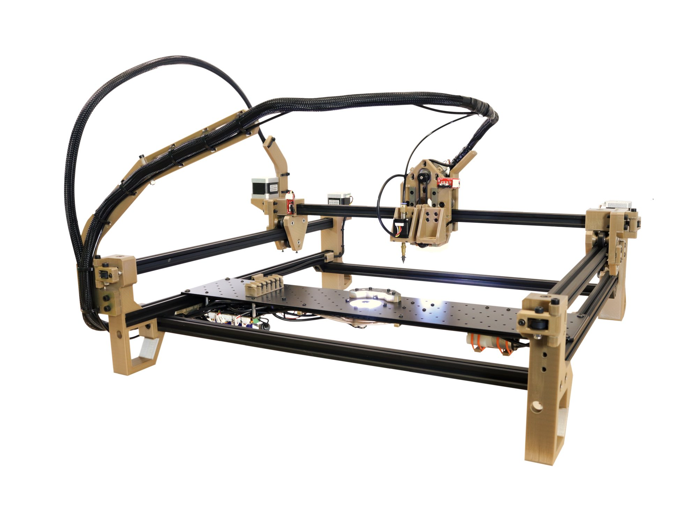

Après une longue réflexion sur mon projet final de FabAcademy. J'en garde deux, un écran splitflap et une machine de placement automatique de composant électronique. Actuellement, je n'arrive toujours pas à choisir entre ces deux projets, je ferai donc ce choix plus tard au cours de ma FabAcademy. Voici donc un aperçu de ces idées.

## Affichage à écran Splitflap

Ma première idée est donc de faire un écran Splitflap open source, ou parfois simplement appelé afficheur Flap, c'est un dispositif d'affichage électromécanique qui présente un texte alphanumérique modifiable et parfois des graphiques fixes.

 

Souvent utilisés comme tableau des horaires dans les aéroports ou les gares ferroviaires, ils sont souvent appelés panneaux Solari d'après le fabricant italien d'affichage [Solari di Udine](https://www.solari.it/it/), ou dans les pays d'Europe centrale, ils sont appelés Pragotron via le fabricant tchèque.

Les écrans Splitflap étaient également autrefois couramment utilisés dans les horloges numériques grand public connues sous le nom d'horloges à rabat.

Chaque position de caractère ou position graphique a une collection de volets sur lesquels les caractères ou graphiques sont peints ou sérigraphiés. Ces volets sont tournés avec précision pour afficher le caractère ou le graphique souhaité.

### Concept

L'idée de ce projet est de concevoir un module d'affichage Splitflap capable d'afficher un caractère. Mais que ce dernier soit connectable en chaine et adressé pour les contrôler individuellement comme pourraient l'être des LED adressables par exemple.

Le module d'affichage aurait sa logique interne, avec la possibilité de s'initialiser (une sorte de position zéro), de gérer ses niveaux de tension, la rotation en fonction du caractère envoyé dans le bus de données, etc. Les modules doivent être connectables entre eux dans toutes les directions, un système de sélection de l’ordre des modules est nécessaire pour permettre la formation d'une matrice de ces derniers.


<!-- TODO: check theme html generation to remove margin on svg markdown tag -->
Un PCB de contrôle pour l'ensemble de la matrice de module est également nécessaire, il supportera une connexion wifi pour pouvoir faire transiter les flux de données depuis internet.

### Ressources

Voici une liste de ressources qui sont proches de ce que j'aimerais réaliser avec ce projet, ce sont des points d'inspiration potentiels.

#### Oat Foundry


[Oat foundry](https://www.oatfoundry.com/split-flap/) fabrique et vend des afficheurs Splitflap personnalisés. Leurs afficheurs sont fabriqués avec le même principe de fonctionnement que les afficheurs Splitflap d'origine, mais avec un système de contrôle leur permettant d'afficher des flux de données comme la météo, la température, les réseaux sociaux, depuis une interface web.

 

Voici une courte vidéo de ```Oat foundry``` a propos de leur afficheur Splitflap :



#### Unknown Domain

[Unknow Domain](http://unknowndomain.co.uk) est le blog de Mark Lynch un maker, qui a conçu une solution d'affichage Splitflap, les fichiers ne sont pas open source, mais il y décrit les différentes étapes de la conception. Certains choix techniques sont assez intéressants, d'autres projets sont également disponibles sur son blog.

Voici quelques photos de ses projets :

 

> **Article Hackaday :** [Afficheur Splitflap: si vous ne le trouvez pas, construisez-le](https://hackaday.com/2014/10/04/split-flap-display-if-cant-find-it-built-it/)

#### Projets Thingiverse


Et voici la magie de Thingiverse. Thingiverse est un site web dédié au partage de fichiers de conception numérique créés par les utilisateurs.

Plusieurs projets similaires sont disponibles sur Thingiverse, rarement complets, rarement terminés, ils sont tout de même une grande source d'inspiration pour déterminer des solutions techniques valables.

Voici une liste non exhaustive :
- [Afficheur Splitflap super simple](https://www.thingiverse.com/thing:2369832)
- [Station météo à la découpeuse laser](https://www.thingiverse.com/thing:815981)
- [La météo en une heure](https://www.thingiverse.com/thing:841058)
- [Afficheur Splitflap](https://www.thingiverse.com/thing:3402311)

## Pick and place

Les Pick-and-Place ou PnP, sont des machines robotisées qui sont utilisées pour placer des composants électroniques [SMT](https://en.wikipedia.org/wiki/Surface-mount_technology) (montage en surface) sur une carte de circuit imprimé.

 

Ils sont utilisés pour le placement à grande vitesse et de haute précision d'une large gamme de composants électroniques, tels que des condensateurs, des résistances, des circuits intégrés sur les PCB. Ces circuits sont ensuite utilisés dans la fabrication des ordinateurs, de l'électronique, l'industrie, le médical, l'automobile, l'armée et les télécommunications.

Un équipement similaire existe pour les composants traversants.

### Concept

La description de ce projet sera assez rapide, l'idée est de concevoir une petite machine de placement automatique de composants électroniques open source. Plusieurs projets open source existent déjà, mais en général, ces machines sont imposantes.


Une communauté de fabricants assez importante propose des solutions matérielles, le site Web [OpenPnp](https://openpnp.org) en regroupe la plupart. OpenPnp propose également un logiciel capable de fonctionner avec une sélection de machines open source, mais également des machines commerciales existantes, leur donnant des capacités qu'ils n'avaient jamais eues avec leur logiciel OEM.

L'idée serait de s'appuyer sur le logiciel OpenPnp pour concevoir une machine de placement automatique de petit format.

### Ressources

Voici une liste de ressources qui se rapprochent de ce que j'aimerais réaliser avec ce projet, ce sont des points d'inspiration potentiels.

#### LumenPnp

[LumenPnp](https://opulo.io/products/lumenpnp-kit) est une machine PnP entièrement open source conçue par Stephen Hawes. Il décrit chaque étape de sa conception sur sa chaîne YouTube. Il vend depuis peu des kits, pour pouvoir monter cette machine qui s'appuie sur la solution OpenPnp pour son pilotage.

 

> **Github repository :** [Index pnp](https://github.com/index-machines/index)

#### LitePlacer

[LitePlacer](https://liteplacer.com/) est une machine conçue par Juha Kuusama, qui avait besoin d'une machine automatique de placement de composants électroniques pour son entreprise afin d'accélérer le processus de développement et d'économiser le coût de l'externalisation de l'assemblage. Cette machine s'appuie également sur le logiciel OpenPnp pour fonctionner, c'est même maintenant l'une des machines officielles d'OpenPnp.

Vidéo d'introduction à LitePlacer :


## Checklist finale de la fabacademy

Voici les objectifs de cet assignment de la Fabacademy et la vérification de la bonne réalisation des ces derniers:
- [X] Décrivez et esquissez votre projet final
- [X] Décrivez ce qu'il fera et qui l'utilisera
