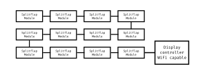

After a long reflection on my final FabAcademy project. I keep two, a splitflap display and a pick and place. I still can't choose between these two projects, I will make the choice later during my FabAcademy. So here's a quick rundown of those ideas.

## Splitflap display

So my first idea is to make an opensource splitflap display, or sometimes simply a flap display, is a digital electromechanical display device that presents changeable alphanumeric text, and occasionally fixed graphics.

 

Often used as a public transport timetable in airports or railway stations, as such they are often called Solari boards after Italian display manufacturer Solari di Udine, or in Central European countries they are called Pragotron after the Czech manufacturer.

Split-flap displays were once commonly used in consumer digital clocks known as flip clocks. 

Each character position or graphic position has a collection of flaps on which the characters or graphics are painted or silkscreened. These flaps are precisely rotated to show the desired character or graphic.

### Concept

The idea of this project is to design a splitflap display module capable of displaying a character. But that it is connectable in chain and addressed to control them individually as could be addressable LEDs for example. 

The display module would have its internal logic, with the ability to initialize (some sort of zero position), to manage its voltage levels, the rotation according to the character sent in the data bus, etc. The modules must be connectable to each other in all directions, a system for selecting the next module is necessary to allow the formation of a matrix of modules. 


<!-- TODO: check theme html generation to remove margin on svg markdown tag -->
A control PCB for the whole module matrix is also necessary, it will support a wifi connection to be able to select the information to be displayed from a web interface.

Here is a short video of ```Oat foundry``` split flap display :



### Links

Here is a list of resources that is close to what I would like to achieve with this project, these are potential points of inspiration.

#### Oat Foundry


[Oat foundry](https://www.oatfoundry.com/split-flap/) manufactures and sells custom split flap displays. Their displays are manufactured with the same operating principle as the original splitflap display but with a control system allowing them to display data streams such as weather, temperature, social networks, from a web interface.

 

#### Unknown Domain

[Unknow Domain](http://unknowndomain.co.uk) is the blog of Mark Lynch a maker, who designed a splitflap display solution, the files are not opensource but he writes the different stages of the design. Some technical choices are quite interesting, other projects are also available on his blog.

Here are some pictures of his projects:

 

> **Hackaday blog post :** [split flap display: if you can't find it, built it](https://hackaday.com/2014/10/04/split-flap-display-if-cant-find-it-built-it/)

#### Thingiverse projects

And here is the magic of Thingiverse. Thingiverse is a website dedicated to the sharing of user-created digital design files.

Several similar projects are available on Thingiverse, rarely complete, rarely finished, but they are great source of inspiration to determine valid technical solutions. 

Here is a non-exhaustive list :
- [Dead simple split flap display](https://www.thingiverse.com/thing:2369832)
- [Lasercut weather station](https://www.thingiverse.com/thing:815981)
- [Weather in one hour](https://www.thingiverse.com/thing:841058)
- [Split-flap display](https://www.thingiverse.com/thing:3402311)

## Pick and place

Surface-mount technology component placement systems, commonly called pick-and-place machines or P&Ps, are robotic machines which are used to place surface-mount devices onto a printed circuit board.

 

They are used for high speed, high precision placing of a broad range of electronic components, like capacitors, resistors, integrated circuits onto the PCBs which are in turn used in computers, consumer electronics as well as industrial, medical, automotive, military and telecommunications equipment. 

Similar equipment exists for through-hole components. This type of equipment is sometimes also used to package microchips using the flip chip method.

### Concept

The description of this project will be rather quick, the idea is to design a small opensource automatic electronic component placement machine. Several opensource projects already exist, but in general, these machines are big.


A fairly large maker community offers hardware solutions, the [OpenPnp](https://openpnp.org) website includes most of them. OpenPnp also offers software to run an opensource pick and place machine, but also existing commercial machines, giving them abilities they never had with their OEM software.

The idea would be to rely on the OpenPnp software to design a small format automatic placement solution.

### Links

Here is a list of resources that is close to what I would like to achieve with this project, these are potential points of inspiration.

#### LumenPnp

[LumenPnp](https://opulo.io/products/lumenpnp-kit) is a fully open source PNP machine designed by Stephen Hawes. He describes each stage of his design on his youtube channel. He has been selling kits recently, to be able to mount this machine which relies on the OpenPnp solution for its control.

 

> **Github repository :** [Index pnp](https://github.com/index-machines/index)

#### LitePlacer

[LitePlacer](https://liteplacer.com/) is a machine designed by Juha Kuusama, who needed an automatic electronic component placement machine for his company to speed up the development process and to save the cost of outsourcing the assembly. This machine also relies on the OpenPnp software to work, it is even now one of the official designs of OpenPnp. 

Introduction video to LitePlacer :


## Final Checklist

For this week we had to :

- [X] Describe and sketch your final project
- [X] Describe what it will do and who will use it
