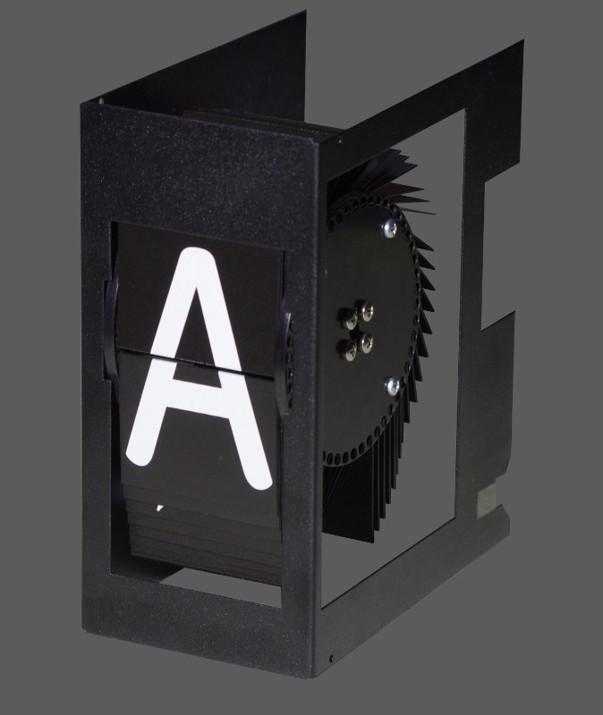

After a long reflection on my final FabAcademy project. I keep two, a splitflap display and a pick and place. I still can't choose between these two projects, I will make the choice later during my FabAcademy. So here's a quick rundown of those ideas.

## Splitflap display

So my first idea is to make an opensource splitflap display, or sometimes simply a flap display, is a digital electromechanical display device that presents changeable alphanumeric text, and occasionally fixed graphics.

 

Often used as a public transport timetable in airports or railway stations, as such they are often called Solari boards after Italian display manufacturer Solari di Udine, or in Central European countries they are called Pragotron after the Czech manufacturer.

Split-flap displays were once commonly used in consumer digital clocks known as flip clocks. 

Each character position or graphic position has a collection of flaps on which the characters or graphics are painted or silkscreened. These flaps are precisely rotated to show the desired character or graphic.

### Concept

The idea of this project is to design a splitflap display module capable of displaying a character. But that it is connectable in chain and addressed to control them individually as could be addressable LEDs for example. 

The display module would have its internal logic, with the ability to initialize (some sort of zero position), to manage its voltage levels, the rotation according to the character sent in the data bus, etc. 

### Interrogations

### Links

## Pick and place

Surface-mount technology component placement systems, commonly called pick-and-place machines or P&Ps, are robotic machines which are used to place surface-mount devices onto a printed circuit board.

 

They are used for high speed, high precision placing of a broad range of electronic components, like capacitors, resistors, integrated circuits onto the PCBs which are in turn used in computers, consumer electronics as well as industrial, medical, automotive, military and telecommunications equipment. 

Similar equipment exists for through-hole components. This type of equipment is sometimes also used to package microchips using the flip chip method.

### Design

### Interrogations

### Links

## Other ideas