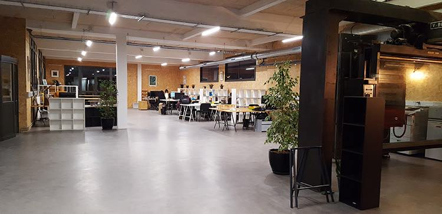
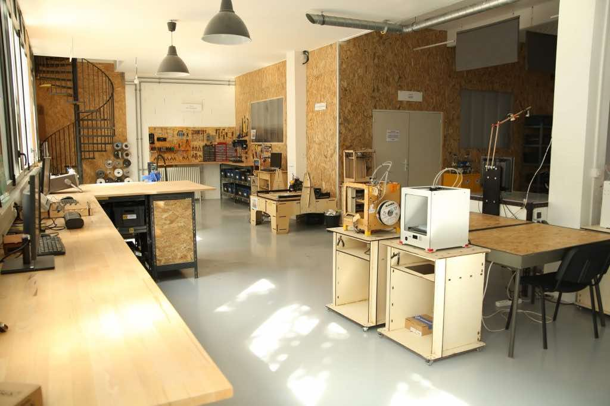

Salut ! Je suis Alban Petit, un développeur web français passionné travaillant au sein de La Machinerie, une structure qui héberge un Fablab. J'ai eu la chance de connaître cette organisation depuis 7 ans maintenant, commençant comme bénévole pour finalement devenir responsable d'un pôle dédié à la prestation de services dans divers domaines techniques tels que l'électronique, l'informatique et la fabrication numérique.

Ces expériences professionnelles m'ont révélé une véritable passion pour le développement informatique, l'électronique et le prototypage en général.

## Mes experiences
- 2015 - 2016, **Assistant FabManager, Association La Machinerie**, Amiens

    La Machinerie abrite un Fablab qui s'adresse à divers passionnés tels que les entrepreneurs, les designers, les artistes, les bricoleurs, les étudiants ou encore les hackers. En tant que FabManager, j'étais responsable de la gestion de cet espace.
- 2016 - 2018, **Dévelopeur Web, BTS SIO en alternance, Entreprise Etoele**, Amiens

    Chez Etoele, un bureau de recherche qui travaille aussi bien avec les particuliers qu'avec les professionnels et les grandes entreprises, j'ai pu intervenir sur différentes missions, notamment dans le développement embarqué, le prototypage électronique, les sites web et applications sur mesure, l'architecture de services web, le développement IoT, le traitement du signal, la robotique, la numérisation 3D, et la rétroconception de systèmes.
- 2018 - 2019, **Responsable développement Web, Licence informatique en alternance, Entreprise Etoele**, Amiens
    
    Durant cette période, j'ai poursuivi mes activités en tant que développeur web et embarqué chez Etoele.
- 2019 - 2021, **Développeur Web & Embarqué, Entreprise Etoele**, Amiens
- 2022 - 2023, **Responsable du pôle Manufacture, Association La Machinerie**,  Amiens
    
    Actuellement, je suis responsable du pôle Manufacture de La Machinerie, où nous aidons les professionnels à développer des prototypes dans des domaines tels que l'électronique, le mobilier, les pièces fonctionnelles et les objets connectés.

## La Machinerie
La Machinerie est une association créée en avril 2014 par des passionnés amiénois qui souhaitaient "fabriquer et travailler autrement". Elle abrite un Fablab ainsi qu'un espace de coworking, et s'inspire des valeurs des Fablabs en mettant à disposition une ressource communautaire où chaque utilisateur contribue. Elle a pour objectif de promouvoir l'innovation citoyenne, l'écologie, la culture du libre et l'entrepreneuriat.

 

Aujourd'hui, [La Machinerie](https://lamachinerie.org) regroupe 4 grands pôles d'activités :
- Un incubateur d'entreprise 
- Un espace de coworking
- Un Fablab
- Une Manufacture, un service orienté vers les professionnels désireux de développer et de produire des prototypes diverses (électronique, mobilier, pièce fonctionnelle, objet connecté).

Le Fablab, situé en plein cœur d'Amiens près de la gare, accueille régulièrement des visiteurs que j'assiste lors de sessions libres dans leurs différents projets techniques. De nombreux étudiants amiénois viennent également pour leurs projets d'études.



    

        <iframe style="width: 100%;" height="400" id="gmap_canvas" src="https://maps.google.com/maps?q=1B%20rue%20de%20la%20vall%C3%A9e,%2080000&t=k&z=17&ie=UTF8&iwloc=&output=embed" frameborder="0" scrolling="no" marginheight="0" marginwidth="0"></iframe>
    



##  Projets personnels & FabAcademy
En plus de mes activités au sein de La Machinerie, je profite de ce site pour documenter mes projets personnels réalisés à la fois dans le Fablab de La Machinerie et dans mon atelier personnel. 

La plupart de [mes missions](/assignments/) de la [FabAcademy](https://fabacademy.org) sont également réalisées dans le Fablab de La Machinerie.

## Contact
N'hésitez pas à me contacter par e-mail à contact@albanpetit.com ou sur [Twitter](https://twitter.com/Padh_) pour toute information, conseil, question ou suggestion de modification de ce site web.

Bonne visite ! :smile: