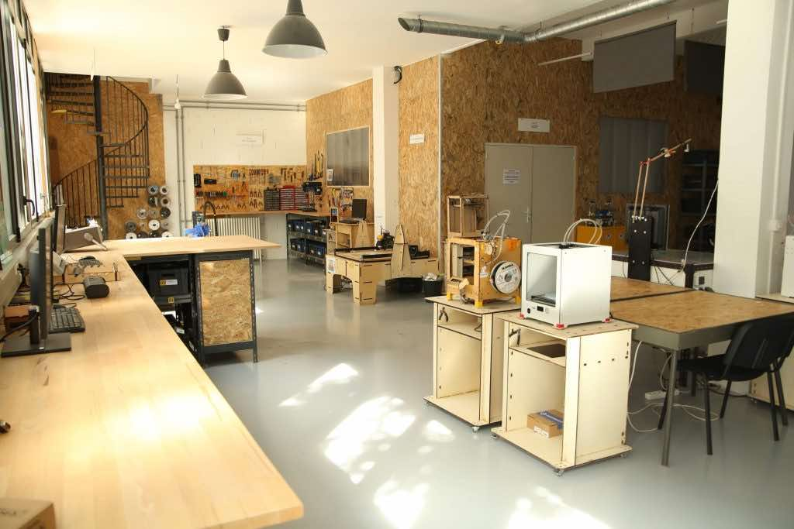

Hello! I'm Alban Petit, a passionate French web developer working at La Machinerie, a facility that houses a Fablab. I've been involved with this organization for the past 7 years, starting as a volunteer and eventually becoming responsible for a department that offers a range of technical services, including electronics, programming, and digital fabrication.

Through my work experiences and interactions at La Machinerie, I discovered a strong passion for software development, electronics, and prototyping in general.

## My Experiences

- **Assistant FabManager, La Machinerie Association**, 2015 - 2016, Amiens

  La Machinerie houses a Fablab that caters to entrepreneurs, designers, artists, DIY enthusiasts, students, and hackers, providing a space to rapidly transition from concept to prototyping. As a FabManager, I was in charge of managing this facility.

- **BTS Apprenticeship, Etoele Company**, 2016 - 2018, Amiens

  Etoele is a research bureau that serves both individuals and professionals, including large-scale industrial clients. During my time there, I worked on various projects, including embedded development, electronic prototyping, custom web development, web services architecture, IoT development, signal processing, robotics, 3D scanning, and reverse engineering.

- **Bachelor's Degree Apprenticeship in Computer Science, Etoele Company**, 2018 - 2019, Amiens
  During this period, I continued my role as a web and embedded developer at Etoele.
- **Web & Embedded developer, Etoele Company**, 2019 - 2021, Amiens
- **Head of Manufacturing Department, La Machinerie Association**, 2022 - 2023, Amiens
  Currently, I hold the position of head of the manufacturing department at La Machinerie, where we assist professionals in developing prototypes in areas such as electronics, furniture, functional parts, and connected devices.

## La Machinerie

La Machinerie is an association that was founded in April 2014 by a group of idealistic individuals in Amiens who aspired to "create and work differently." It encompasses a Fablab and coworking space, drawing inspiration from the Fablab movement to provide an accessible community resource where users contribute their skills, tools, and knowledge. The collective embraces various aspirations, including citizen innovation, ecology, open culture, and entrepreneurship, leading to a diverse range of experiences.

 

Today, [La Machinerie](https://lamachinerie.org) brings together 4 major areas of activity:

- A business incubator
- A coworking space
- A Fablab
- La Manufacture, a service aimed at professionals wishing to develop prototypes or small manufacturing series. (electronics, furniture, functional part, connected object)

Situated in the heart of Amiens, near the train station, the Fablab frequently welcomes visitors whom I assist during open sessions for their diverse technical projects. Many students from local schools also frequent the Fablab for their study-related projects.



    

        <iframe style="width: 100%;" height="400" id="gmap_canvas" src="https://maps.google.com/maps?q=1B%20rue%20de%20la%20vall%C3%A9e,%2080000&t=k&z=17&ie=UTF8&iwloc=&output=embed" frameborder="0" scrolling="no" marginheight="0" marginwidth="0"></iframe>
    



## Personal projects

In addition to my activities at La Machinerie, I am utilizing this website as a platform to document my personal projects, which are undertaken both within La Machinerie's Fablab and my personal workshop.

## Contact

Please feel free to contact me via email at contact@albanpetit.com or on [Twitter](https://twitter.com/Padh_) for any information, advice, questions, or modifications regarding this website.

Enjoy your visit ! :smile:
