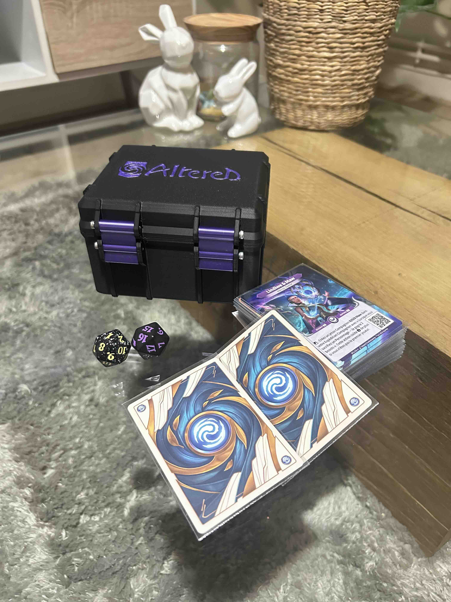
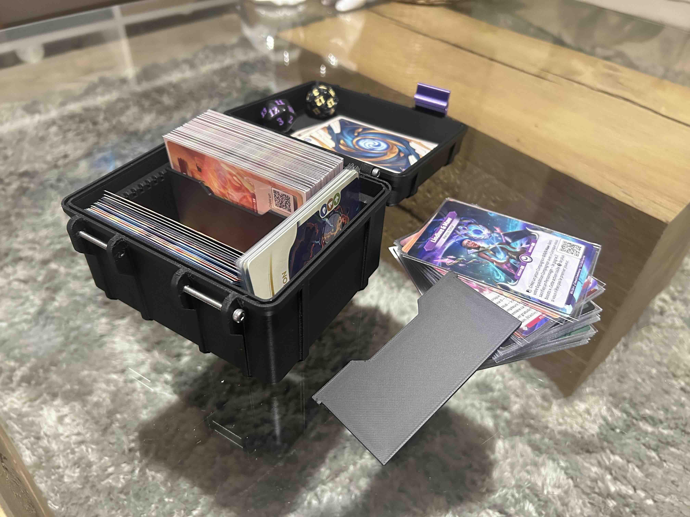
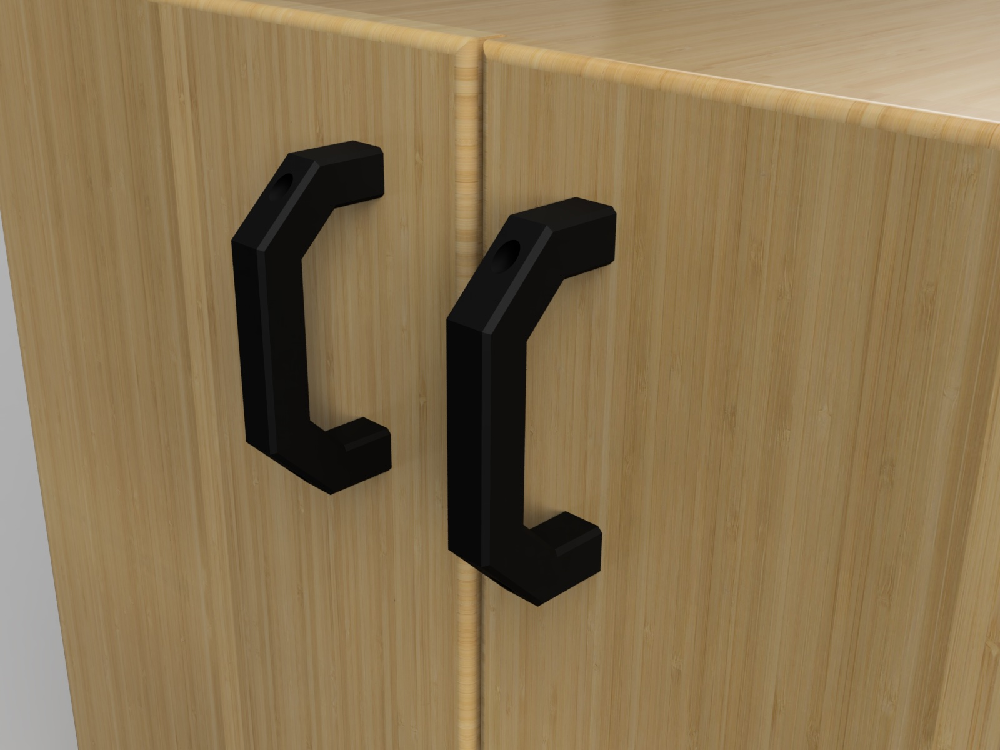
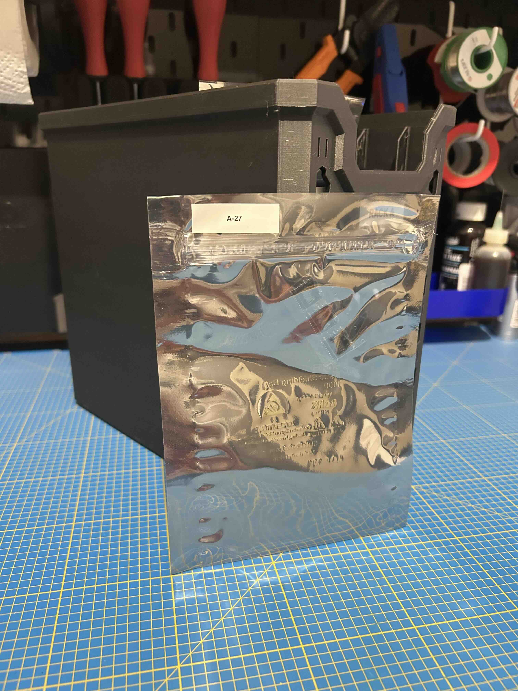

# Une Bambulab A1, des projets, beaucoup d'impressions !

Ma Bambulab A1 est enfin arrivée ! Depuis le temps que je voulais mon *Ender 5*, j’avais hâte de voir ce qu’elle avait dans le ventre. Après quelques réglages et des impressions de test, j’ai rapidement voulu créer mes propres modèles. Voici donc mes premiers projets, pensés pour répondre à des besoins précis.

## 🃏 Boîte de Cartes pour *Altered*

J’aime beaucoup *Altered*, un jeu de cartes qui propose une mécanique originale et un univers fascinant. Mais comme souvent avec les jeux de cartes, le rangement devient vite un problème. Les solutions existantes ne me convenaient pas totalement, alors je me suis dit : "et si je concevais ma propre boîte ?"

 

### 🔹 Pourquoi cette boîte ?

- Un format parfaitement adapté aux cartes Altered, même sous sleeves.
- Une conception optimisée pour une impression facile, sans supports.
- Des séparateurs modulaires pour ajuster l’espace intérieur en fonction du nombre de cartes.
- Un couvercle bien ajusté pour éviter toute ouverture accidentelle.

### 📥 Téléchargement :

Le modèle est disponible sur MakerWorld.

## 🔧 Poignée Paramétrique

Autre problème du quotidien : les poignées cassées ou mal adaptées. Plutôt que de chercher un modèle tout fait, j’ai voulu créer un design paramétrique en OpenSCAD, que je pourrais adapter à n’importe quelle situation.

 

### 🔹 Pourquoi cette poignée ?

- Entièrement personnalisable : longueur, diamètre, forme du grip, taille du trou, tout est modifiable.
- Impression sans support, simple et efficace.
- Convient pour de nombreux usages : remplacement de poignées cassées, création d’une prise en main plus ergonomique, customisation d’outils…

### 📥 Téléchargement :

Le modèle est disponible sur MakerWorld et GitHub.

# 🧪 Point d’étape : plus de 500 heures d’impression plus tard…

Après plusieurs mois d’utilisation et plus de 500 heures d’impression, je commence à bien connaître les capacités de la Bambulab A1 !

Parmi les projets les plus utiles que j’ai réalisés récemment : un système de rangement pour mes composants électroniques.

## 🧰 Un rangement simple pour mes composants électroniques

Quand on bricole en électronique, on accumule vite plein de composants. Et sans un minimum d’organisation, ça devient un vrai casse-tête de savoir ce qu’on a… ou où on l’a rangé. Résultat : je finissais souvent par recommander des pièces que j’avais déjà.

J’ai donc mis en place un petit système de rangement qui me correspond : pas cher, facile à étendre, et surtout adapté à ma façon de bosser.

### 🔹 L’idée ?

Des sachets antistatiques, des boîtes imprimées en 3D, et un simple fichier Excel. C’est tout !

Chaque composant est rangé dans un sachet antistatique. Ensuite, les sachets sont stockés verticalement dans des boîtes imprimées en 3D, que j’ai conçues sur mesure pour s’adapter à leurs dimensions.

Les sachets sont faciles à étiqueter et protègent bien les composants sensibles en plus peu couteux.
Les boîtes permettent un rangement propre, sans que tout s’écroule.
C’est modulaire : dès que j’ai besoin de plus de place, j’imprime un nouveau support.

Je colle une étiquette (manuscrite ou imprimée) sur chaque sachet avec un identifiant de reference que j'identifie dans un tableau excel. Dans ce tableau j'ajoute la reference le lien vers le revendeur, la datasheet, la package et la quantite pour ne pas racheter ce que j'ai deja en stock.

Le design est simple et efficace. Pas de supports, impression rapide.

 

### 📥 Téléchargement et materiel :

Les fichiers STL sont dispos ici sur MakerWorld et [Github](https://github.com/albanpetit/3d-printed-projects). Concernant les sacs rien de plus simple ils sont disponibles chez la plupart des grossistes d'electroniques, ce sont des sacs en 5x8" egalement compatible avec les 5x7" comme sur la photos. [Mouser](https://www.mouser.fr/ProductDetail/SCS/30058?qs=atelM%2FHH1ECEPEBWw31qNQ%3D%3D)

# 🚀 Et la suite ?

Ces projets ne sont qu’un aperçu de ce que j’ai pu créer avec la Bambulab A1. Entre les objets du quotidien, les accessoires de jeux et les solutions pratiques, je compte bien continuer à expérimenter. D’autres idées sont en cours, et je partagerai tout ça ici bientôt !

💬 Si vous avez des suggestions de modèles ou si vous voulez récupérer le fichier Excel que j’utilise, faites-moi signe !

- 🔗 Tous mes projets 3D
- 🔗 [GitHub - 3D Printed Projects](https://github.com/albanpetit/3d-printed-projects)