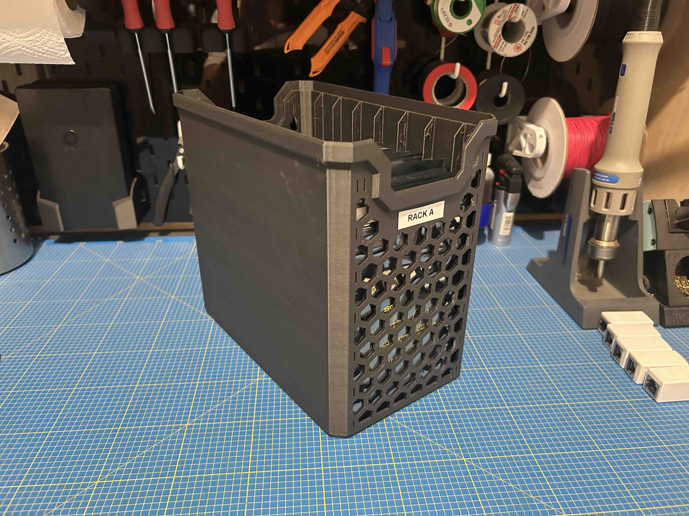
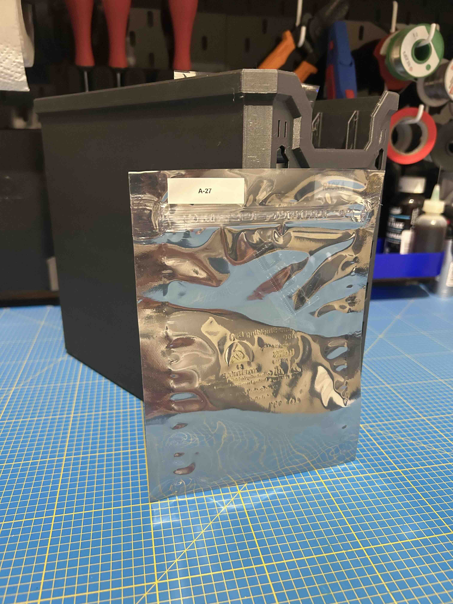

# A Bambulab A1, Projects, and Lots of Printing!

My Bambulab A1 has finally arrived! I had been wanting an *Ender 5* for a long time, and I was excited to see what this one could do. After a few tweaks and some test prints, I quickly wanted to start designing my own models. Here are my first projects, designed to meet specific needs.

## 🃏 Deck Box for *Altered*

I really enjoy *Altered*, a card game with original mechanics and a fascinating universe. But, as with most card games, storage quickly becomes a problem. The existing solutions didn’t quite suit me, so I thought: "why not design my own box?"

 

### 🔹 Why this box?

- A format perfectly suited for *Altered* cards, even sleeved.
- An optimized design for easy, support-free printing.
- Modular dividers to adjust the interior space depending on the number of cards.
- A snug-fitting lid to prevent accidental openings.

### 📥 Download:

The model is available on MakerWorld.

## 🔧 Customizable Handle

Another everyday issue: broken or poorly fitted handles. Instead of looking for a pre-made model, I wanted to create a parametric design in OpenSCAD that I could adapt to any situation.

 

### 🔹 Why this handle?

- Fully customizable: length, diameter, grip shape, hole size—everything can be adjusted.
- Support-free printing, simple and efficient.
- Suitable for many uses: replacing broken handles, improving grip ergonomics, customizing tools…

### 📥 Download:

The model is available on MakerWorld and GitHub.

# 🧪 Milestone: Over 500 Hours of Printing Later...

After several months of use and over **500 hours of printing**, I'm starting to really understand the capabilities of the Bambulab A1!

One of the most useful projects I’ve worked on recently: a storage system for my electronic components.

## 🧰 A Simple Storage System for Electronic Components

When you tinker with electronics, you quickly accumulate lots of components. And without a bit of organization, it becomes a real headache to know what you have… or where you stored it. I often ended up reordering parts I already had.

So I set up a small storage system that fits the way I work: inexpensive, expandable, and tailored to my needs.

### 🔹 The concept?

Antistatic bags, 3D printed boxes, and a simple Excel spreadsheet. That’s it!

Each component goes into an antistatic bag. The bags are then stored vertically in 3D printed boxes that I custom-designed to fit their size.

The bags are easy to label and provide good protection for sensitive components while staying very affordable.  
The printed boxes keep everything neatly upright.  
It’s modular: whenever I need more space, I just print another holder.

I stick a label (handwritten or printed) on each bag with a reference ID that matches an entry in my Excel sheet. The spreadsheet includes the reference, supplier link, datasheet, package type, and quantity—so I don’t reorder what I already have.

The design is simple and efficient. No supports, and a fast print.

 

### 📥 Download & Materials:

The STL files are available on MakerWorld and on [GitHub](https://github.com/albanpetit/3d-printed-projects).  
As for the bags, nothing fancy—they're available from most electronics suppliers. I use 5x8" antistatic bags, also compatible with 5x7" ones like in the photo.  
[Mouser](https://www.mouser.fr/ProductDetail/SCS/30058?qs=atelM%2FHH1ECEPEBWw31qNQ%3D%3D)

# 🚀 What’s Next?

These projects are just a glimpse of what I’ve been able to create with the Bambulab A1. Between everyday objects, game accessories, and practical solutions, I plan to keep experimenting. More ideas are already in the works, and I’ll be sharing them here soon!

💬 If you have suggestions for models, or if you'd like a copy of the Excel spreadsheet I use—just let me know!

- 🔗 All My 3D Projects
- 🔗 [GitHub - 3D Printed Projects](https://github.com/albanpetit/3d-printed-projects)
