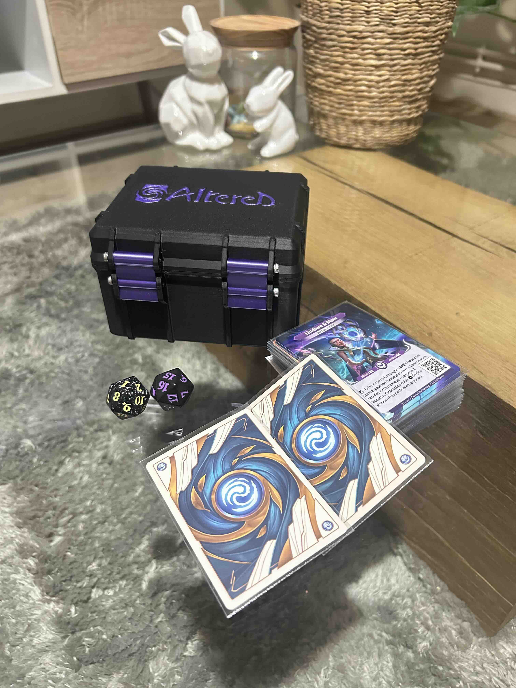
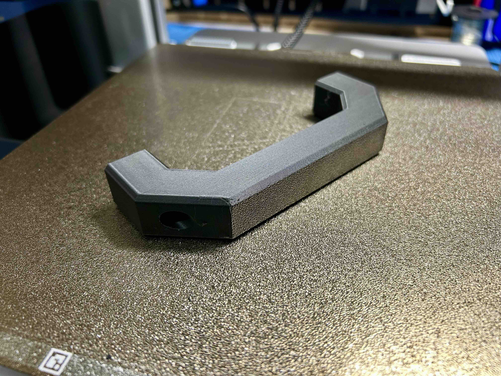
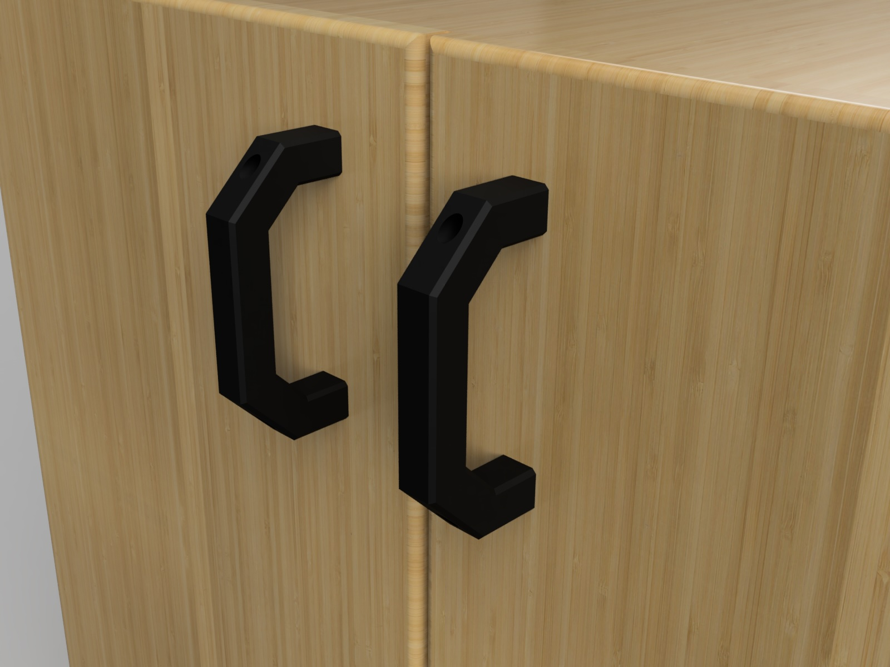

# A Bambu Lab A1, Projects, and Lots of Printing!  

My **Bambu Lab A1** has finally arrived! I had been wanting an *Ender 5* for a long time, but now that I have this one, I was eager to see what it could do. After some adjustments and test prints, I quickly wanted to start creating my own models. Here are my first projects, designed to meet specific needs and help me get familiar with 3D modeling.  

## 🃏 *Altered* Deck Box  

I really enjoy *Altered*, a card game with an original mechanic and a fascinating universe. But, like most card games, storage quickly becomes an issue. The existing solutions didn’t quite suit me, so I thought: *why not design my own box?*  

   

### 🔹 Why This Box?  

- A format perfectly suited for *Altered* cards, even with sleeves.  
- Optimized design for easy, support-free printing.  
- Modular dividers to adjust the interior space based on the number of cards.  
- A snug-fitting lid to prevent accidental openings.  

### 📥 Download:  

The model is available on my MakerWorld profil.  

## 🔧 Customizable Handle  

Another everyday issue: broken or poorly fitted handles. Instead of searching for a pre-made model, I wanted to create a **parametric design in OpenSCAD** that I could adapt to any situation.  

   

### 🔹 Why This Handle?  

- Fully customizable: length, diameter, grip shape, hole size—everything can be adjusted.  
- Support-free printing, simple and efficient.  
- Suitable for various uses: replacing broken handles, improving grip ergonomics, customizing tools…  

### 📥 Download:  

The model is available on MakerWorld and GitHub.  

## 🚀 What’s Next?  

These two projects are just the beginning! Now that my **Bambu Lab A1** is running at full speed, I plan to keep experimenting and creating useful, practical, or just fun objects. I’ll share my future designs here, so stay tuned!  

## 🔗 GitHub - 3D Printed Projects  

And if you have suggestions or ideas for models to design, feel free to share them with me! 😊