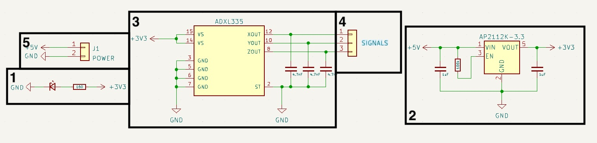

Dans cet article, nous plongeons au cœur de mon dernier projet un PCB personnalisé conçu autour d'un accéléromètre MEMS. Ce projet est relativement simple dans son application, mails il utilise un composant électronique extrêmement interessant par son fonctionnement interne, un accerometre MEMS.
Cette carte électronique sera utilise plus tard au sein d'autres projets.

## Accéléromètres MEMS



Les accéléromètres MEMS sont des dispositifs compacts qui exploitent la technologie de microfabrication pour intégrer des éléments mécaniques, des capteurs, des actionneurs et de l'électronique sur une minuscule puce en silicium. Au cœur de ces dispositifs se trouve une structure MEMS, souvent composée de microstructures telles que des poutres ou des porte-à-faux, qui répondent aux forces externes.

### Principe de fonctionnement

Le principe de fonctionnement des accéléromètres MEMS repose sur le concept d'inertie. Selon la deuxième loi du mouvement de Newton, un objet au repos a tendance à rester au repos, et un objet en mouvement a tendance à rester en mouvement sauf s'il est soumis à une force externe. Les accéléromètres MEMS capitalisent sur ce principe pour mesurer l'accélération.

Au sein de la structure MEMS, il existe généralement une masse suspendue par des poutres flexibles. Lorsque le dispositif subit une accélération, la masse résiste à ce changement en raison de l'inertie, provoquant une déviation dans les poutres. Cette déviation est ensuite convertie en un signal électrique par un capteur, tel qu'un capteur capacitif ou piézoélectrique, intégré dans la structure MEMS.

### Traduire le mouvement mécanique en signaux électriques

Au fur et à mesure que l'accéléromètre rencontre une accélération, le mouvement de la masse induit une variation de capacité ou génère une tension proportionnelle à la force appliquée. Ce signal électrique est ensuite traité et traduit en données significatives, nous permettant de quantifier l'accélération subie par le dispositif.

## Carte électronique

Ce PCB est relativement simple, de petites dimensions il s'intègre sans aucun problèmes dans n'importe quel projet. La presence d'un régulateur de tension AP2112 permet la regulation de la tension d'entree a 3.3V et donc l'utilisation de cette carte électronique avec proposant du 5V comme tension par défaut, comme les Arduino par exemple.
Elle présente ainsi des dimensions de 19mm x 24mm avec deux connecteurs, le premier pour l'alimentation en 5V, le second pour les données analogiques de l'acceleration sur les trois axes: x, y, z.

### Composants principaux

Sur cette carte électronique, deux composants sont les plus importants, le régulateur et l'accéléromètre.

#### AP2112K-3.3

Ce régulateur linéaire en package **SOT-23-5** est extrêmement courant, utilisé dans de nombreuse cartes électroniques a destination des hobbyist il reviens dans de nombreux design des chez **Adafruit** ou encore **Sparkfun**. C'est un régulateur linéaire a faible abaissement a tension fixe, disponible dans de multiple variantes, 1.2V, 1.8V, 2.5V, 2.6V, et 3.3V, ce projet utilise la version 3.3V. Il dispose de toutes les caractéristiques nécessaire pour ce projet :
-  Précision de la tension de sortie : ±1,5 %
-  Courant de sortie : 600 mA (min.)
-  Protection contre les courts-circuits repliables : 50 mA
-  Activer la fonction pour activer/désactiver VOUT
-  Faible tension de chute (3,3 V) : 250 mV (Typ.) @IOUT = 600 mA
-  Excellente régulation de charge : 0,2 %/A (Typ.)
-  Excellente régulation de ligne : 0,02 %/V (Typ.)
-  Faible courant de repos : 55µA (Typ.)
-  Faible courant de veille : 0,01 µA (Typ.)
-  Faible bruit de sortie : 50µVRMS
- PSRR : 100 Hz -65 dB, 1 kHz -65 dB
-  Protection OTSD
-  Stable avec un capuchon flexible de 1,0 µF : céramique, tantale et
Électrolyse de l'aluminium
-  Plage de température de fonctionnement : -40°C à +85°C


En prime, il est extrêmement simple a mettre en oeuvre, le document de données techniques fournis avec nous présente l'ensemble des composants satellites nécessaire a sont bon fonctionnement. Il suffira de deux condensateurs de lissage d'une valeur de 1uF sur l'entree en tension ainsi que la sortie, ainsi que d'une resistance de 100K ohms pour permettre son allumage constant.

#### ADXL335

Le coeur du projet, l'accéléromètre **ADXL335**, ce composant de la marque **Analog Devices** dispose d'une sensibilité la vibration de 3g, disponible uniquement en format **LFCSP-16** il est relativement simple a mettre en oeuvre également en partie grace a sa taille réduite (4mm x 4mm).

Ce composant dispose de trois sorties analogiques, chacune responsable de fournir l'information d'acceleration d'une des trois dimensions. Une fonction particulière est disponible sur ces sorties analogique, décrit dans la documentation technique, une resistance de 32K ohms est disposée sur chacune d'entres elles. Ces resistances permettent via l'ajout d'un condensateur de créer un filtre passe bas, réduisant ainsi le bruit sur les données et l'effet de crénelage d'un suréchantillonnage. La valeur minimal conseillée de ces condensateur est de 4,7nF selon la documentation technique.

Il est également interessant de relever de cette documentation que la fréquence utile maximale de chaque axe est différente, 1600Hz pour X et Y et seulement 500Hz pour Z. Le positionnement de ce composant est donc extrêmement important en fonction de l'usage.

### Liste des composants

Bien qu'ils soient les plus composants les plus importants, d'autres composants sont tout de meme present sur cette carte :

| Denomination          | Reference | Quantité | Format     | Datasheet                         |
| --------------------- | --------- | -------- | ---------- | --------------------------------- |
| ADXL335               | U1        | 1        | LFCSP-16   | [ADXL335](datasheet-adxl-335.pdf) |
| AP2112K-3.3           | U2        | 1        | SOT-23-5   | [AP2112](datasheet-ap2112.pdf)    |
| 100k ohm SMD resistor | R2        | 1        | 0603       | -                                 |
| 160 ohm SMD resistor  | R1        | 1        | 0603       | -                                 |
| LED                   | D1        | 1        | 0603       | -                                 |
| 1uF SMD capacitor     | C4,C5     | 2        | 0603       | -                                 |
| 4,7nF SMD capacitor   | C1-C3     | 3        | 0603       | -                                 |
| Power connector       | J1        | 1        | JST PH B2B | -                                 |
| Signal connector      | J2        | 1        | JST PH B3B | -                                 |

### Schéma et carte électronique

L'ensemble des fichiers de conception et de fabrication sont disponibles dans ce repertoire **GitHub** : [ADXL-335](). Voici tout de meme un rapide descriptif des différentes sections de ce circuit imprime :

 

1. Une simple LED responsable d'afficher l'état d'alimentation de la carte électronique, accompagne de sa résistance pour éviter toute émission de fumer
2. L'étage d'alimentation de la carte électronique, base sur l'AP2112K-3.3, il dispose de trois condensateurs de lissage pour assurer sa fonction correctement, ces informations sont disponibles directement au sein de la fiche technique du composant.
3. L'accéléromètre MEMS ADXL335, avec ces trois condensateurs, un pour chaque sortie analogique de ce composant. Ils permettent de filtrer les hautes fréquences permettant donc une réduction de bruit et l'anti-crénelage comme indique plus tot.
4. Le connecteur JST-PH avec trois broches, une pour chaque sortie analogique
5. Le connecteur JST-PH d'alimentation en 5 volts

