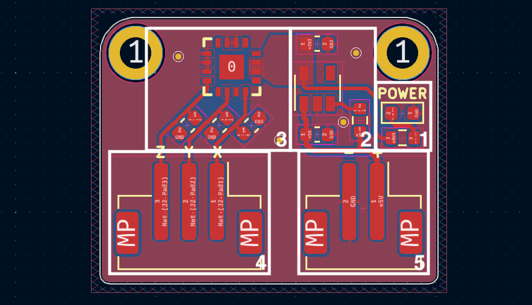
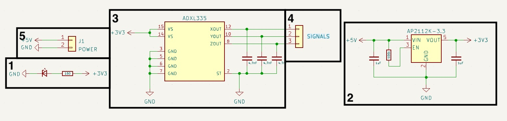
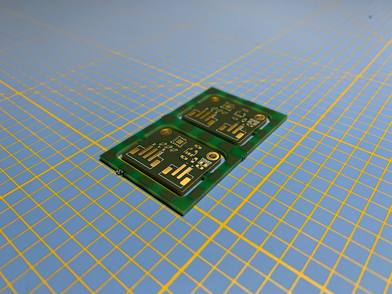
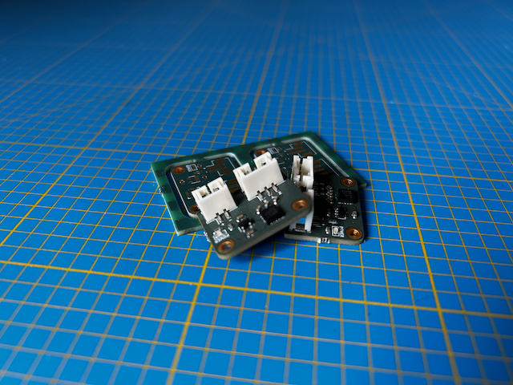
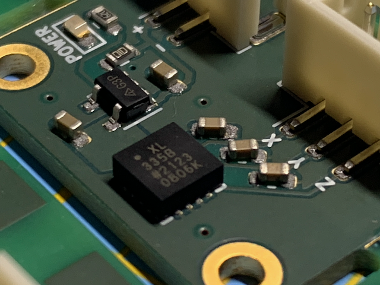
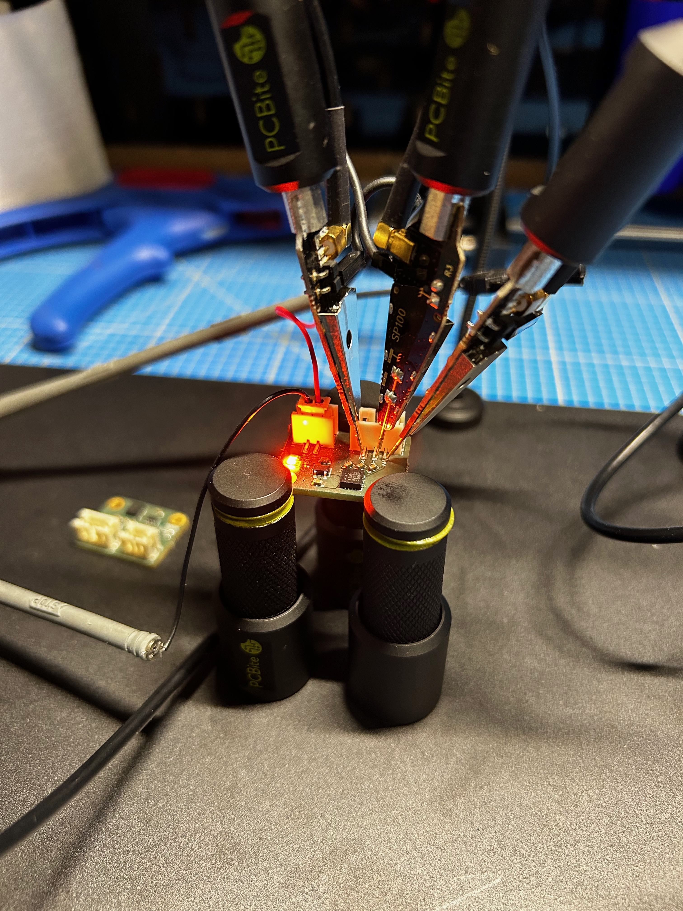
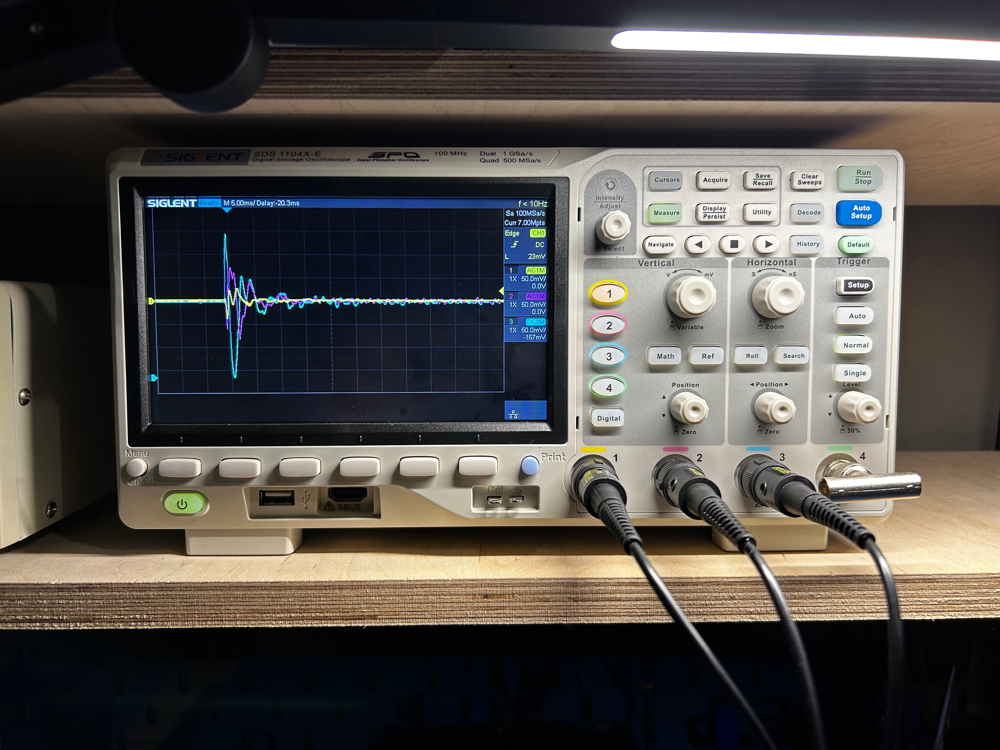
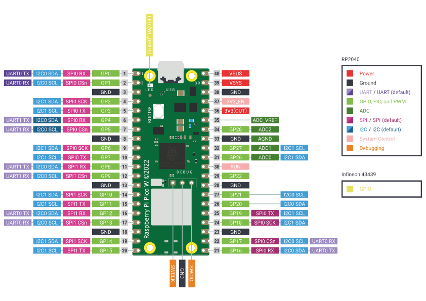
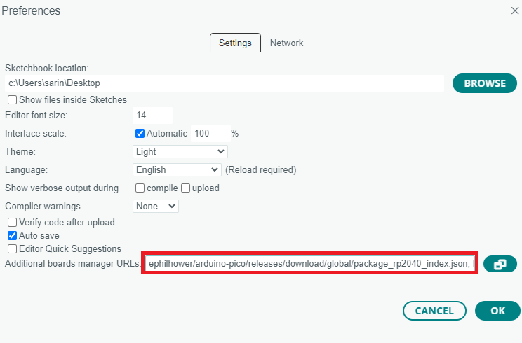
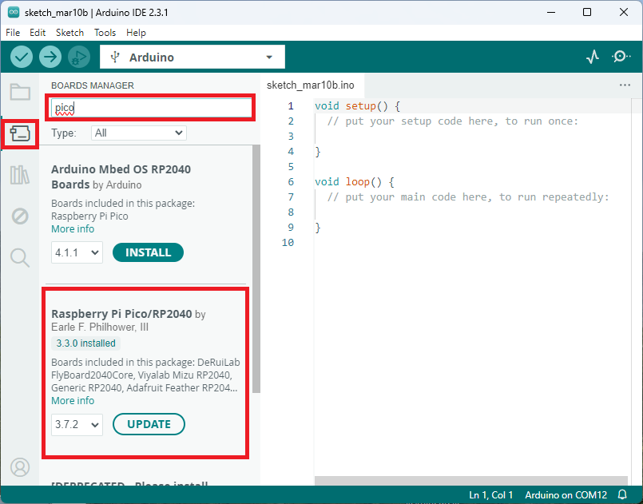

Dans cet article, plongeons au cœur de mon dernier projet : un PCB personnalisé conçu autour d'un accéléromètre MEMS. Ce projet, bien que relativement simple dans son application, utilise un composant électronique extrêmement intéressant de par son fonctionnement interne, un accéléromètre MEMS. Cette carte électronique sera utilisée plus tard dans d'autres projets.

## Accéléromètres MEMS

 

Les accéléromètres MEMS sont des dispositifs compacts qui exploitent la technologie de microfabrication pour intégrer des éléments mécaniques, des capteurs, des actionneurs sur une minuscule puce en silicium. Au cœur de ces dispositifs se trouve un assemblage MEMS, souvent composée de microstructures telles que des poutres ou des porte-à-faux, qui répondent aux forces externes.

### Principe de fonctionnement

Le principe de fonctionnement des accéléromètres MEMS repose sur le concept d'inertie. Selon la deuxième loi du mouvement de Newton, un objet au repos a tendance à rester au repos, et un objet en mouvement a tendance à rester en mouvement sauf s'il est soumis à une force externe. Les accéléromètres MEMS capitalisent sur ce principe pour mesurer l'accélération.

 

Au sein de la structure MEMS, il existe généralement une masse suspendue par des poutres flexibles. Lorsque le dispositif subit une accélération, la masse résiste à ce changement en raison de l'inertie, provoquant une déviation dans les poutres. Cette déviation est ensuite convertie en un signal électrique par un capteur, capacitif ou piézoélectrique, directement intégré dans la structure MEMS.

### Traduire le mouvement mécanique en signaux électriques

Au fur et à mesure que l'accéléromètre rencontre une accélération, le mouvement de la masse induit une variation de capacité ou génère une tension proportionnelle à la force appliquée. Ce signal électrique est ensuite traité et traduit en données significatives, nous permettant de quantifier l'accélération subie par le dispositif.

## Conception de la carte électronique

Ce PCB est relativement simple et de petites dimensions. Il s'intègre aisément dans n'importe quel projet. La présence d'un régulateur de tension AP2112 permet la régulation de la tension d'entrée à 3,3V. Ainsi l'utilisation de cette carte électronique avec des dispositifs fournissant 5V par défaut est possible, tels que les Arduino, par exemple. Ses dimensions sont de 19mm x 24mm, avec deux connecteurs : l'un pour l'alimentation en 5V, et l'autre pour les données analogiques de l'accélération sur les trois axes : x, y, z.

### Composants principaux

Sur cette carte électronique, il y a deux composants majeurs : le régulateur et l'accéléromètre.

#### AP2112K-3.3

Ce régulateur linéaire en package **SOT-23-5** est extrêmement courant, utilisé dans de nombreuses cartes électroniques à destination des hobbyistes. Il revient dans beaucoup de designs de chez **Adafruit** ou encore **Sparkfun**. C'est un régulateur linéaire à faible abaissement propose une tension fixe, disponible dans de multiples variantes : 1.2V, 1.8V, 2.5V, 2.6V, et 3.3V. Ce projet utilise la version 3.3V. Il dispose de toutes les caractéristiques nécessaires pour ce projet :
-  Précision de la tension de sortie : ±1,5%
-  Courant de sortie : 600 mA (minimum)
-  Protection contre les courts-circuits repliables : 50 mA
-  Activer la fonction pour activer/désactiver VOUT
-  Faible tension de chute (3,3 V) : 250 mV (typ.) @IOUT = 600 mA
-  Excellente régulation de charge : 0,2%/A (typ.)
-  Excellente régulation de ligne : 0,02%/V (typ.)
-  Faible courant de repos : 55µA (typ.)
-  Faible courant de veille : 0,01 µA (typ.)
-  Faible bruit de sortie : 50µVRMS
- PSRR : 100 Hz -65 dB, 1 kHz -65 dB
-  Protection OTSD
-  Stable avec un condensateur flexible de 1,0 µF : céramique, tantale et électrolytique à l'aluminium
-  Plage de température de fonctionnement : -40°C à +85°C

 

En prime, il est simple de mise en oeuvre. Le document de données techniques fourni par le fabricant présente l'ensemble des composants satellites nécessaires à son bon fonctionnement. Il suffira de deux condensateurs de lissage d'une valeur de 1uF sur l'entrée et sur la sortie en tension, et d'une résistance de 100K ohms pour permettre un allumage constant.

#### ADXL335

Le cœur du projet, l'accéléromètre **ADXL335** de la marque **Analog Devices**, dispose d'une sensibilité à la vibration de 3G. Disponible uniquement en format **LFCSP-16**, il présente des dimensions réduites (4mm x 4mm).

Ce composant dispose de trois sorties analogiques, chacune responsable de fournir l'information d'accélération d'une des trois dimensions. Une fonction particulière est disponible sur ces sorties analogiques, décrite dans la documentation technique. Une résistance de 32K ohms est disposée sur chacune d'entre elles. Ces résistances permettent, via l'ajout d'un condensateur, de créer un filtre passe-bas, réduisant ainsi le bruit sur les données et l'effet de crénelage d'un suréchantillonnage. La valeur minimale conseillée de ces condensateurs est de 4,7nF selon la documentation technique.

Il est également intéressant de relever de cette documentation que la fréquence utile maximale de chaque axe est différente : 1600Hz pour X et Y, et seulement 500Hz pour Z.

 Le positionnement de ce composant est donc extrêmement important en fonction de l'usage.

### Liste des composants

Bien qu'ils soient les plus importants, d'autres composants sont tout de même présents sur cette carte :

| Désignation               | Référence | Quantité | Format     | Fiche technique                           |
| ------------------------- | --------- | -------- | ---------- | ----------------------------------------- |
| ADXL335                   | U1        | 1        | LFCSP-16   | [ADXL335](datasheet-adxl-335.pdf)         |
| AP2112K-3.3               | U2        | 1        | SOT-23-5   | [AP2112](datasheet-ap2112.pdf)            |
| Résistance SMD 100k ohm   | R2        | 1        | 0603       | -                                         |
| Résistance SMD 160 ohm    | R1        | 1        | 0603       | -                                         |
| LED                       | D1        | 1        | 0603       | -                                         |
| Condensateur SMD 1uF      | C4,C5     | 2        | 0603       | -                                         |
| Condensateur SMD 4,7nF    | C1-C3     | 3        | 0603       | -                                         |
| Connecteur d'alimentation | J1        | 1        | JST PH B2B | -                                         |
| Connecteur de signal      | J2        | 1        | JST PH B3B | -                                         |

### Schéma et carte électronique

L'ensemble des fichiers de conception et de fabrication sont disponibles dans ce répertoire **GitHub** : [ADXL-335](). Voici tout de même un rapide descriptif des différentes sections de ce circuit imprimé :

 

1. Une LED discrète responsable d'afficher l'état d'alimentation de la carte électronique, accompagnée de sa résistance pour éviter toute émission de fumée.
2. L'étage d'alimentation de la carte électronique, basé sur l'AP2112K-3.3, dispose de trois condensateurs de lissage pour assurer sa fonction correctement. Ces informations sont disponibles directement au sein de la fiche technique du composant.
3. L'accéléromètre MEMS ADXL335, avec ces trois condensateurs, un pour chaque sortie analogique de ce composant.
4. Le connecteur JST-PH avec trois broches, une pour chaque sortie analogique.
5. Le connecteur JST-PH d'alimentation en 5 volts.

## Fabrication de la carte électronique

 

Habitant en France, les fournisseurs habituels (chinois) de cartes électroniques peuvent être relativement onéreux à cause des frais de port. Je me fournis principalement chez **Aisler**, un fabricant allemand. Efficace, abordable et bien documenté, ils ont toujours honoré mes commandes. Ils ont même un plugin disponible sur **Kicad** pour faciliter la commande, [Aisler push for Kicad](https://github.com/AislerHQ/PushForKiCad). En un clic le projet est directement transmis au site pour effectuer ladite commande.

**Aisler** propose des PCB avec un traitement **ENIG** (Electroless Nickel Immersion Gold), ainsi que la possibilité de faire fabriquer des **stencils** pour la crème à braser.

L'utilisation d'un **stencil** donne accès à des solutions pour souder des **PCB** bien plus précisément que les méthodes conventionnelles avec un fer à souder. L'idée est de faire fabriquer pour chaque circuit électronique un pochoir qui permet de déposer de la crème à braser sur les surfaces accueillant plus tard de l'étain. Par la suite, il s'agira de déposer les composants électroniques à leurs positions finales. Une fois l'ensemble des composants placés, une plaque chauffante ou un four à refusion peut être utilisé pour faire fondre la crème à braser et donc réaliser la soudure, il en résulte des points de soudure parfaitement homogènes.

**GreatScott** explique et présente cette méthode dans une de ses vidéos :


Voici tout de même quelques photos de différentes étapes de cette réalisation :

  

## Mise en œuvre

### Tests initiaux

Une fois la carte électronique en état de fonctionnement, j'ai effectué quelques tests avec un oscilloscope, pour éviter d'essayer d'interfacer une carte électronique dysfonctionnelle avec un microcontrôleur pendant des heures. Accompagné d'un de mes outils préférés, les sondes de mesure **Sensepeek**, les résultats semblent parfaitement cohérents avec la fiche technique de l'**ADXL335**.

  

### Raspberry Pi Pico

 

Le Raspberry Pi Pico est une carte électronique accueillant le RP2040, un microcontrôleur d'architecture ARM conçu par la fondation Raspberry Pi. Annoncé en janvier 2021, c'est le premier microcontrôleur développé par la fondation.

Ce microcontrôleur, d'architecture ARM, dispose de deux cœurs de 133 MHz, offrant des performances élevées. Le Pico dispose de 264 Ko de mémoire SRAM et de 2 Mo de mémoire flash, offrant suffisamment d'espace de stockage pour les programmes et les données. Il est équipé de 26 broches d'E/S numériques, dont 3 peuvent être utilisées comme entrées analogiques. De plus, il est équipé de deux broches d'horloge, deux broches d'alimentation et de nombreuses autres broches pour les communications série et les interfaces de bus.

C'est donc ce microcontrôleur que j'ai utilisé pour vérifier le bon fonctionnement de la carte électronique.

### Branchement

Le montage électronique est relativement simple, la carte électronique fille doit être alimentée par l'interface **+** et **-**, le **Raspberry Pico** dispose pour cela des interfaces **40** et **38**.
Ensuite les sorties **X**, **Y** et **Z** de notre carte doivent être respectivement branchées aux interfaces **31**, **32** et **34** du **Pico**.

Le schéma ci-dessous est d'une grande aide pour rapidement identifier les interfaces de connexion en question :



#### Code Arduino

Avant toute chose, le **Pico** n'est pas naturellement disponible à l'usage dans le logiciel **Arduino**, une installation est nécessaire. Pour cela, il faut ajouter cette URL : `https://github.com/earlephilhower/arduino-pico/releases/download/global/package_rp2040_index.json` au sein de l'option `Gestionnaire de carte supplémentaires` présente dans le panneau de préférences d'**Arduino** : *Fichier > Préférences* tel que cela :



Ensuite le gestionnaire de carte va nous aider à installer la carte maintenant référencée :



Ensuite il suffit de créer un script **Arduino** qui relève les valeurs de tension des interfaces analogiques **31**, **32** et **34** du **Pico**. Voici un exemple de script fonctionnel :

```Arduino
const int xInput = 26;
const int yInput = 27;
const int zInput = 28;

// initialize minimum and maximum Raw Ranges for each axis
int RawMin = 0;
int RawMax = 1023;

// Take multiple samples to reduce noise
const int sampleSize = 10;

void setup() 
{
  Serial.begin(9600);
}

void loop() 
{
  //Read raw values
  int xRaw = ReadAxis(xInput);
  int yRaw = ReadAxis(yInput);
  int zRaw = ReadAxis(zInput);

  // Convert raw values to 'milli-Gs"
  long xScaled = map(xRaw, RawMin, RawMax, -3000, 3000);
  long yScaled = map(yRaw, RawMin, RawMax, -3000, 3000);
  long zScaled = map(zRaw, RawMin, RawMax, -3000, 3000);

  // re-scale to fractional Gs
  float xAccel = xScaled / 1000.0;
  float yAccel = yScaled / 1000.0;
  float zAccel = zScaled / 1000.0;

  Serial.print("X, Y, Z  :: ");
  Serial.print(xRaw);
  Serial.print(", ");
  Serial.print(yRaw);
  Serial.print(", ");
  Serial.print(zRaw);
  Serial.print(" :: ");
  Serial.print(xAccel,0);
  Serial.print("G, ");
  Serial.print(yAccel,0);
  Serial.print("G, ");
  Serial.print(zAccel,0);
  Serial.println("G");

  delay(200);
}

// Take samples and return the average
int ReadAxis(int axisPin)
{
  long reading = 0;
  analogRead(axisPin);
  delay(1);
  for (int i = 0; i < sampleSize; i++)
  {
  reading += analogRead(axisPin);
  }
  return reading/sampleSize;
}
```

L'interface série doit normalement retourner ce genre de valeur :

```Arduino
X, Y, Z  :: 532, 578, 625 :: 0G, 0G, 1G
X, Y, Z  :: 530, 578, 627 :: 0G, 0G, 1G
X, Y, Z  :: 531, 577, 627 :: 0G, 0G, 1G
X, Y, Z  :: 530, 578, 625 :: 0G, 0G, 1G
X, Y, Z  :: 530, 578, 625 :: 0G, 0G, 1G
X, Y, Z  :: 531, 577, 626 :: 0G, 0G, 1G
X, Y, Z  :: 530, 577, 627 :: 0G, 0G, 1G
X, Y, Z  :: 531, 577, 625 :: 0G, 0G, 1G
X, Y, Z  :: 531, 576, 627 :: 0G, 0G, 1G
X, Y, Z  :: 533, 577, 626 :: 0G, 0G, 1G
X, Y, Z  :: 531, 578, 626 :: 0G, 0G, 1G
```

Notre capteur mesure maintenant l'accélération !