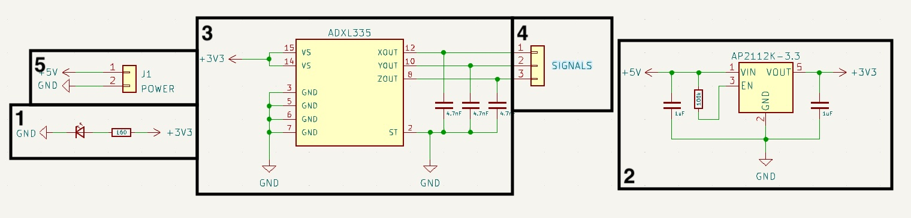
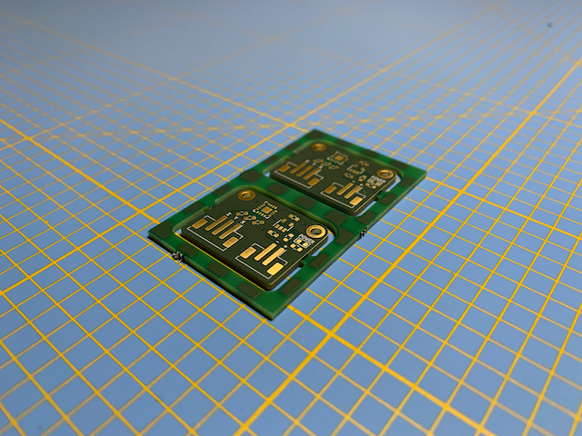
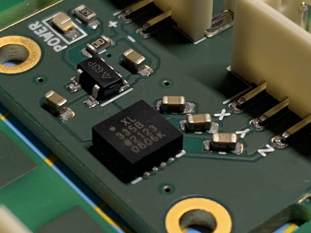
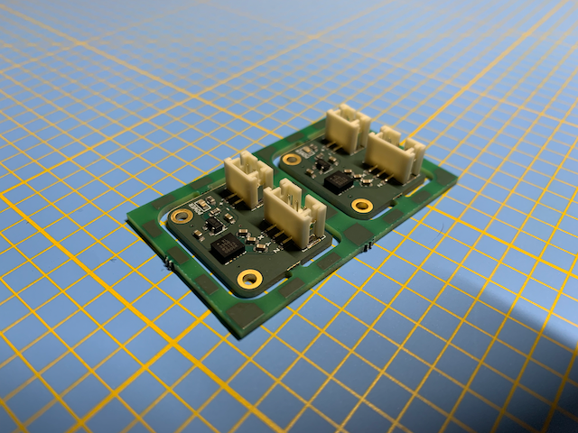
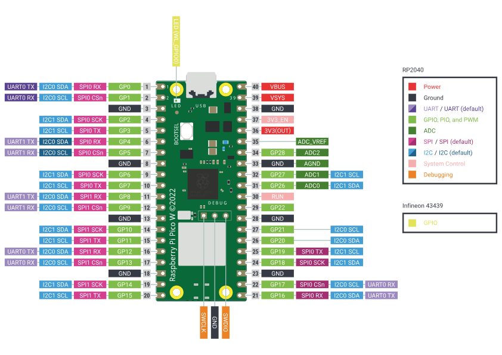
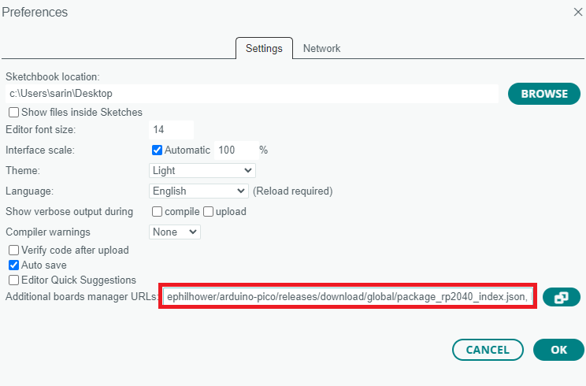
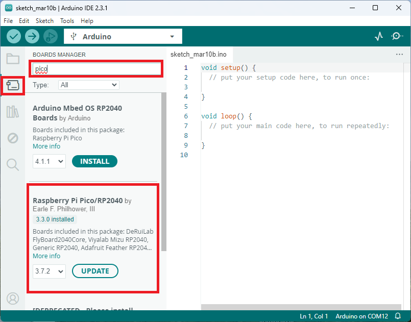

In this article, we delve into the heart of my latest project: a custom PCB designed around a MEMS accelerometer. This project, although relatively simple in its application, uses an extremely interesting electronic component due to its internal operation, a MEMS accelerometer. This electronic board will be used later in other projects.

## MEMS Accelerometers


MEMS accelerometers are compact devices that exploit microfabrication technology to integrate mechanical elements, sensors, actuators, and electronics on a tiny silicon chip. At the core of these devices lies a MEMS structure, often composed of microstructures such as beams or cantilevers, which respond to external forces.

### Operating Principle

The operating principle of MEMS accelerometers is based on the concept of inertia. According to Newton's second law of motion, an object at rest tends to stay at rest, and an object in motion tends to stay in motion unless acted upon by an external force. MEMS accelerometers capitalize on this principle to measure acceleration.

Within the MEMS structure, there is typically a mass suspended by flexible beams. When the device experiences acceleration, the mass resists this change due to inertia, causing a deflection in the beams. This deflection is then converted into an electrical signal by a sensor, such as a capacitive or piezoelectric sensor, integrated into the MEMS structure.

### Translating Mechanical Motion into Electrical Signals

As the accelerometer encounters acceleration, the movement of the mass induces a change in capacitance or generates a voltage proportional to the applied force. This electrical signal is then processed and translated into meaningful data, allowing us to quantify the acceleration experienced by the device.

## Electronic Board Design

This PCB is relatively simple and small in size, allowing it to integrate seamlessly into any project. The presence of an AP2112 voltage regulator allows the regulation of the input voltage to 3.3V, enabling the use of this electronic board with devices providing 5V by default, such as Arduino, for example. Its dimensions are 19mm x 24mm, with two connectors: one for 5V power supply, and the other for analog acceleration data on the three axes: x, y, z.

### Main Components

On this electronic board, two components are the most important: the regulator and the accelerometer.

#### AP2112K-3.3

This linear regulator in **SOT-23-5** package is extremely common, used in many hobbyist electronic boards. It appears in many designs from Adafruit or Sparkfun. It is a fixed voltage low-dropout linear regulator, available in multiple variants: 1.2V, 1.8V, 2.5V, 2.6V, and 3.3V. This project uses the 3.3V version. It has all the necessary characteristics for this project:
- Output voltage accuracy: ±1.5%
- Output current: 600 mA (minimum)
- Foldback short-circuit protection: 50 mA
- Enable function for VOUT enable/disable
- Low dropout voltage (3.3V): 250 mV (typ.) @IOUT = 600 mA
- Excellent load regulation: 0.2%/A (typ.)
- Excellent line regulation: 0.02%/V (typ.)
- Low quiescent current: 55µA (typ.)
- Low standby current: 0.01 µA (typ.)
- Low output noise: 50µVRMS
- PSRR: 100 Hz -65 dB, 1 kHz -65 dB
- OTSD protection
- Stable with a flexible capacitor of 1.0 µF: ceramic, tantalum, and aluminum electrolytic
- Operating temperature range: -40°C to +85°C



Additionally, it is extremely simple to implement. The provided datasheet contains all the necessary peripheral components required for its proper operation. Two smoothing capacitors with a value of 1uF on the input and output voltage and a 100K ohm resistor to allow constant ignition are sufficient.

#### ADXL335

The heart of the project, the Analog Devices ADXL335 accelerometer, has a vibration sensitivity of 3g. Available only in **LFCSP-16** format, it is relatively easy to implement as well, partly due to its small size (4mm x 4mm).

This component has three analog outputs, each responsible for providing acceleration information along one of the three dimensions. A specific function is available on these analog outputs, described in the technical documentation. A 32K ohm resistor is placed on each of them. These resistors, via the addition of a capacitor, allow the creation of a low-pass filter, thus reducing noise on the data and the effect of aliasing from oversampling. The recommended minimum value for these capacitors is 4.7nF according to the technical documentation.

It is also interesting to note from this documentation that the maximum useful frequency of each axis is different: 1600Hz for X and Y, and only 500Hz for Z.

The positioning of this component is therefore extremely important depending on its usage.

### Components List

Although they are the most important, other components are still present on this board:

| Designation               | Reference | Quantity | Format     | Datasheet                              |
| ------------------------- | --------- | -------- | ---------- | --------------------------------------- |
| ADXL335                   | U1        | 1        | LFCSP-16   | [ADXL335](datasheet-adxl-335.pdf)      |
| AP2112K-3.3               | U2        | 1        | SOT-23-5   | [AP2112](datasheet-ap2112.pdf)         |
| SMD Resistor 100k ohm     | R2        | 1        | 0603       | -                                       |
| SMD Resistor

 160 ohm      | R1        | 1        | 0603       | -                                       |
| LED                       | D1        | 1        | 0603       | -                                       |
| SMD Capacitor 1uF         | C4,C5     | 2        | 0603       | -                                       |
| SMD Capacitor 4.7nF       | C1-C3     | 3        | 0603       | -                                       |
| Power Connector            | J1        | 1        | JST PH B2B | -                                       |
| Signal Connector          | J2        | 1        | JST PH B3B | -                                       |

### Schematic and Electronic Board

All design and manufacturing files are available in this GitHub repository: [ADXL-335](). However, here is a quick description of the different sections of this printed circuit board:

 

1. A simple LED responsible for displaying the power status of the electronic board, accompanied by its resistor to prevent any smoke emission.
2. The power stage of the electronic board, based on the AP2112K-3.3, has three smoothing capacitors to ensure its proper function. This information is available directly within the component datasheet.
3. The MEMS accelerometer ADXL335, with its three capacitors, one for each analog output of this component. They filter out high frequencies, thus reducing noise and aliasing as mentioned earlier.
4. The JST-PH connector with three pins, one for each analog output.
5. The power supply JST-PH connector for 5 volts.

## Electronic Board Manufacturing



Living in France, the usual (Chinese) suppliers of electronic boards can be relatively expensive due to shipping costs. I mainly order my boards from Aisler, a German board manufacturer. Always efficient, well-documented, and affordable, they have always perfectly fulfilled my orders. They even have a plugin available on KiCad to facilitate ordering, [Aisler push for KiCad](https://github.com/AislerHQ/PushForKiCad). A simple press on the icon and the project is directly transmitted to the website to place the order.

Aisler offers PCBs with **ENIG** (Electroless Nickel Immersion Gold) treatment, as well as the possibility of having stencils made for solder paste.

Using a stencil provides solutions for soldering PCBs much more precisely than conventional methods with a soldering iron. The idea is to have a stencil made for each electronic circuit, allowing solder paste to be deposited on the surfaces that will later receive solder. Subsequently, electronic components are placed in their final positions. Once all the components are placed, a hotplate or reflow oven can be used to melt the solder paste, resulting in perfectly homogeneous solder joints.

GreatScott explains and presents this method in one of his videos:


Here are some photos of different stages of this realization:

  

## Implementation

### Initial Tests

Once the electronic board is operational, I performed some tests with an oscilloscope to avoid trying to interface a malfunctioning electronic board with a microcontroller for hours. Accompanied by one of my favorite tools, the Sensepeek measurement probes, the results seem perfectly consistent with the datasheet of the ADXL335.

  

### Raspberry Pi Pico



The Raspberry Pi Pico is an electronic board hosting the RP2040, an ARM architecture microcontroller designed by the Raspberry Pi Foundation. Announced in January 2021, the RP2040 is the first microcontroller developed by the foundation.

This ARM architecture microcontroller has two cores clocked at 133 MHz, offering high performance. The Pico has 264 KB of SRAM and 2 MB of flash memory, providing sufficient storage space for programs and data. It is equipped with 26 digital I/O pins, three of which can be used as analog inputs. Additionally, it is equipped with two clock pins, two power pins, and many other pins for serial communication and bus interfaces.

Therefore, I used this microcontroller to verify the proper functioning of the electronic board.

### Connection

The electronic setup is relatively simple, the daughter electronic board must be powered by the **+** and **-** interfaces, the Raspberry Pico has interfaces **40** and **38** for this purpose.
Then the **X**, **Y**, and **Z** outputs of our board must be respectively connected to interfaces **31**, **32**, and **34** of the **Pico**.

The diagram below is of great help to quickly identify the connection interfaces in question:



#### Arduino Code

First and foremost, the **Pico** is not naturally available for use in the **Arduino** software, an installation is required. To do this, you need to add this URL: `https://github.com/earlephilhower/arduino-pico/releases/download/global/package_rp2040_index.json` within the `Additional Board Manager URLs` option in the preferences panel of **Arduino**: *File > Preferences* like this:



Then the board manager will help us install the now referenced board:



Then all you have to do is create an **Arduino** script that reads the voltage values ​​from the analog interfaces **31**, **32**, and **34** of the **Pico**. Here is an example of a functional script:

```Arduino
const int xInput = 26;
const int yInput = 27;
const int zInput = 28;

// initialize minimum and maximum Raw Ranges for each axis
int RawMin = 0;
int RawMax = 1023;

// Take multiple samples to reduce noise
const int sampleSize = 10;

void setup() 
{
  Serial.begin(9600);
}

void loop() 
{
  //Read raw values
  int xRaw = ReadAxis(xInput);
  int yRaw = ReadAxis(yInput);
  int zRaw = ReadAxis(zInput);

  // Convert raw values to 'milli-Gs"
  long xScaled = map(xRaw, RawMin, RawMax, -3000, 3000);
  long yScaled = map(yRaw, RawMin, RawMax, -3000, 3000);
  long zScaled = map(zRaw, RawMin, RawMax, -3000, 3000);

  // re-scale to fractional Gs
  float xAccel = xScaled / 1000.0;
  float yAccel = yScaled / 1000.0;
  float zAccel = zScaled / 1000.0;

  Serial.print("

X, Y, Z  :: ");
  Serial.print(xRaw);
  Serial.print(", ");
  Serial.print(yRaw);
  Serial.print(", ");
  Serial.print(zRaw);
  Serial.print(" :: ");
  Serial.print(xAccel,0);
  Serial.print("G, ");
  Serial.print(yAccel,0);
  Serial.print("G, ");
  Serial.print(zAccel,0);
  Serial.println("G");

  delay(200);
}

// Take samples and return the average
int ReadAxis(int axisPin)
{
  long reading = 0;
  analogRead(axisPin);
  delay(1);
  for (int i = 0; i < sampleSize; i++)
  {
  reading += analogRead(axisPin);
  }
  return reading/sampleSize;
}
```

The serial interface should normally return values ​​like this:

```Arduino
X, Y, Z  :: 532, 578, 625 :: 0G, 0G, 1G
X, Y, Z  :: 530, 578, 627 :: 0G, 0G, 1G
X, Y, Z  :: 531, 577, 627 :: 0G, 0G, 1G
X, Y, Z  :: 530, 578, 625 :: 0G, 0G, 1G
X, Y, Z  :: 530, 578, 625 :: 0G, 0G, 1G
X, Y, Z  :: 531, 577, 626 :: 0G, 0G, 1G
X, Y, Z  :: 530, 577, 627 :: 0G, 0G, 1G
X, Y, Z  :: 531, 577, 625 :: 0G, 0G, 1G
X, Y, Z  :: 531, 576, 627 :: 0G, 0G, 1G
X, Y, Z  :: 533, 577, 626 :: 0G, 0G, 1G
X, Y, Z  :: 531, 578, 626 :: 0G, 0G, 1G
```

Our sensor is now measuring acceleration!