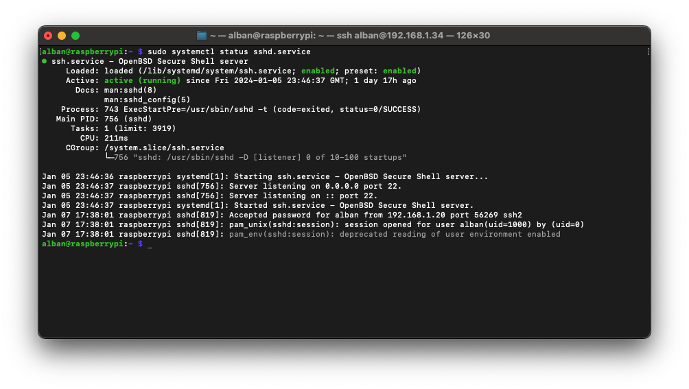

L'accès à distance à votre Raspberry Pi est essentiel pour simplifier la gestion sans avoir besoin d'un écran, d'un clavier et d'une souris. La configuration de l'accès SSH (Secure Shell) est une étape cruciale pour établir une connexion sécurisée avec votre Raspberry Pi.

Comme pour la [configuration du wifi](/fr/posts/raspberry-wifi-config/), vous pouvez configurer une partie des éléments importants du serveur **SSH** avant même le premier démarrage du Raspberry via l'utilitaire **Raspberry Pi Imager**.

## openssh-server

Avant de commencer, assurez-vous que votre **Raspberry Pi** est équipé d'un système d'exploitation compatible. Les systèmes couramment utilisés, tels que **Raspbian**, prennent en charge **SSH** dès l'installation. Assurez-vous également que votre Raspberry Pi est connecté à votre réseau local.
Vous pouvez vérifier le bon fonctionnement du serveur **SSH** de votre **Raspberry** avec la commande suivante :

```bash
sudo systemctl status sshd.service
```

Si le serveur **SSH** fonctionne correctement, la réponse à cette commande doit ressembler à cela :

Si la commande retourne une erreur comme : `Unit sshd.service could not be found.`, il est nécessaire d'installer le serveur **SSH**. Pour cela, les commandes suivantes pourront vous aider :

```bash
sudo apt update
sudo apt upgrade
sudo apt install openssh-server
```

## Activation du SSH

La manière la plus simple d'activer le service SSH est d'utiliser l'outil **raspi-config** de la **Raspberry Foundation**. Pour ce faire, suivez ces étapes :

1. Ouvrez un terminal sur votre Raspberry Pi.
2. Tapez la commande suivante pour ouvrir l'outil de configuration :
   ```bash
   sudo raspi-config
   ```
3. Sélectionnez l'option **Interface Options**.
4. Naviguez jusqu'à **SSH** et appuyez sur **Enter**.
5. Choisissez **Yes** pour activer le service SSH.
6. Appuyez sur **Finish** pour quitter l'outil de configuration.

Pour la suite, vous devez connaître l'adresse **IP** du **Raspberry** sur votre réseau. Pour cela, vous pouvez utiliser l'interface de votre routeur réseau ou la commande suivante sur le **Raspberry**:

```bash
hostname -I | awk '{print $1}'
```

## Connexion SSH depuis un autre appareil

Une fois le service SSH activé, vous pouvez vous connecter à votre Raspberry Pi à partir d'un autre ordinateur sur le même réseau. Utilisez l'adresse IP de votre Raspberry Pi pour établir la connexion SSH. La commande standard est la suivante (remplacez `adresse_ip` par l'adresse réelle) :

```bash
ssh pi@adresse_ip
```

Vous serez invité à entrer le mot de passe par défaut, qui est généralement **raspberry** pour l'utilisateur **pi**.

## Changement du mot de passe par défaut

Il est fortement recommandé de changer le mot de passe par défaut de votre Raspberry Pi pour renforcer la sécurité. Utilisez la commande suivante pour changer le mot de passe de l'utilisateur **pi** :

```bash
passwd
```

Suivez les instructions pour définir un nouveau mot de passe robuste.

## Configuration avancée

Pour des mesures de sécurité, vous pouvez effectuer quelques modifications supplémentaires.

### Utilisation de clés SSH

Utiliser une clé SSH sur votre Raspberry Pi est une excellente pratique pour sécuriser l'accès à distance à votre appareil. Cela élimine la nécessité d'entrer un mot de passe à chaque fois que vous vous connectez via SSH, tout en renforçant la sécurité de votre connexion.

#### Génération de la Paire de Clés

**Sur Votre Ordinateur :**

- Utilisez la commande suivante pour générer une paire de clés :
  ```bash
  ssh-keygen -t rsa
  ```
- Suivez les instructions à l'écran. Appuyez simplement sur `Enter` pour accepter les paramètres par défaut, à moins que vous ne souhaitiez spécifier un emplacement ou un nom de fichier différent.

**Copiez la Clé Publique sur le Raspberry Pi :**

- Utilisez la commande suivante pour copier la clé publique sur votre Raspberry Pi (remplacez `pi` et `adresse_ip` par votre nom d'utilisateur et l'adresse IP de votre Raspberry Pi) :
  ```bash
  ssh-copy-id pi@adresse_ip
  ```
- Vous serez invité à saisir le mot de passe de votre Raspberry Pi.

#### Connexion SSH avec la Clé

Maintenant, vous devriez pouvoir vous connecter à votre Raspberry Pi sans être invité à entrer un mot de passe :

```bash
ssh pi@raspberrypi
```

Vous devriez être connecté sans avoir à saisir de mot de passe.

#### Désactivation de la Connexion par Mot de Passe (Optionnel) :

Pour renforcer la sécurité, vous pouvez désactiver la connexion par mot de passe sur votre Raspberry Pi. Éditez le fichier de configuration SSH :

```bash
sudo nano /etc/ssh/sshd_config
```

Modifiez `PasswordAuthentication yes` en `PasswordAuthentication no`, ensuite redémarrez le service SSH :

```bash
sudo systemctl restart sshd.service
```

### Changement du port SSH

Le port **SSH** par défaut sur tous les serveurs est le port 22. Un changement de ce port permet de rendre plus difficile les attaques automatisées. Pour effectuer cette modification, vous devez éditer le fichier `/etc/ssh/sshd_config` avec les droits administrateurs :

```bash
sudo nano /etc/ssh/sshd_config
```

Vous pouvez ensuite retirer le `#` à la ligne `#Port 22` et changer la valeur 22 par le port de votre choix entre 1024 et 65536. Enregistrez et quittez **nano** avec les raccourcis clavier : `ctrl+o`, `ctrl+x`.

Ensuite, vous devez relancer openssh-server pour appliquer les modifications :

```bash
sudo systemctl restart sshd.service
```

La connexion à votre Raspberry s'effectuera avec un nouveau paramètre pour spécifier le port de connexion (remplacez `pi` par votre nom d'utilisateur, `adresse_ip` par l'adresse IP réelle et `port_de_connexion` par le nouveau port) :

```bash
ssh pi@adresse_ip -p port_de_connexion
```

La configuration du SSH sur votre Raspberry Pi est une étape essentielle pour garantir un accès à distance sécurisé. En suivant ces étapes simples, vous améliorez la gestion de votre Raspberry Pi tout en renforçant la sécurité de votre système. N'hésitez pas à explorer des options avancées pour personnaliser davantage votre configuration SSH en fonction de vos besoins spécifiques.
