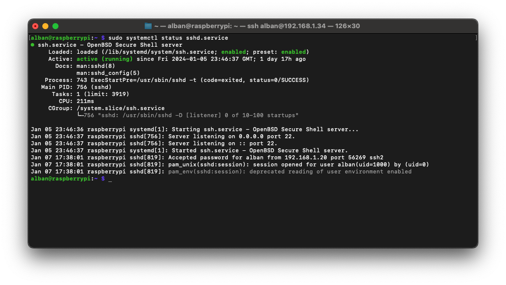

Remote access to your Raspberry Pi is crucial to simplify management without the need for a physical screen, keyboard, or mouse. Configuring SSH (Secure Shell) access is a crucial step in establishing a secure connection with your Raspberry Pi.

Similar to the [Wi-Fi configuration](/fr/posts/raspberry-wifi-config/), you can configure some important elements of the **SSH** server even before the first boot of the Raspberry using the **Raspberry Pi Imager** utility.

## openssh-server

Before you begin, ensure that your **Raspberry Pi** is equipped with a compatible operating system. Commonly used systems like **Raspbian** support **SSH** right from the installation. Also, make sure your Raspberry Pi is connected to your local network.
You can check the proper functioning of the **SSH** server on your **Raspberry** with the following command:
```bash
sudo systemctl status sshd.service
```
If the **SSH** server is working correctly, the response to this command should look like this:

If the command returns an error like: `Unit sshd.service could not be found.`, it is necessary to install the **SSH** server. The following commands can help you with that:
```bash
sudo apt update
sudo apt upgrade
sudo apt install openssh-server
```

## SSH Activation

The easiest way to enable the SSH service is to use the **raspi-config** tool from the **Raspberry Foundation**. To do this, follow these steps:
1. Open a terminal on your Raspberry Pi.
2. Type the following command to open the configuration tool:
   ```bash
   sudo raspi-config
   ```
3. Select the **Interface Options** option.
4. Navigate to **SSH** and press **Enter**.
5. Choose **Yes** to enable the SSH service.
6. Press **Finish** to exit the configuration tool.

For the next steps, you need to know the **IP** address of the **Raspberry** on your network. You can use the interface of your network router or the following command on the **Raspberry**:
```bash
hostname -I | awk '{print $1}'
```

## SSH Connection from Another Device

Once the SSH service is enabled, you can connect to your Raspberry Pi from another computer on the same network. Use the IP address of your Raspberry Pi to establish the SSH connection. The standard command is as follows (replace `address_ip` with the actual address):
```bash
ssh pi@address_ip
```
You will be prompted to enter the default password, which is usually **raspberry** for the **pi** user.

## Changing the Default Password

It is highly recommended to change the default password of your Raspberry Pi to enhance security. Use the following command to change the password for the **pi** user:
```bash
passwd
```
Follow the instructions to set a strong new password.

## Advanced Configuration

For security measures, you can make some additional modifications.

### Use of SSH Keys

Using an SSH key on your Raspberry Pi is an excellent practice to secure remote access to your device. This eliminates the need to enter a password every time you connect via SSH, while enhancing the security of your connection.

#### Key Pair Generation

**On Your Computer:**
   - Use the following command to generate a key pair:
   ```bash
   ssh-keygen -t rsa
   ```
   - Follow the on-screen instructions. Simply press `Enter` to accept the default settings unless you want to specify a different location or filename.

**Copy the Public Key to the Raspberry Pi:**
   - Use the following command to copy the public key to your Raspberry Pi (replace `pi` and `address_ip` with your username and the IP address of your Raspberry Pi):
   ```bash
   ssh-copy-id pi@address_ip
   ```
   - You will be prompted to enter the password for your Raspberry Pi.

#### SSH Connection with the Key

Now you should be able to connect to your Raspberry Pi without being prompted for a password:
```bash
ssh pi@raspberrypi
```
You should be connected without entering a password.

#### Disabling Password Authentication (Optional):

To enhance security, you can disable password authentication on your Raspberry Pi. Edit the SSH configuration file:
```bash
sudo nano /etc/ssh/sshd_config
```
Change `PasswordAuthentication yes` to `PasswordAuthentication no`, then restart the SSH service:
```bash
sudo systemctl restart sshd.service
```

### Changing the SSH Port

The default **SSH** port on all servers is port 22. Changing this port makes automated attacks more difficult. To make this change, edit the `/etc/ssh/sshd_config` file with administrator rights:
```bash
sudo nano /etc/ssh/sshd_config
```
You can then remove the `#` on the line `#Port 22` and change the value 22 to the port of your choice between 1024 and 65536. Save and exit **nano** with the keyboard shortcuts: `ctrl+o`, `ctrl+x`.

Next, you need to restart openssh-server to apply the changes:
```bash
sudo systemctl restart sshd.service
```
Connecting to your Raspberry will be done with a new parameter to specify the connection port (replace `pi` with your username, `address_ip` with the actual IP address, and `port_de_connexion` with the new port):
```bash
ssh pi@address_ip -p port_de_connexion
```

Configuring SSH on your Raspberry Pi is an essential step to ensure secure remote access. By following these simple steps, you enhance the management of your Raspberry Pi while reinforcing the security of your system. Feel free to explore advanced options to further customize your SSH configuration based on your specific needs.
