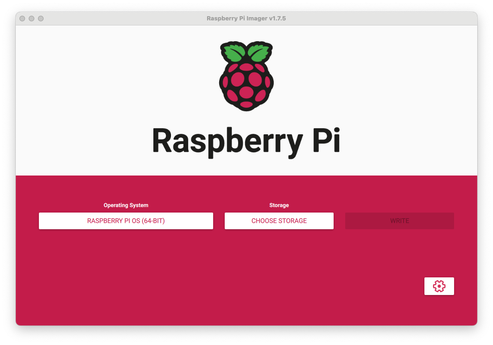
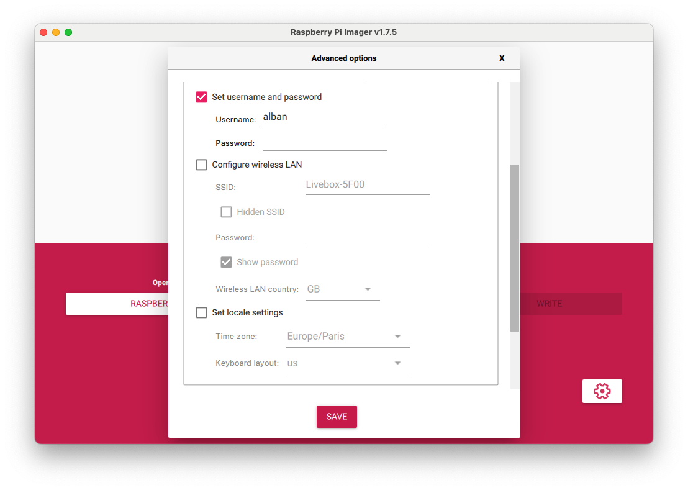
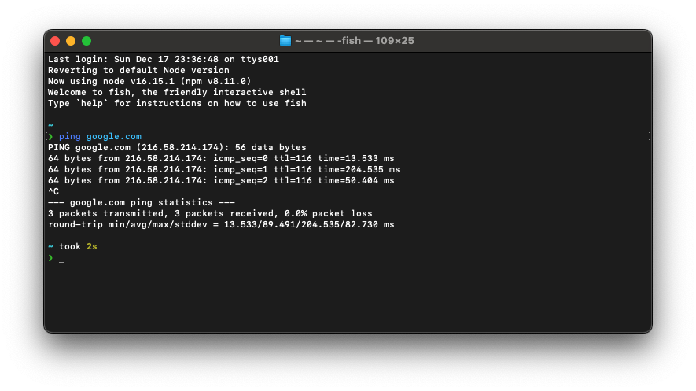
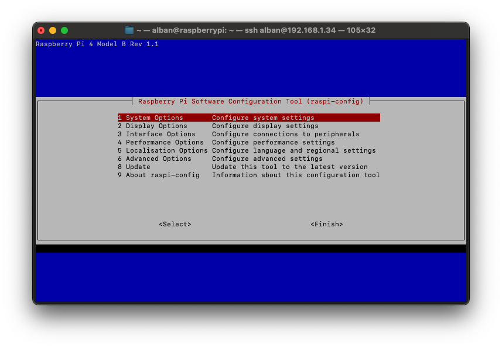
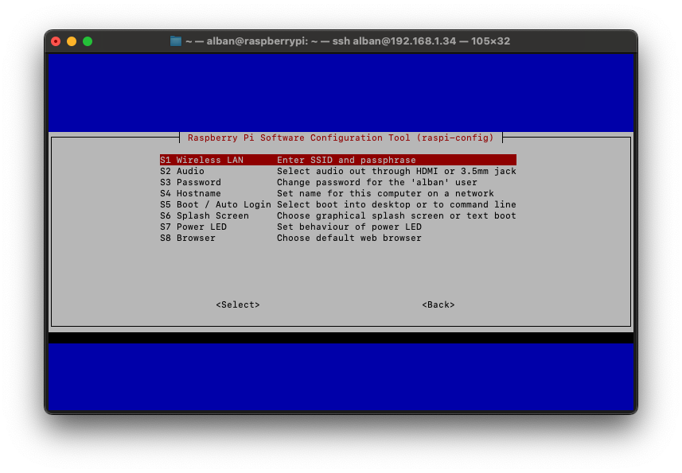
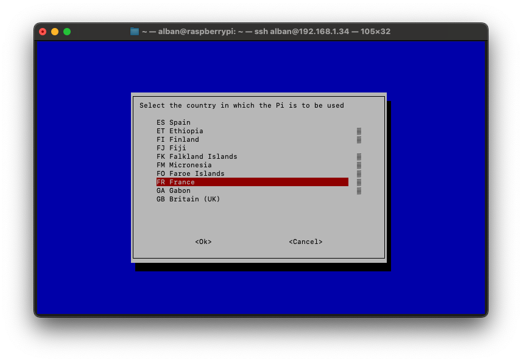
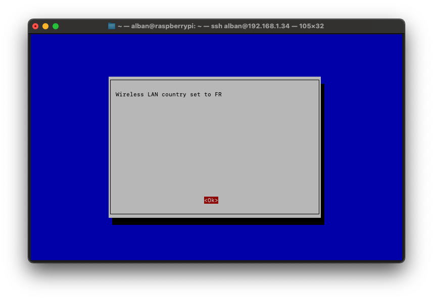
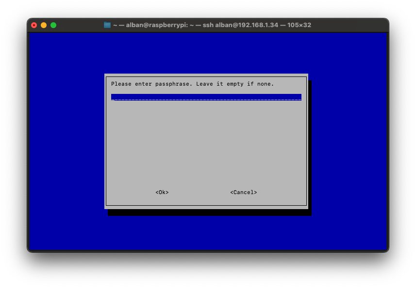

Le Raspberry Pi est un formidable micro-ordinateur qui, grâce à sa polyvalence, est utilisé dans divers projets, de l’automatisation domestique à la création de serveurs personnels. La configuration du WiFi sur ces derniers est presque indispensable pour exploiter au maximum leurs possibilités. Deux grandes options s'offrent aux utilisateurs : la configuration avant ou après le premier démarrage. Il s'agit généralement d'une étape importante, surtout avec l'utilisation de **Raspbian Lite**, qui ne dispose pas d'interface graphique et nécessite une connexion **SSH** pour son utilisation.

## Raspberry Pi Imager

Cette partie concerne donc la configuration du **Wifi** et du **SSH** avant même le premier lancement du Raspberry. Grâce à la [Raspberry Pi Foundation](https://www.raspberrypi.org), il n’est même plus nécessaire d’avoir un clavier et un écran pour cela. Ils nous fournissent un utilitaire disponible sur toutes les plateformes, Windows, Apple et Linux, qui permet de produire des cartes SD fonctionnelles avec de multiples systèmes d’exploitation. En plus de graver pour nous les images des systèmes d’exploitation, cet utilitaire permet même la configuration des éléments les plus importants pour la mise en place d’un **Raspberry**.



Cet utilitaire est disponible en téléchargement directement sur la page des logiciels du site **Raspberry** : [Raspberry Software](https://www.raspberrypi.com/software/). Il suffit de sélectionner le système d’exploitation que vous voulez utiliser et votre périphérique de stockage (carte SD ou USB), puis d’appuyer sur **WRITE** pour lancer l’écriture de l’image sur le périphérique.

### Options avancées

En bas à droite de l’interface, un bouton en forme d’engrenage permet d’accéder aux fonctions avancées de cet utilitaire, au sein de ces fonctions nous pouvons configurer le **SSH**, le nom du **Raspberry** sur le réseau mais aussi les informations nécessaires pour qu’il puisse se connecter sur le réseau **Wifi** :



Il s'agira de remplir : le **SSID**, le mot de passe du réseau, et la localisation du routeur émettant le Wifi. Lors de son premier démarrage et pour tous les suivants le **Raspberry** qui accueille cette carte SD pourra donc se connecter au Wifi via les informations saisies durant la gravure de cette image.

> Le **SSID**, sigle de l'anglais : _service set identifier_ (« identifiant défini de service »), est le nom d'un réseau sans fil selon la norme IEEE 802.11. Ce nom est constitué par une chaîne de caractères de 0 à 32 octets.

## Configuration en ligne de commande

L'application **Raspberry pi imager** permet de configurer le wifi avant même le premier démarrage du Raspberry, mais parfois cette configuration doit être faite après le démarrage, dans ce cas plusieurs possibilités s'offrent à nous : une configuration entièrement manuelle en ligne de commande ou alors l'utilitaire : **Raspi-config**.

### Configuration manuelle

Il est d'abord nécessaire de configurer les interfaces réseaux, pour cela, l’utilitaire d’édition de fichier texte par défaut de **Raspbian**, **nano** nous aidera :

```bash
sudo nano /etc/network/interfaces
```

Ce fichier liste toutes les interfaces réseaux existantes, il ne sera donc probablement pas vide. Il faut ajouter une ligne en haut du fichier :

```bash
auto wlan0
```

Ensuite, il faut permettre au **Raspberry** d'utiliser le Wifi comme méthode de connexion à internet et d'utiliser le fichier de configuration `/etc/wpa_supplicant/wpa_supplicant.conf`. Il faut alors également ajouter à la toute fin du même fichier les lignes de configuration suivantes :

```bash
allow-hotplug wlan0
iface wlan0 inet dhcp
wpa-conf /etc/wpa_supplicant/wpa_supplicant.conf
iface default inet dhcp
```

Il faut ensuite enregistrer les modifications, puis quitter **nano** avec les raccourcis suivants : `ctrl+o`, `ctrl+x`.

La suite de la configuration aura lieu dans le fichier `/etc/wpa_supplicant/wpa_supplicant.conf` :

```bash
sudo nano /etc/wpa_supplicant/wpa_supplicant.conf
```

Ce fichier n'est encore une fois probablement pas vide, il faut ajouter les lignes de configurations suivantes à la fin du fichier (en changeant bien sûr **LE_NOM_DU_RESEAU** et **LE_MOT_DE_PASSE**):

```bash
country=FR
ctrl_interface=DIR=/var/run/wpa_supplicant GROUP=netdev
update_config=1
network={
  ssid="LE_NOM_DU_RESEAU"
  psk="LE_MOT_DE_PASSE"
}
```

De la même façon, il faut enregistrer le fichier et quitter **nano** avec les raccourcis : `ctrl+o`, `ctrl+x`.

Suite à cela, la configuration est normalement fonctionnelle. Un redémarrage permet de le vérifier :

```bash
sudo reboot
```

Pour vérifier la connexion après un redémarrage, un simple `ping` fera l'affaire :

```bash
ping google.com
```

Voici le genre de réponse attendue :



### Raspi-config

La fondation Raspberry met également à disposition un outil pour faciliter ce type de configuration, bien qu'il soit moins complet qu'une configuration manuelle, il est en contrepartie bien plus simple à prendre en main : **Raspi-config**.

```bash
sudo raspi-config
```

Voici l'interface qui s'ouvre à nous, elle permet la configuration de beaucoup de choses, mais ce qui concerne le Wifi est disponible dans: **System Options**, ensuite: **Wireless Lan :**




Raspi-config demande de configurer le pays dans lequel le raspberry sera utilisé :




L'utilitaire demandera ensuite le **SSID** et le **mot de passe** du réseau.




Il suffit maintenant de quitter l'outil pour appliquer la configuration. Le Raspberry se connectera automatiquement à chaque redémarrage.

### Une IP statique ?

L'objectif de ce genre de configuration est généralement d'utiliser le **Raspberry** sans clavier, ni souris : avec une connexion **SSH**. Il est donc intéressant de s'assurer que ce dernier ne va pas changer d'adresse **IP**.

La configuration de l'interface a encore lieu dans **/etc/network/interfaces**:

```bash
sudo nano /etc/network/interfaces
```

Il faut y changer la ligne `iface wlan0 inet dhcp` en `iface wlan0 inet static`, cela va permettre de faire évoluer l'interface `wlan0` de DHCP à static.
Dans ce même fichier il faut ajouter les lignes de configuration suivantes juste avant `wpa-conf /etc/wpa_supplicant/wpa_supplicant.conf`:

```bash
address 192.168.1.155 # IP statique souhaitée
netmask 255.255.255.0
gateway 192.168.1.1   # IP du routeur
```

Le fichier `/etc/network/interfaces` doit normalement ressembler à cela après toutes les configurations :

```bash

auto wlan0

iface lo inet loopback
iface eth0 inet dhcp

allow-hotplug wlan0
iface wlan0 inet static
address 192.168.1.155
netmask 255.255.255.0
gateway 192.168.1.1
wpa-conf /etc/wpa_supplicant/wpa_supplicant.conf
iface default inet dhcp
```

Un redémarrage du Raspberry permet de vérifier le bon fonctionnement de la configuration :

```bash
sudo reboot
```
