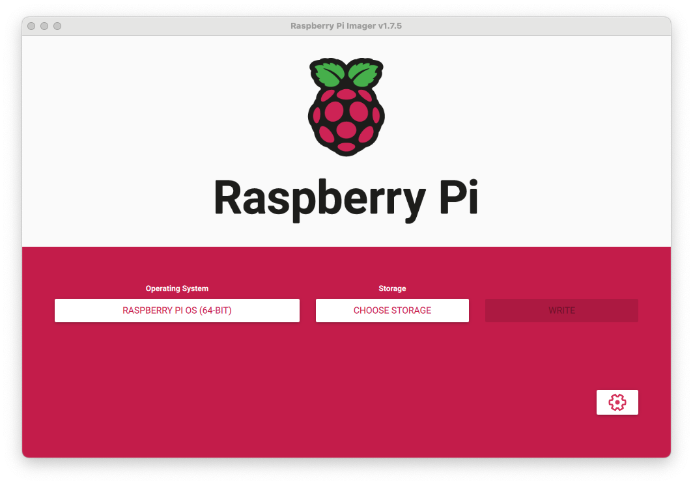
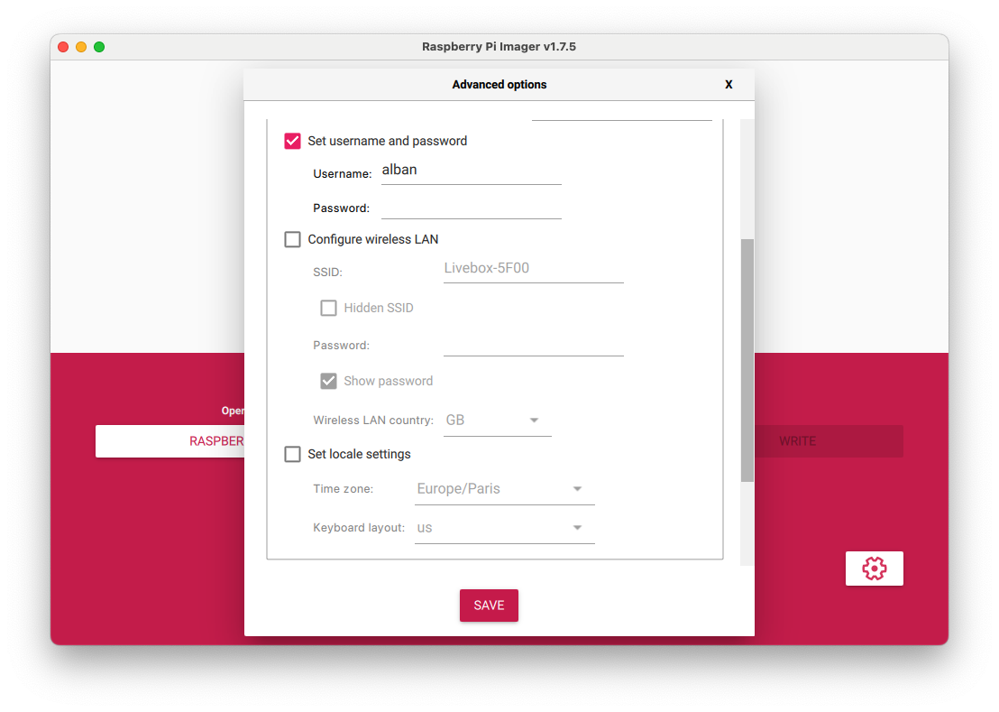
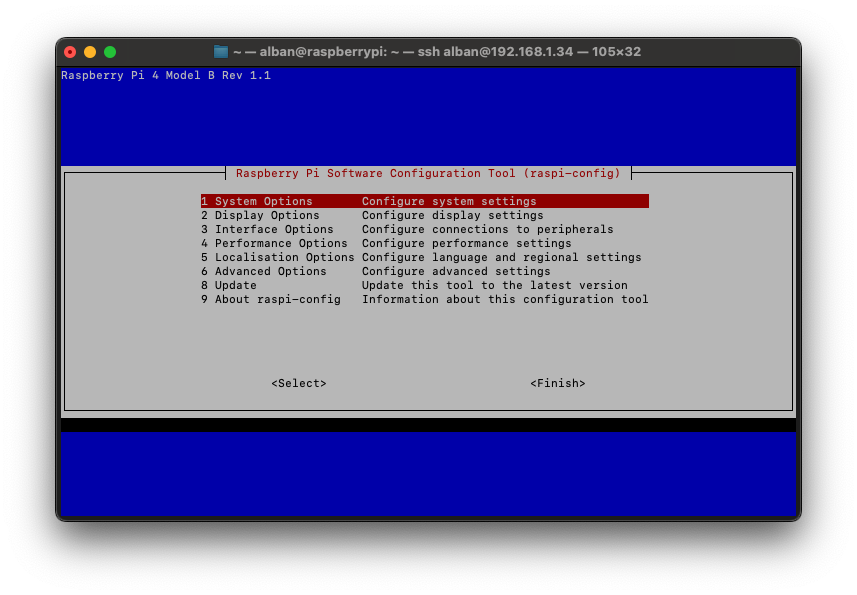
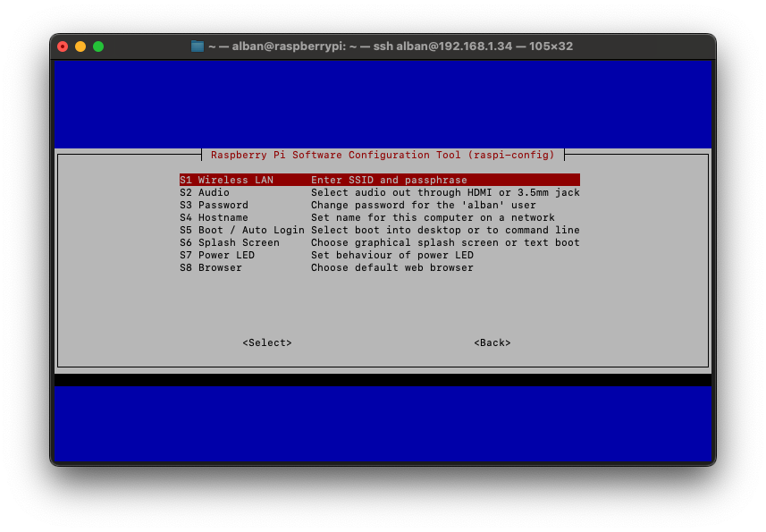
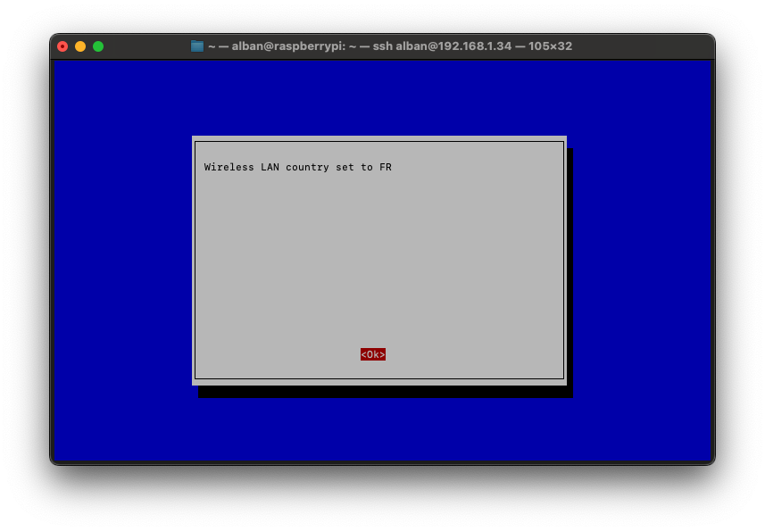
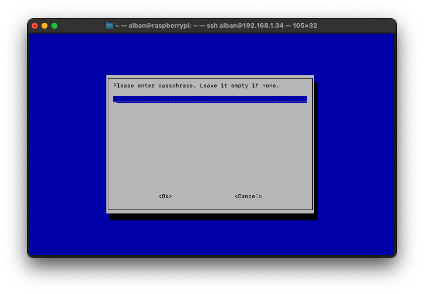

The Raspberry Pi is a fantastic microcomputer that, thanks to its versatility, is used in various projects, from home automation to the creation of personal servers. Configuring WiFi on these devices is almost essential to fully exploit their capabilities. Users have two main options: configuration before or after the first boot. This is generally a crucial step, especially when using **Raspbian Lite**, which lacks a graphical interface and requires an **SSH** connection for usage.

## Raspberry Pi Imager

This section focuses on configuring **Wi-Fi** and **SSH** even before the first Raspberry startup. Thanks to the [Raspberry Pi Foundation](https://www.raspberrypi.org), there's no longer a need for a keyboard and screen. They provide a utility available on all platforms—Windows, Apple, and Linux—that enables the creation of functional SD cards with multiple operating systems. Besides writing OS images, this utility even allows the configuration of essential elements for setting up a **Raspberry Pi**.



You can download this utility directly from the **Raspberry Pi** software page: [Raspberry Software](https://www.raspberrypi.com/software/). Simply select the operating system you want to use and your storage device (SD card or USB), then press **WRITE** to start writing the image to the device.

### Advanced Options

At the bottom right of the interface, a gear-shaped button provides access to the advanced functions of this utility. Within these functions, you can configure **SSH**, the name of the **Raspberry Pi** on the network, and also the necessary information for it to connect to the **Wi-Fi** network:



You'll need to fill in the **SSID**, the network password, and the location of the router emitting the Wi-Fi signal. During its first startup and all subsequent ones, the Raspberry Pi that hosts this SD card will be able to connect to Wi-Fi using the information entered during the image writing.

> The **SSID**, an acronym for _service set identifier_, is the name of a wireless network according to IEEE 802.11 standards. This name consists of a character string of 0 to 32 octets.

## Command Line Configuration

The **Raspberry Pi Imager** application allows configuring Wi-Fi even before the first Raspberry startup. However, sometimes this configuration must be done after startup. In this case, several options are available to us: a fully manual command-line configuration or the utility: **Raspi-config**.

### Manual Configuration

First, it is necessary to configure the network interfaces. For this, the default text file editing utility in **Raspbian**, **nano**, will help us:

```bash
sudo nano /etc/network/interfaces
```

This file lists all existing network interfaces, so it probably won't be empty. Add a line at the top of the file:

```bash
auto wlan0
```

Next, allow the **Raspberry Pi** to use Wi-Fi as the method of connecting to the internet and use the configuration file `/etc/wpa_supplicant/wpa_supplicant.conf`. Also, add the following lines to the end of the same file:

```bash
allow-hotplug wlan0
iface wlan0 inet dhcp
wpa-conf /etc/wpa_supplicant/wpa_supplicant.conf
iface default inet dhcp
```

Save the changes and then exit **nano** with the following shortcuts: `ctrl+o`, `ctrl+x`.

The rest of the configuration takes place in the file `/etc/wpa_supplicant/wpa_supplicant.conf`:

```bash
sudo nano /etc/wpa_supplicant/wpa_supplicant.conf
```

This file is probably not empty either. Add the following configuration lines to the end of the file (making sure to change **NETWORK_NAME** and **PASSWORD**):

```bash
country=US
ctrl_interface=DIR=/var/run/wpa_supplicant GROUP=netdev
update_config=1
network={
  ssid="NETWORK_NAME"
  psk="PASSWORD"
}
```

Similarly, save the file and exit **nano** using the shortcuts: `ctrl+o`, `ctrl+x`.

Following this, the configuration should be operational. A restart will verify it:

```bash
sudo reboot
```

To check the connection after a restart, a simple `ping` will do:

```bash
ping google.com
```

Here's the expected response:


### Raspi-config

The Raspberry Pi Foundation also provides a tool to facilitate this type of configuration. Although it is less comprehensive than manual configuration, it is much simpler to use: **Raspi-config**.

```bash
sudo raspi-config
```

Here's the interface that opens up. It allows configuration for many things, but concerning Wi-Fi, it is available in **System Options**, then **Wireless Lan**:




Raspi-config will then ask to configure the country in which the Raspberry will be used:




The utility will then ask for the **SSID** and **password** of the network.




Now, simply exit the tool to apply the configuration. The Raspberry will connect automatically upon each restart.

### Static IP?

The goal of this kind of configuration is generally to use the Raspberry without a keyboard or mouse, with an **SSH** connection. Therefore, it is essential to ensure that it does not change its **IP** address.

The interface configuration still takes place in **/etc/network/interfaces**:

```bash
sudo nano /etc/network/interfaces
```

Change the line `iface wlan0 inet dhcp` to `iface wlan0 inet static`. This will change the `wlan0` interface from DHCP to static. In the same file, add the following configuration lines just before `wpa-conf /etc/wpa_supplicant/wpa_supplicant.conf`:

```bash
address 192.168.1.155 # Desired static IP
netmask 255.255.255.0
gateway 192.168.1.1   # Router IP
```

The file `/etc/network/interfaces` should now look something like this after all configurations:

```bash

auto wlan0

iface lo inet loopback
iface eth0 inet dhcp

allow-hotplug wlan0
iface wlan0 inet static
address 192.168.1.155
netmask 255.255.255.0
gateway 192.168.1.1
wpa-conf /etc/wpa_supplicant/wpa_supplicant.conf
iface default inet dhcp
```

A restart of the Raspberry will confirm the proper functioning of the configuration:

```bash
sudo reboot
```
