Dans cet article, je vous emmène au cœur de mon dernier projet : un PCB personnalisé conçu autour d'un accéléromètre MEMS. Ce projet, bien que relativement simple dans son application, met en avant un composant électronique fascinant, aussi bien par son fonctionnement interne que par ses applications. Cette carte électronique me servira plus tard dans d'autres expérimentations et projets.

## Accéléromètres MEMS

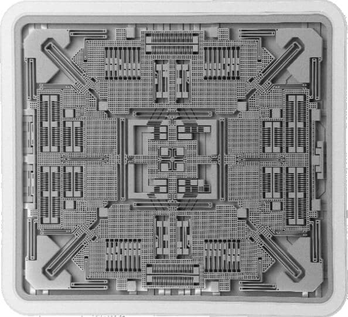

Les accéléromètres MEMS sont des dispositifs compacts qui exploitent la microfabrication pour intégrer des éléments mécaniques, des capteurs et des actionneurs sur une minuscule puce en silicium. Au cœur de ces dispositifs, on trouve une structure MEMS composée de microstructures telles que des poutres ou des porte-à-faux qui réagissent aux forces externes.

### Principe de fonctionnement

Le principe repose sur l'inertie : un objet au repos tend à rester immobile, tandis qu'un objet en mouvement continue dans sa trajectoire sauf s'il est soumis à une force externe. L'accéléromètre MEMS utilise ce concept pour mesurer l'accélération.

À l'intérieur de la structure, une masse suspendue par des poutres flexibles se déplace en réponse aux accélérations. Cette déviation mécanique est ensuite convertie en signal électrique par un capteur capacitif ou piézoélectrique intégré.

### Traduire le mouvement mécanique en signaux électriques

Lorsqu'une accélération est appliquée, la masse bouge, ce qui entraîne une variation de capacité ou génère une tension proportionnelle à la force appliquée. Ce signal est ensuite traité pour fournir une donnée exploitable sur l'accélération subie par l'appareil.

## Conception de la carte électronique

Ce PCB est compact et simple à intégrer dans différents projets. Il comprend un régulateur de tension AP2112 pour assurer une alimentation stable de 3,3V, permettant une compatibilité avec des dispositifs fonctionnant sous 5V, comme les cartes Arduino. Ses dimensions sont de 19mm x 24mm, et il comporte deux connecteurs :
- Un pour l'alimentation en 5V
- Un autre pour la sortie des données analogiques de l'accélération sur les axes X, Y et Z

### Composants principaux

Sur cette carte électronique, il y a deux composants majeurs : le régulateur et l'accéléromètre.

#### AP2112K-3.3

Ce régulateur linéaire en package **SOT-23-5** est extrêmement courant, utilisé dans de nombreuses cartes électroniques à destination des hobbyistes. C'est un régulateur linéaire à faible abaissement proposant une tension fixe, disponible dans de multiples variantes : 1.2V, 1.8V, 2.5V, 2.6V, et 3.3V. Ce projet utilise la version 3.3V. Caractéristiques clés :
- Précision de la tension de sortie : ±1,5%
- Courant de sortie : 600 mA (minimum)
- Protection contre les courts-circuits : 50 mA
- Faible tension de chute (3,3 V) : 250 mV (typ.) @IOUT = 600 mA
- Excellente régulation de charge : 0,2%/A (typ.)
- Faible courant de repos : 55µA (typ.)
- Faible bruit de sortie : 50µVRMS
- PSRR : 100 Hz -65 dB, 1 kHz -65 dB
- Plage de température de fonctionnement : -40°C à +85°C

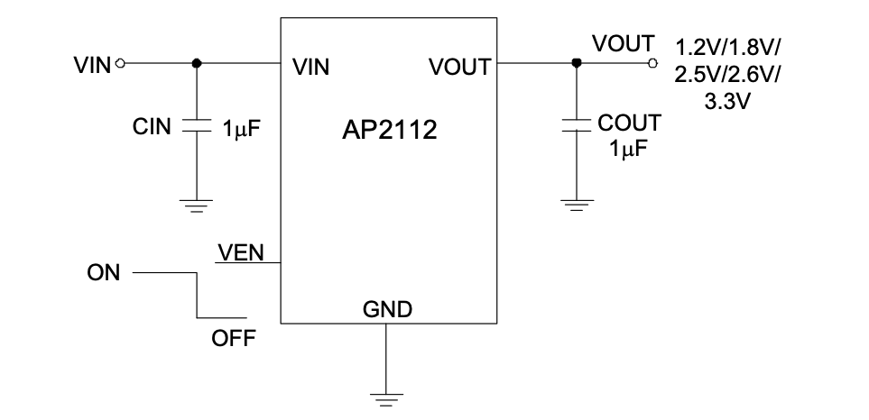

En prime, il est simple de mise en œuvre. Le document de données techniques fourni par le fabricant présente l'ensemble des composants satellites nécessaires à son bon fonctionnement. Il suffira de deux condensateurs de lissage d'une valeur de 1uF sur l'entrée et sur la sortie en tension, et d'une résistance de 100K ohms pour permettre un allumage constant.

#### ADXL335

Le cœur du projet, l'accéléromètre **ADXL335** de la marque **Analog Devices**, dispose d'une sensibilité à la vibration de 3G. Disponible uniquement en format **LFCSP-16**, il présente également des dimensions réduites (4mm x 4mm).

Ce composant dispose de trois sorties analogiques, chacune responsable de fournir l'information d'accélération d'une des trois dimensions. Une résistance de 32K ohms est disposée sur chacune d'entre elles. Ces résistances permettent, via l'ajout d'un condensateur, de créer un filtre passe-bas, réduisant ainsi le bruit sur les données et l'effet de crénelage d'un suréchantillonnage. La valeur minimale conseillée de ces condensateurs est de 4,7nF.

Il est également intéressant de relever que la fréquence utile maximale de chaque axe est différente : 1600Hz pour X et Y, et seulement 500Hz pour Z.

### Liste des composants

| Désignation               | Référence | Quantité | Format     | Fiche technique                           |
| ------------------------- | --------- | -------- | ---------- | ----------------------------------------- |
| ADXL335                   | U1        | 1        | LFCSP-16   | [ADXL335](datasheet-adxl-335.pdf)         |
| AP2112K-3.3               | U2        | 1        | SOT-23-5   | [AP2112](datasheet-ap2112.pdf)            |
| Résistance SMD 100k ohm   | R2        | 1        | 0603       | -                                         |
| Résistance SMD 160 ohm    | R1        | 1        | 0603       | -                                         |
| LED                       | D1        | 1        | 0603       | -                                         |
| Condensateur SMD 1uF      | C4,C5     | 2        | 0603       | -                                         |
| Condensateur SMD 4,7nF    | C1-C3     | 3        | 0603       | -                                         |
| Connecteur d'alimentation | J1        | 1        | JST PH B2B | -                                         |
| Connecteur de signal      | J2        | 1        | JST PH B3B | -                                         |

### Schéma et carte électronique

L'ensemble des fichiers de conception et de fabrication sont disponibles sur [GitHub](https://github.com/albanpetit/adxl335-accelerometer). Voici un rapide descriptif des différentes sections de ce circuit imprimé :

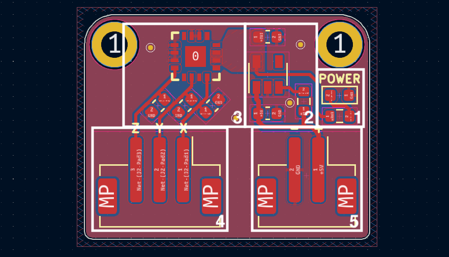 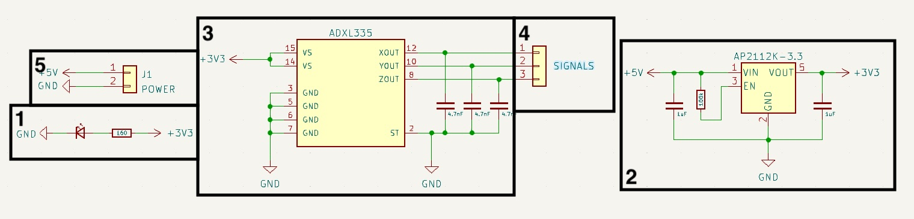

1. Une LED discrète responsable d'afficher l'état d'alimentation de la carte électronique, accompagnée de sa résistance.
2. L'étage d'alimentation de la carte électronique, basé sur l'AP2112K-3.3, avec ses trois condensateurs de lissage.
3. L'accéléromètre MEMS ADXL335, avec ces trois condensateurs, un pour chaque sortie analogique.
4. Le connecteur JST-PH avec trois broches, une pour chaque sortie analogique.
5. Le connecteur JST-PH d'alimentation en 5 volts.

## Fabrication de la carte électronique

<div class="float-left">


</div>

Habitant en France, les fournisseurs habituels (chinois) de cartes électroniques peuvent être relativement onéreux à cause des frais de port. Je me fournis principalement chez [Aisler](https://aisler.net), un fabricant allemand. Efficace, abordable et bien documenté, ils ont toujours honoré mes commandes. Ils ont même un plugin disponible sur **KiCad** pour faciliter la commande, [Aisler push for KiCad](https://github.com/AislerHQ/PushForKiCad).

**Aisler** propose des PCB avec un traitement **ENIG** (Electroless Nickel Immersion Gold), ainsi que la possibilité de faire fabriquer des **stencils** pour faciliter l'application de la crème à braser.

L'utilisation d'un **stencil** donne accès à des solutions pour souder des **PCB** bien plus précisément que les méthodes conventionnelles avec un fer à souder. L'idée est de faire fabriquer pour chaque circuit électronique un pochoir qui permet de déposer de la crème à braser sur les surfaces accueillant plus tard de l'étain. Une fois l'ensemble des composants placés, une plaque chauffante ou un four à refusion peut être utilisé pour faire fondre la crème à braser, il en résulte des points de soudure parfaitement homogènes.

**GreatScott** explique et présente cette méthode dans une de ses vidéos : [Voir sur YouTube — Soudure avec un stencil](https://www.youtube.com/watch?v=QarizoUnRfk)

Voici quelques photos de différentes étapes de cette réalisation :

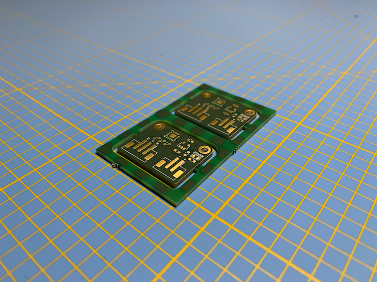 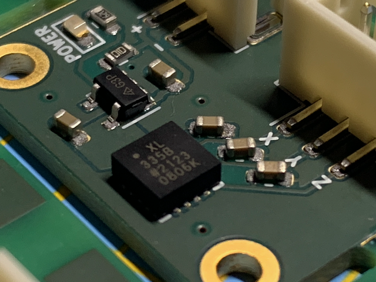 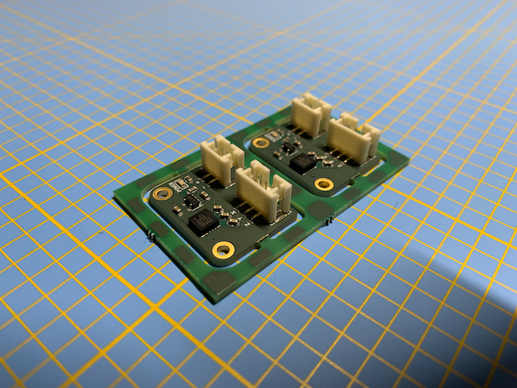

## Mise en œuvre

### Tests initiaux

Une fois la carte électronique en état de fonctionnement, j'ai effectué quelques tests avec un oscilloscope, pour éviter d'essayer d'interfacer une carte électronique dysfonctionnelle avec un microcontrôleur pendant des heures. Accompagné d'un de mes outils préférés, les sondes de mesure **Sensepeek**, les résultats semblent parfaitement cohérents avec la fiche technique de l'**ADXL335**.

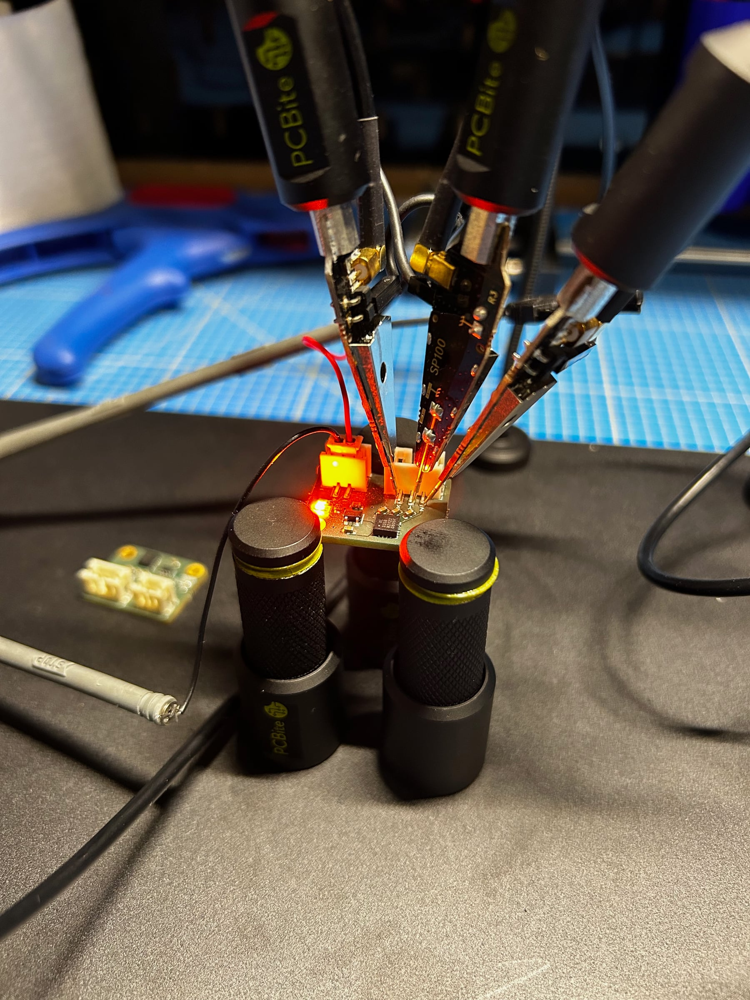 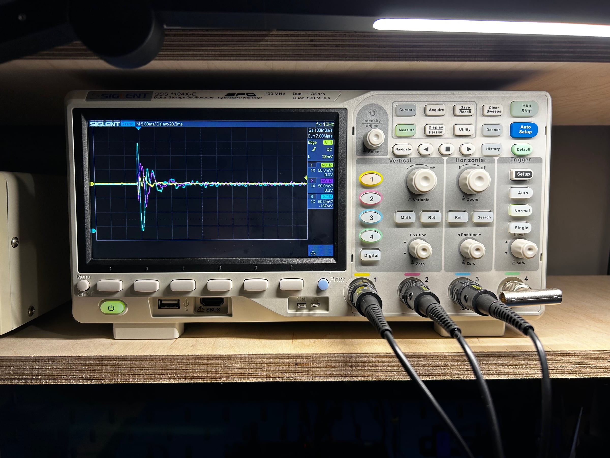 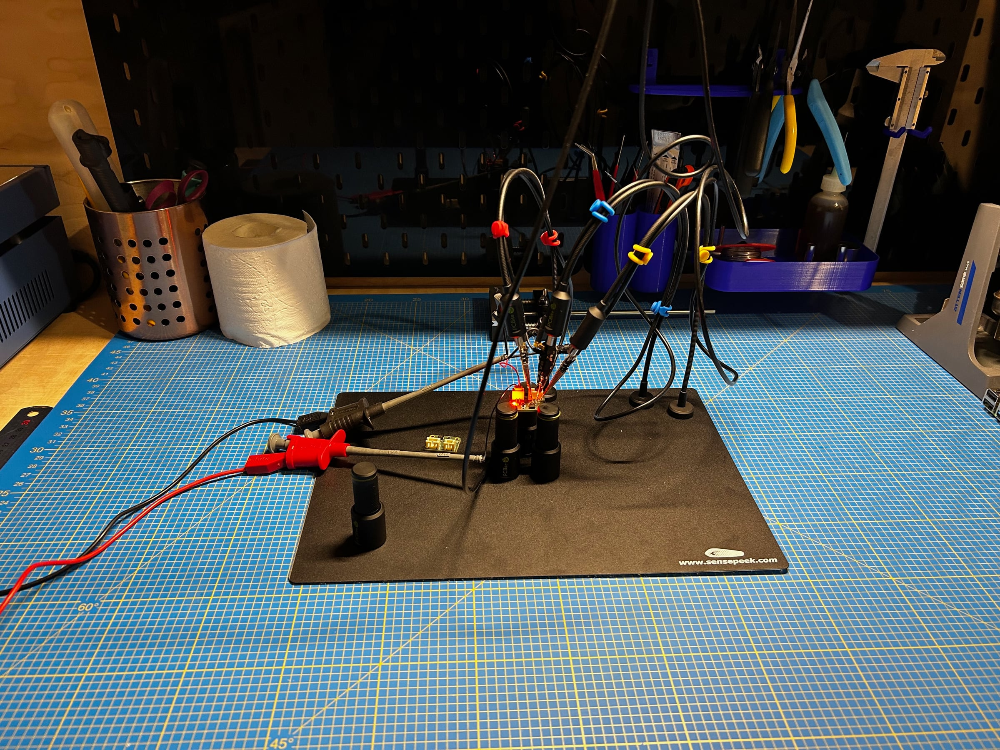

### Raspberry Pi Pico

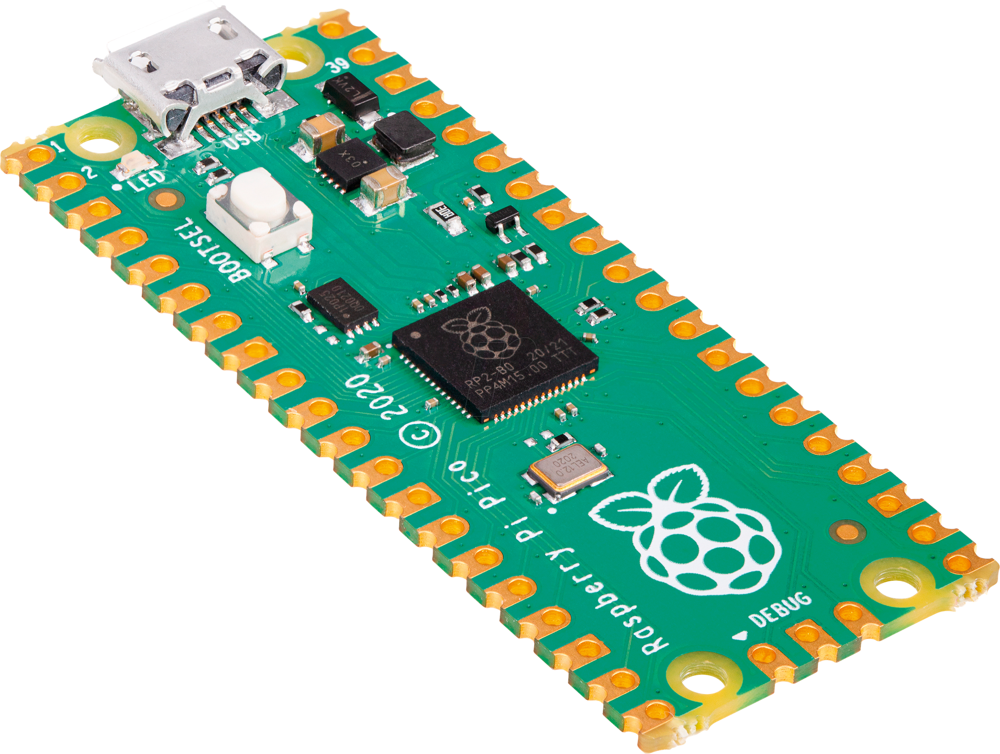

Le Raspberry Pi Pico est une carte électronique accueillant le RP2040, un microcontrôleur d'architecture ARM conçu par la fondation Raspberry Pi. Annoncé en janvier 2021, c'est le premier microcontrôleur développé par la fondation.

Ce microcontrôleur dispose de deux cœurs de 133 MHz, offrant des performances élevées. Le Pico dispose de 264 Ko de mémoire SRAM et de 2 Mo de mémoire flash. Il est équipé de 26 broches d'E/S numériques, dont 3 peuvent être utilisées comme entrées analogiques.

### Branchement

La carte électronique fille doit être alimentée par l'interface **+** et **-** — le **Raspberry Pico** dispose pour cela des interfaces **40** et **38**. Ensuite les sorties **X**, **Y** et **Z** de notre carte doivent être respectivement branchées aux interfaces **31**, **32** et **34** du **Pico**.

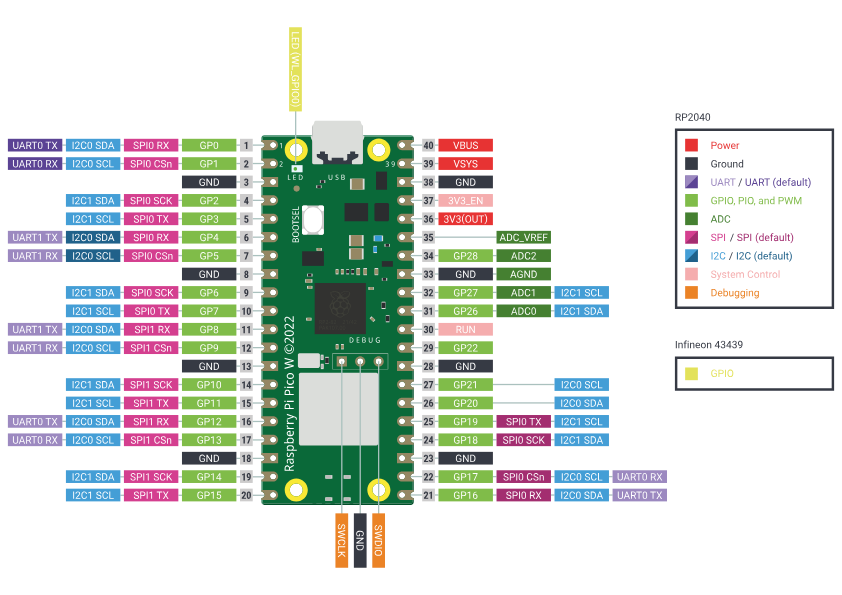

#### Code Arduino

Avant toute chose, le **Pico** n'est pas naturellement disponible dans le logiciel **Arduino** — une installation est nécessaire. Il faut ajouter cette URL dans les préférences d'**Arduino** (*Fichier > Préférences*, option `Gestionnaire de cartes supplémentaires`) :

`https://github.com/earlephilhower/arduino-pico/releases/download/global/package_rp2040_index.json`

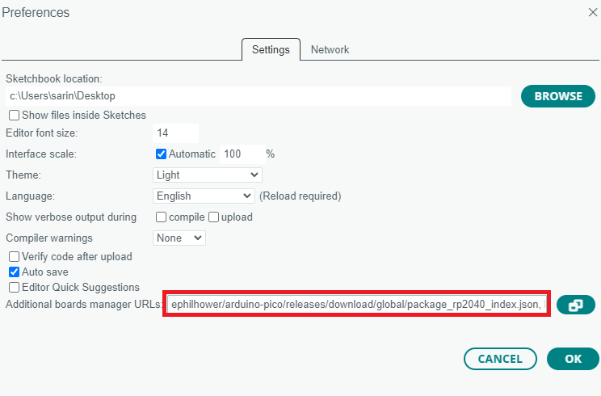

Ensuite, installez la carte via le gestionnaire de cartes :

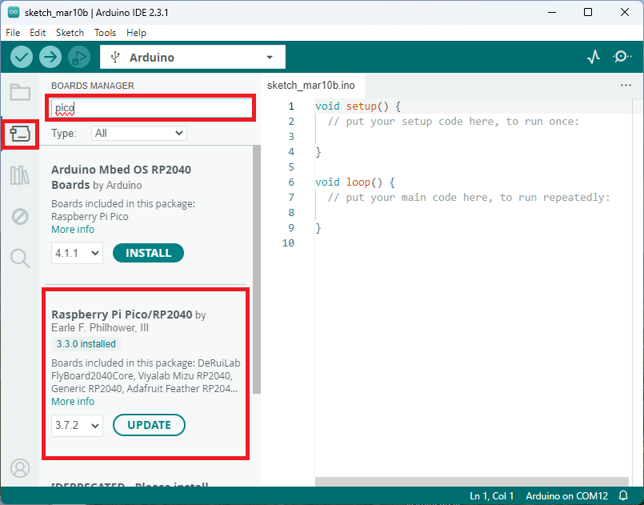

Voici un exemple de script fonctionnel qui relève les valeurs des interfaces analogiques :

```arduino
const int xInput = 26;
const int yInput = 27;
const int zInput = 28;

int RawMin = 0;
int RawMax = 1023;
const int sampleSize = 10;

void setup()
{
  Serial.begin(9600);
}

void loop()
{
  int xRaw = ReadAxis(xInput);
  int yRaw = ReadAxis(yInput);
  int zRaw = ReadAxis(zInput);

  long xScaled = map(xRaw, RawMin, RawMax, -3000, 3000);
  long yScaled = map(yRaw, RawMin, RawMax, -3000, 3000);
  long zScaled = map(zRaw, RawMin, RawMax, -3000, 3000);

  float xAccel = xScaled / 1000.0;
  float yAccel = yScaled / 1000.0;
  float zAccel = zScaled / 1000.0;

  Serial.print("X, Y, Z  :: ");
  Serial.print(xRaw);
  Serial.print(", ");
  Serial.print(yRaw);
  Serial.print(", ");
  Serial.print(zRaw);
  Serial.print(" :: ");
  Serial.print(xAccel, 0);
  Serial.print("G, ");
  Serial.print(yAccel, 0);
  Serial.print("G, ");
  Serial.print(zAccel, 0);
  Serial.println("G");

  delay(200);
}

int ReadAxis(int axisPin)
{
  long reading = 0;
  analogRead(axisPin);
  delay(1);
  for (int i = 0; i < sampleSize; i++)
  {
    reading += analogRead(axisPin);
  }
  return reading / sampleSize;
}
```

L'interface série doit normalement retourner ce genre de valeurs :

```
X, Y, Z  :: 532, 578, 625 :: 0G, 0G, 1G
X, Y, Z  :: 530, 578, 627 :: 0G, 0G, 1G
X, Y, Z  :: 531, 577, 627 :: 0G, 0G, 1G
```

---

## Conclusion

Ce projet m'a permis d'explorer la conception et la fabrication d'une carte intégrant un capteur MEMS. La phase de soudure avec un stencil a été une expérience enrichissante, permettant d'obtenir une qualité de finition professionnelle. Cette carte me servira dans des applications plus avancées, et j'ai déjà quelques idées pour la suite !

Si vous souhaitez récupérer les fichiers de conception, ils sont disponibles sur mon [dépôt GitHub](https://github.com/albanpetit/adxl335-accelerometer). N'hésitez pas à me faire part de vos retours et expériences similaires !
