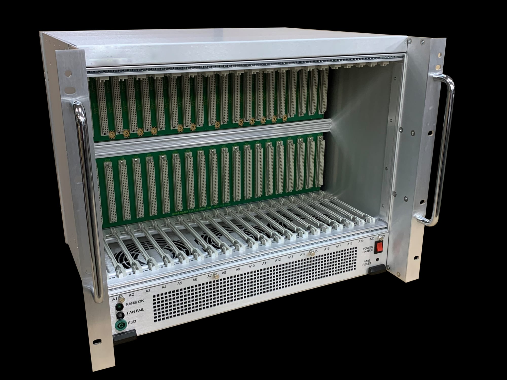
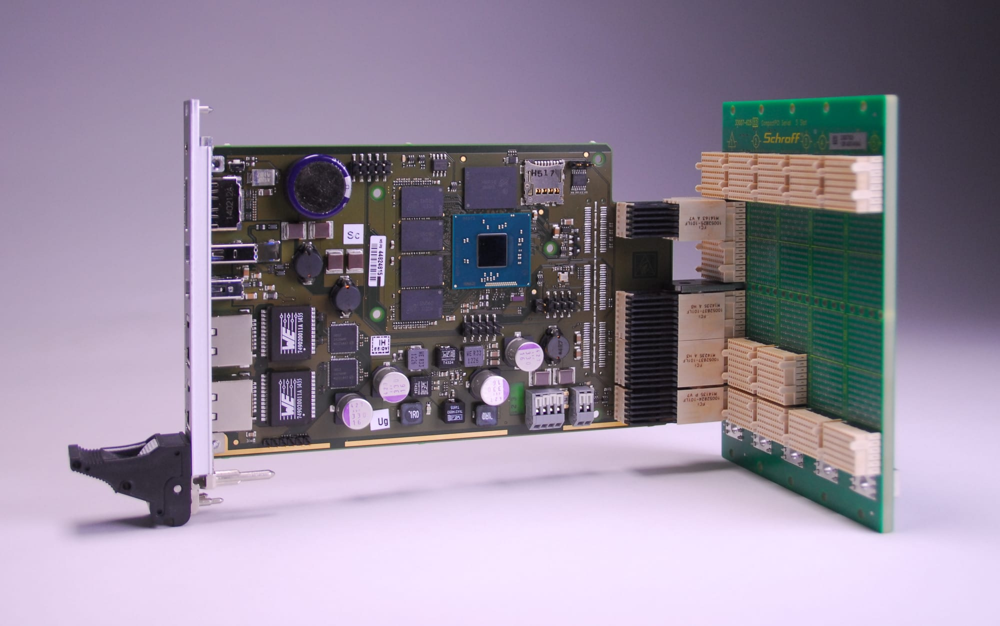
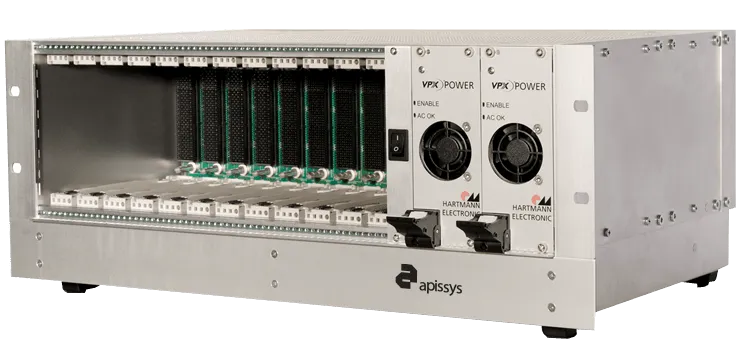
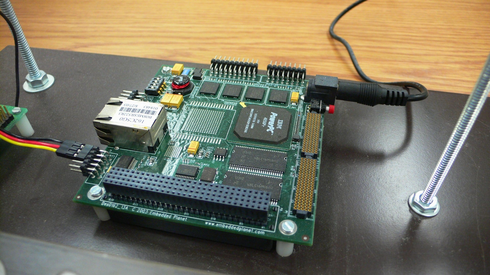
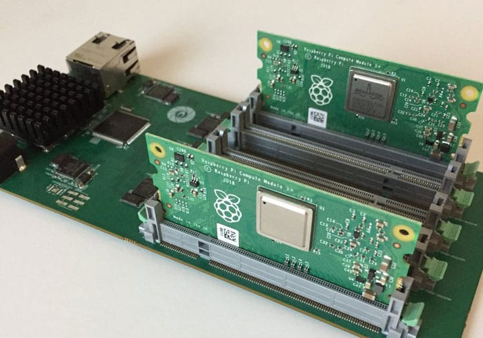
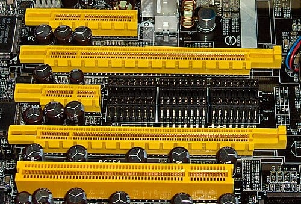

For my robotics projects, I almost always use off-the-shelf development boards. And with every new project, it's the same ritual: pick a board, wire up the motor drivers, the sensors, the power supplies, then start all over again on the next project because the previous board didn't have enough pins, the right connector or the right power supply.

I ended up asking myself a simple question: why not design **my own modular platform**? A backplane board that centralizes power and communication buses, into which daughter boards plug in perpendicularly: a stepper board, a servo board, a sensor board… and even the microcontroller board, so it can be swapped without redoing everything.

This project is called **Axon**. This post is the first in a series: it covers the design phase, what already exists, the ideas I explored, the ones I dropped, and the architecture I settled on. Nothing has been built yet, which is exactly when the structural choices are made.

## What already exists

Before inventing anything, I wanted to see how others had solved this problem. And it has been solved many times, in very different worlds: industry, embedded computing and the maker ecosystem. Each has its strengths, and Axon borrows a lot from them.

### Industrial backplanes

The idea of a passive motherboard into which perpendicular boards plug in is an old one. The **VMEbus**, introduced by Motorola in the early 1980s, is the best-known example: Eurocard-format boards, rugged DIN 41612 connectors, a metal rack with card guides. It is still found today in industrial, scientific and military equipment, proof that the architecture stands the test of time.

Its direct descendant, **CompactPCI**, keeps the same mechanical format but carries a PCI bus. Two of its principles particularly struck me:

- **The "system slot"**: a single slot reserved for the processor board, which drives the bus, and peripheral slots for everything else. That's exactly the role the Soma will play in Axon.
- **Geographical addressing**: each backplane slot has a few hard-wired pins that tell the inserted board its position. This is the direct origin of Axon's SLOT_ID contacts.

CompactPCI also popularized hot-swapping thanks to **contacts of different lengths**: grounds and power connect first, signals last. I'm not aiming for hot-swapping for now, but it's an easy trick to reuse later on the daughter boards.

More recent, **VPX** drops parallel buses in favour of fast serial links and targets very harsh environments (vibration, extreme temperatures). It's overkill for my robots, but it's a reminder of one essential point: **in a system that moves, mechanics matter as much as electronics**. Card guides, board retention, locking: everything industrial racks do very well.

### Stacks: PC/104

At the opposite end from the backplane, **PC/104** (which appeared in the early 1990s) stacks boards on top of each other, linked by pass-through connectors. The format is compact and very rugged, which made it popular in industrial embedded systems and even in robotics. Its successive versions (PC/104-Plus, PCI-104, PCIe/104) also show how a standard can evolve while keeping the same mechanics. The drawback for my use: to change the board in the middle, you have to take the whole stack apart.

### Processor modules: COM and Compute Modules

Another family separates the processor from everything else: a **compute module** that plugs into a **carrier board** designed for the application. **COM Express**, **Qseven** and **SMARC** are the industrial standards of this world. SMARC, for example, uses a 314-contact MXM edge connector. Toradex built its Colibri and Apalis ranges on the same principle, on SO-DIMM and MXM connectors respectively.

On the maker side, the **Raspberry Pi Compute Module** follows the same logic: the first versions used a SO-DIMM memory module connector, later ones high-density board-to-board connectors.

This model convinced me of one thing: **the processor must be swappable**. Microcontrollers evolve quickly, and the backplane must be able to outlive them.

### The maker world

Maker ecosystems have each found their own answer to modularity:

- **mikroBUS** (MikroElektronika) standardizes a 16-pin socket that groups SPI, I²C, UART, an analog input, a PWM, an interrupt, a reset and the power supplies. Each module, called a Click board, uses only what it needs, and there are more than a thousand of them.
- **ClickID**, added by MikroE, puts a small memory on the board, read over 1-Wire through the CS line while reset is held low. It describes the board, which lets a Linux kernel load the right driver automatically. This is the direct inspiration for Axon's identification EEPROM.
- **SparkFun MicroMod** also separates processor and carrier board, using an **M.2** connector for the processor boards. It's the project closest to my original idea, but the boards are mounted flat.
- **Arduino Portenta** places high-density connectors under the board to plug into carrier boards, with the same idea of a swappable core.
- **Feather** (Adafruit) and its **FeatherWings** bet on a common format and stacking.
- **Grove**, **Qwiic** and **STEMMA QT** go for cable daisy-chaining instead: a small 4-pin I²C connector, and modules are linked in series. Unbeatable for prototyping, much less so for carrying current.

### In robotics

Two approaches are particularly interesting for my case:

- **Pixhawk flight controllers** used on drones connect their peripherals (GPS, motor controllers, sensors) over **CAN**, with the DroneCAN protocol. Each peripheral has its own microcontroller and announces itself on the bus.
- **Smart servomotors** such as Dynamixel are daisy-chained on a serial bus and receive position commands rather than PWM signals.

### What I take away

None of these solutions ticks all my boxes. Industrial backplanes are too big and too expensive, stacks impractical to reconfigure, maker ecosystems not designed to carry several amps to motors. But each brings an idea I want to keep:

| Solution | What Axon borrows from it |
|---|---|
| CompactPCI | Dedicated processor slot, geographical addressing of slots |
| VME, VPX | Mechanical ruggedness, board retention |
| COM, Compute Module, MicroMod | Swappable processor |
| mikroBUS | Standardized pinout, shared buses |
| ClickID | Boards that identify themselves |
| Pixhawk, Dynamixel | Sending commands over a bus rather than raw signals |

Axon's requirements sit at the crossroads of all this: perpendicular boards that are easy to swap, current for the motors, a swappable processor, boards that introduce themselves, and a cost compatible with a maker project.

## The false good ideas

The most interesting part of this design phase is everything I ruled out. Here is the path, in order.

### Connecting every microcontroller pin to every connector

The most intuitive idea: each connector receives all the µC's pins, and each daughter board takes what it needs. In practice, it's the model of stacked Arduino shields, with its flaws: two boards driving the same pin create an electrical conflict, each line running to five connectors picks up parasitic capacitance, and you need huge connectors for boards that only use ten pins.

### A dedicated set of pins per connector

Each slot receives its own µC pins, with no sharing. No conflict possible anymore, and thanks to the ESP32's GPIO matrix, any internal peripheral can be assigned to any pin. But the arithmetic is merciless: with ten or so pins per slot, an ESP32 tops out at three slots.

### A GPIO pool and multiplexers

A pool of generic lines running through all the slots, and on each daughter board multiplexers (an I²C expander driving 74HC4051s) to choose which lines to use. It works, it's even rather elegant, but each daughter board becomes more complex and more expensive.

### A routing FPGA

The ultimate version: an FPGA on the backplane, which gives each slot its own pins and generates the real-time signals itself (step pulses, PWM, encoder reading), like the Mesa boards used with LinuxCNC. Very powerful, but a project in its own right.

### One microcontroller per daughter board

The "smart boards" approach, the one of Pixhawk peripherals: a small µC on each daughter board, receiving its commands over a bus. It's very modular, but it multiplies the firmwares to write and maintain. I ruled it out.

## The breakthrough: sharing buses, not pins

The solution finally came from turning the problem around. Instead of sending real-time signals to the daughter boards, I send them **commands over shared buses**: SPI, I²C, CAN. The number of pins used on the µC side becomes almost independent of the number of slots.

The trade-off is that each function must rely on a bus-controlled component. Fortunately, there are some for almost everything in robotics:

- **Steppers**: TMC5072 or TMC5160, over SPI, with a built-in ramp generator. You send them a target position, they produce the pulses themselves.
- **Servos**: PCA9685, 16 PWM outputs over I²C.
- **Encoders**: LS7366R, quadrature counter over SPI.
- **Analog**: ADS1115 over I²C.
- **Inputs/outputs**: PCA9555 or MCP23017.
- **External smart actuators**: directly on the CAN bus.

## Axon's architecture

The naming is inspired by the neuron:

- **Axon**: the backplane, which carries the signals.
- **Soma**: the microcontroller board, the cell body where decisions are made.
- **Synapses**: the daughter boards, connection points with the outside world. Depending on their role, they are **Effectors** (actuators), **Receptors** (sensors) or **Relays** (communication).
- **Nodes**: the slots, a reference to the nodes of Ranvier that punctuate an axon.

The Soma slot plays the same role as CompactPCI's "system slot": it drives all the buses, the Nodes only respond.

The first version will have 4 Nodes and a slot dedicated to the Soma. The backplane itself carries no microcontroller: it distributes power and connects the Soma slot to each Node. The first Soma will be a daughter board built around an ESP32-S3, which can later be replaced by a Soma based on another microcontroller without touching the rest.

## The connector: PCIe x4

I compared several connector formats:

- **PCIe x1** (36 contacts): too tight to carry current while keeping spare pins.
- **M.2**: few guaranteed insertion cycles, and the board is mounted flat.
- **SO-DIMM**: excellent clip latching, but the board lies flat, the pitch is fine and the current per contact low.
- **DIN 41612**, the one used in industrial racks: very rugged, but bulky and more expensive than an edge connector, which only costs a PCB with gold fingers.
- **PCIe x4** (64 contacts): perpendicular board, contacts rated around 1 A, connectors easy to find and cheap, and enough room for power, signals and spare pins.

So PCIe x4 wins, with its key between contacts 11 and 12 naturally separating the **power area** from the **signal area**. The connector is mechanically a PCIe one, but the pinout has nothing in common: a real PCIe card plugged into it would be destroyed. This will be clearly marked on the silkscreen.

### The pinout of a Node

| Contact | Side A | Side B |
|---|---|---|
| 1–4 | VCC | VCC |
| 5–8 | GND | GND |
| 9 | +5 V | +5 V |
| 10 | +3.3 V | +3.3 V |
| 11 | GND | GND |
| *key* | | |
| 12 | GND | SDA (dedicated channel) |
| 13 | SCK | SCL (dedicated channel) |
| 14 | GND | GND |
| 15 | MOSI | MISO |
| 16 | GND | CS (dedicated) |
| 17 | DIO0 (dedicated) | GND |
| 18 | GND | DIO1 (dedicated) |
| 19 | SYNC | INT |
| 20 | RST | GND |
| 21 | CAN_H | CAN_L |
| 22 | GND | GND |
| 23 | SLOT_ID0 | SLOT_ID1 |
| 24 | SLOT_ID2 | GND |
| 25 | Spare (RS-485 A) | Spare (RS-485 B) |
| 26 | GND | GND |
| 27–32 | Spares | Spares |

**VCC** is the unregulated power voltage (battery or power supply, typically 12 to 24 V), for the motors or any other load. With 8 contacts, each Node can draw **6 to 8 A**. Grounds separate VCC from the 5 V and surround each fast signal. The 14 spare contacts are routed to pads: the connector is the one thing you can't change afterwards.

The Soma uses the same connector, marked on the silkscreen. Its power area is identical, with the VCC contacts left unconnected on the Soma side: plug it into the wrong slot and nothing works, but nothing burns either.

## How the buses are handled

**SPI.** SCK, MOSI and MISO are shared. Each Node gets its own **chip select**, straight from the Soma. Each Synapse must release MISO (high impedance) when its CS is inactive.

**I²C.** Two identical boards would have the same I²C addresses. The backplane therefore carries a **TCA9546A** multiplexer that gives each Node its own channel. The Soma selects a Node, then talks to its components. Bonus: a faulty board that locks up its bus only paralyses its own channel.

**CAN.** A transceiver on the backplane, with its termination, to communicate with external actuators.

**INT, RST, SYNC.** On the 4-Node version, each Node has its own interrupt line, open-drain on the board side. RST resets all the boards, and SYNC triggers several actions at the same instant, for example starting several motors simultaneously.

**SLOT_ID.** Three contacts hard-wired to ground or 3.3 V depending on the Node, modelled on CompactPCI's geographical addressing. A Synapse can thus know its position.

## The DIOs: keeping a bit of real time

Routing everything through buses has a limit: some things need a direct pin. Each Node therefore has **two DIOs**, connected to dedicated GPIOs on the Soma. Thanks to the ESP32-S3's GPIO matrix, they can become, as needed, a simple input or output, a PWM, an encoder input, an analog input (if they are connected to ADC1 pins), a fast interrupt, or a **UART** (DIO0 as TX, DIO1 as RX). Since the ESP32-S3 has three hardware UARTs and its console goes through native USB, three Nodes can run as UART at the same time. Enough to plug in a GPS, a lidar, or TMC2209s configured over their single wire.

## Each Synapse introduces itself

Inspired by ClickID, each Synapse carries a **24C02 EEPROM at address 0x50** on its Node's I²C channel. Since each Node has its own channel, all boards use the same address without conflict. At boot, the Soma scans the channels: if the EEPROM answers, a board is present, and its contents give its type, revision and serial number. A dozen bytes are enough to start with, for a few cents' worth of component and no extra pin.

## The GPIO budget of the ESP32-S3 Soma

| Function | GPIO |
|---|---|
| SPI (SCK, MOSI, MISO) | 3 |
| Direct CS (4 Nodes) | 4 |
| I²C to the TCA9546A | 2 |
| CAN (TX, RX) | 2 |
| RST, SYNC | 2 |
| Dedicated INT (4 Nodes) | 4 |
| DIO0 + DIO1 (4 Nodes) | 8 |
| **Total** | **25** |

Once the flash, PSRAM, USB and boot pins are removed, a common ESP32-S3 module leaves about 27 usable GPIOs. It fits, with two pins to spare.

## What about 8 Nodes?

With 8 Nodes, wiring everything would take 41 GPIOs, more than the ESP32-S3 has. So the rule will be: on a future 8-Node backplane, Nodes 4 to 7 will only get the shared buses, with a common interrupt, unless a better-equipped Soma is used, such as an ESP32-P4 (55 GPIOs, but no built-in Wi-Fi or Bluetooth). The key point: **the Synapses stay the same**. Only the backplane wiring changes. That's the whole point of separating the processor from the rest.

## A few rules for designing a Synapse

- All outputs in high impedance at boot, enabled only by the firmware.
- INT open-drain only.
- Series resistors of 100 to 330 Ω on the outputs, to limit the damage in case of a mistake.
- No strong I²C pull-up resistors: they are on the backplane.
- Ideally a single SPI component per board.
- Beyond 6 to 8 A, a separate power terminal block on the board.

On the backplane side, each Node will have its own protection (polyfuse or eFuse) and decoupling, the boards will be held at the top by card guides to withstand vibration, and the emergency stop will cut VCC in hardware, independently of the firmware.

## What's next

Several steps remain before ordering the first PCB:

1. Define the Soma pinout.
2. Freeze the format of the EEPROM descriptor.
3. Prototype on a breadboard with an ESP32-S3, a TCA9546A and one or two test boards, for example a stepper Effector based on the TMC5072 and a servo Effector based on the PCA9685.
4. Draw the 4-Node backplane in KiCad.

See you in part 2 for the prototype, the first measurements and, most likely, a few nasty surprises.
