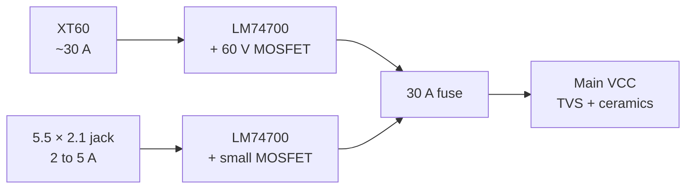
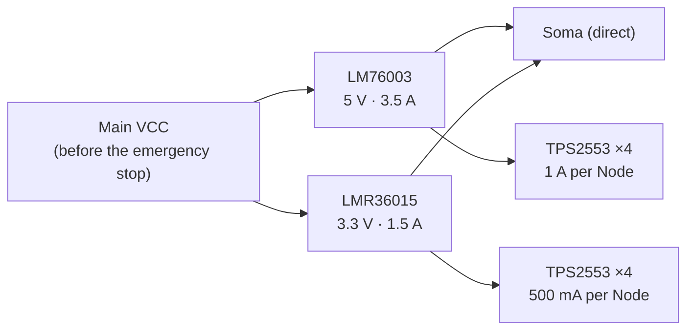
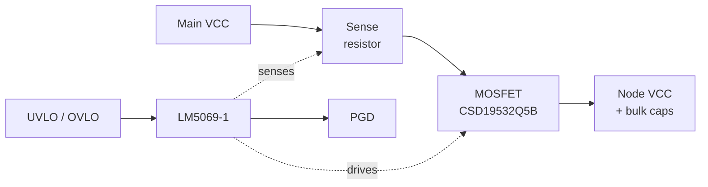
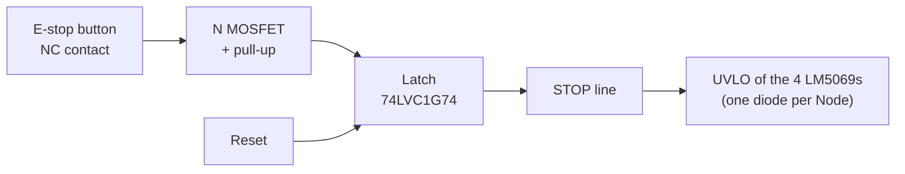
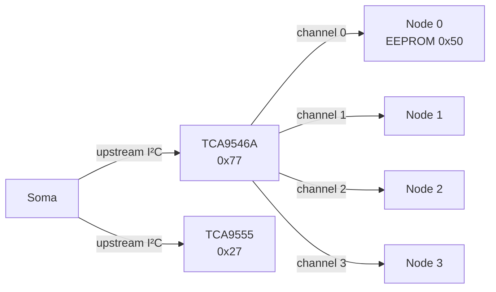
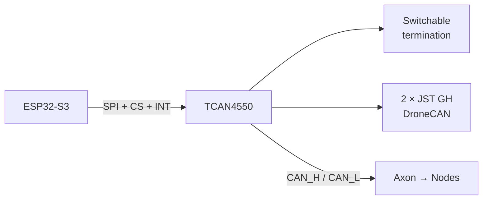

In the [first part](/post/axon-design/), I laid out the architecture of Axon: a backplane with 4 Nodes, microcontroller-free Synapses driven over buses, an interchangeable Soma in its own slot, and a PCIe x4 connector with a custom pinout. What remained was to turn that block diagram into actual electronics.

This second part covers everything on the backplane: power, the protection of each Node, the emergency stop, supervision and the buses. I also go through the calculations behind the choices, and the tools that make them possible. Finally, it is a chance to revisit two decisions from part 1 that did not survive scrutiny.

A quick reminder of the vocabulary:

- **Axon**: the backplane.
- **Soma**: the microcontroller board, in its dedicated slot. The backplane carries no microcontroller.
- **Synapses**: the daughter boards (Effectors for actuators, Receptors for sensors, Relays for communication).
- **Nodes**: the Synapse slots.

## What changed since part 1

**The voltage.** I had mentioned a 12 to 24 V range. I finally settled on **24 V nominal**: a 6S battery (25.2 V fully charged) or a 24 V power supply. It is a standard voltage for many motor drivers, and it keeps the current down for a given power.

**CAN.** I had planned a transceiver on the backplane, connected to the ESP32-S3's built-in CAN controller. The problem: that controller (TWAI) only handles classic CAN, and I want **CAN FD**. So the CAN FD controller moves to the Soma, and the backplane now only carries the differential pair.

## Overview

Here is what sits on the backplane, from the power connector to the Nodes:

| Block | Components |
|---|---|
| Inputs | XT60, 5.5 × 2.1 mm barrel jack |
| Power path | 2 × LM74700 (ideal diodes) |
| Input protection | 30 A fuse, SMCJ33A TVS |
| Logic rails | LM76003 (5 V), LMR36015 (3.3 V) |
| VCC protection per Node | 4 × LM5069-1 + CSD19532Q5B MOSFET |
| 5 V / 3.3 V protection per Node | 8 × TPS2553 |
| Emergency stop | NC button, 74LVC1G74 latch, STOP line |
| Supervision | TCA9555 (16-bit I²C expander) |
| I²C | TCA9546A (one channel per Node) |
| CAN | CAN_H / CAN_L pair to the Nodes |
| Connectors | 5 × PCIe x4 (4 Nodes + Soma) |

I deliberately sourced everything from **Texas Instruments** for the backplane: a single source of documentation, the same calculation tools, and parts that are easy to find.

## Input power

Axon accepts two sources:

- an **XT60** for real operation, with motors;
- a **5.5 × 2.1 mm barrel jack** for the bench, limited to a few amps.

I first thought of the XT30. But with 4 Nodes that can each draw 8 A, the backplane can ask for more than 30 A, while an XT30 is rated for about 15 A continuous. The XT60, with its 30 A, is the right size.

### Ideal diodes rather than diodes

Each input goes through an **LM74700**, an ideal diode controller that drives an external MOSFET. It does two things at once:

- it protects against **reverse polarity**;
- it prevents current from **flowing back into the other input**.

The two outputs are tied together, and whichever source is higher powers the system. Why not plain Schottky diodes? Because at 30 A, a Schottky with a 0.5 V drop would dissipate **15 W**. With a 2 mΩ MOSFET driven by the LM74700, that drops to:

$$
P = I^2 \times R_{DS(on)} = 30^2 \times 0.002 = 1.8\,\mathrm{W}
$$

That is still noticeable: on the XT60 side, it will take a MOSFET with a very low resistance (or two in parallel) and a good copper area. On the jack side, a small MOSFET is enough.

### Fuse and TVS

After the ideal diodes comes a **30 A main fuse**, an automotive blade fuse that is easy to find and replace, then an **SMCJ33A TVS diode** that clamps overvoltages.

### Why everything is rated 60 V

A 24 V bus that powers motors is never really at 24 V. When a motor brakes, it sends energy back and pushes the voltage up; switching creates spikes. The TVS limits those spikes, but a TVS suited to a 24 V bus (33 V standoff voltage) clamps around **50 V**. Everything connected to VCC must therefore withstand that voltage.

That is what made me drop the converters I had first picked:

| Converter | Max voltage | Verdict |
|---|---|---|
| AP63203 / AP63205 | 32 V | Too tight |
| LMR33620 / LMR33630 | 36 V | Too tight |
| **LM76003 / LMR36015** | **60 V** | **Selected** |

The price difference is minimal, the margin is comfortable. Same logic for the MOSFETs (60 V minimum, 100 V on the Nodes) and the capacitors on VCC (50 V minimum, 63 V preferably).

### The spark when plugging in

Anyone who has plugged a big battery into an XT60 knows the spark. It comes from the **bulk capacitors**: when discharged, they behave like a short circuit for an instant, and the inrush current reaches tens of amps. Over time, it damages the contacts.

One could add an anti-spark circuit, or switch to an XT90-S connector with a built-in precharge resistor. I chose something simpler: **no bulk capacitance on the main VCC**. Only the converters' small ceramic capacitors and the TVS remain there. The bulk capacitance moves behind each Node's protection, where it is charged gently. More on that just below.

## Deliberately modest logic rails

First instinct: put big converters on the backplane to power everyone, servos included. Bad idea, for two reasons.

**The connector cannot keep up.** The 5 V and 3.3 V rails only have two contacts each, so about 2 A per rail and per Node.

**Servos disturb the logic.** A standard servo like the MG996R draws 0.5 to 1 A when moving and about 2.5 A when stalled. A few servos starting together on the logic 5 V create voltage drops and noise that can reset the Soma's ESP32.

The principle I settled on: **the backplane's 5 V and 3.3 V are for logic only**. Any heavy load generates its own voltage on its Synapse, from VCC, which offers 6 to 8 A per Node. A servo Synapse will therefore carry its own 5 to 10 A converter.

As a result, the power budget is light:

| Rail | Loads | Realistic budget | Converter |
|---|---|---|---|
| 3.3 V | ESP32-S3 (Wi-Fi peaks ~500 mA), Synapse logic | < 1 A | LMR36015 (1.5 A) |
| 5 V | 5 V sensors and modules (lidar, GPS…) | 1 to 2 A | LM76003 (3.5 A) |

### The duty cycle trap

A buck converter conducts for a fraction of the time equal to the ratio of the voltages. With 24 V in and 3.3 V out:

$$
D = \frac{V_{out}}{V_{in}} = \frac{3.3}{24} \approx 14\,\%
$$

At 2.1 MHz, the period lasts 476 ns, and the on-time would only be about **65 ns**. That is in the range of the minimum on-time of this kind of part: the converter could skip cycles and regulate poorly. At 400 kHz, the same ratio gives about **340 ns**, with a comfortable margin. Both converters will therefore run at around **400 to 500 kHz**, which also improves efficiency (fewer switching losses), at the cost of a slightly larger inductor.

Two other design choices:

- both converters are fed **directly from VCC**: the 3.3 V does not depend on the 5 V, so a failure of one does not take down the other;
- they are fed **before the emergency stop cutoff**: the Soma always stays alive. It is also the only board that does not go through a Node protection: it must never be able to switch itself off.

## Protecting each Node

A Synapse with a short circuit must not bring down the whole robot. Each Node therefore has its own protection, on each of its three rails.

### VCC: one LM5069 per Node

I hesitated between an integrated eFuse, simpler but limited to 6 A, and a controller with an external MOSFET. I chose the **LM5069**, a TI hot-swap controller that drives a 100 V MOSFET. The maximum current then only depends on the MOSFET and the sense resistor: the system can grow.

Here are its settings:

| Setting | Value | Why |
|---|---|---|
| Current limit | 8 A | Node protection threshold |
| Synapse continuous current | 6 A max | Margin on the connector |
| UVLO | ~19 V with hysteresis | ≈ 3.2 V per cell in 6S |
| OVLO | ~28 V | Protects drivers limited to 26–29 V |
| Variant | -1 (latch-off) | No restart on a short circuit |
| MOSFET | CSD19532Q5B, 100 V | Margin and safe operating area |

**The sense resistor.** The LM5069 limits the current when the voltage across this resistor reaches its threshold, around 50 mV. For 8 A:

$$
R = \frac{50\,\mathrm{mV}}{8\,\mathrm{A}} \approx 6\,\mathrm{m\Omega}
$$

A power resistor in a 2512 package, routed for 4-wire (Kelvin) sensing so the trace resistance does not skew the measurement. The exact value will come out of TI's spreadsheet, with the precise threshold from the datasheet.

**MOSFET dissipation.** In steady state, at 8 A and with about 4 mΩ of on-resistance:

$$
P = 8^2 \times 0.004 \approx 0.26\,\mathrm{W}
$$

Nothing to worry about. The real risk lies elsewhere: during startup or a short circuit, the MOSFET sees both a high voltage and a high current, for a brief moment. It must stay within its **safe operating area** (SOA). That is the job of the LM5069's power limiting and fault timer, and it is the main criterion for choosing the MOSFET.

**Why an 8 A limit but 6 A continuous?** The connector's 8 VCC contacts handle about 1 A each, and the current never splits perfectly between them. At 8 A continuous, some contacts would exceed their rating and heat up. The rule for Synapses is therefore **6 A continuous at most**, with the 8 A absorbing peaks, such as motors starting.

**Why an OVLO at 28 V?** Some stepper motor drivers cannot take more than 26 to 29 V: the TMC5072 tops out at 26 V, the TMC2209 at 29 V. The backplane withstands much higher spikes thanks to its 60 V parts, but it cuts the Nodes off before those spikes reach the Synapses. The Synapses do not have to protect themselves.

**Why the -1 variant?** After a fault, the LM5069-1 stays off until it is deliberately reset. The -2 variant retries automatically, which is handy for a transient fault, but causes restart cycles on a real short circuit. On a robot, I would rather a faulty Node stay off.

### Bulk capacitance, behind the protection

This is where the bulk capacitors removed from the input end up: **after the MOSFET of each LM5069**, and on the Synapses themselves, as close as possible to the motor drivers. The LM5069's soft start charges them gently: no more spark, and no voltage drop on the main VCC when a Node starts.

The trade-off: the total capacitance of a Node (backplane plus Synapse) enters the LM5069 startup calculation. A **maximum capacitance per Synapse** will have to be set.

### 5 V and 3.3 V: TPS2553s

For the logic rails, a simple current-limited load switch is enough. One **TPS2553** per rail and per Node:

| Rail | Limit per Node |
|---|---|
| 5 V | 1 A |
| 3.3 V | 500 mA |

It limits the inrush current when a board starts, cuts off on a short circuit, and reports the fault on an open-drain output. The theoretical sum of the limits exceeds what the converters can deliver (4 A for 3.5 A on the 5 V rail, 2 A for 1.5 A on the 3.3 V rail), but actual consumption stays far below it, and each converter has its own protection as a last resort.

## An emergency stop with no extra power parts

My first instinct was a big MOSFET at the head of VCC. But at 24 V and over 30 A, that is an expensive part, which needs a dedicated driver and a lot of copper. Yet each Node already has its own MOSFET, driven by an LM5069… which switches off as soon as its UVLO pin is pulled to ground.

The emergency stop therefore uses a **STOP** line that pulls all the UVLO pins to ground, through one diode per Node. The four LM5069s switch off within a few microseconds, with no software involved.

Two safety rules complete the setup.

**Fail-safe.** The button has a **normally closed** contact, which holds the gate of a small MOSFET at ground. If the button is pressed, but also if a wire breaks or the connector is unplugged, the contact opens, the MOSFET turns on and triggers the stop. A wiring fault never disables the stop: at worst, it stops the robot.

**No restart on release.** A D flip-flop (**74LVC1G74**) latches the stop. Releasing the button is not enough: a deliberate reset is required, from the Soma or from a dedicated button. And as long as the stop button is pressed, the reset has no effect.

The full sequence:

1. Button pressed: STOP goes low, the 4 Nodes are cut off within a few microseconds.
2. The Soma, notified by an interrupt, also clears all its Node enable signals.
3. The button is released: nothing happens, the latch holds the stop.
4. Deliberate reset: STOP is released, which also resets the LM5069-1s.
5. The Nodes stay off until the Soma enables them one by one.

Since the logic rails are not affected, the Soma stays alive throughout and can report the robot's state.

## Supervision: an expander to watch everything

With the LM5069 PGDs, the TPS2553 fault outputs, the emergency stop state and the enable commands, the Soma would have needed about fifteen extra GPIOs. It only had two left.

The solution is a **TCA9555** I²C I/O expander on the backplane:

| I/O | Role |
|---|---|
| 4 outputs | NODE_EN: enables or fully cuts off each Node |
| 4 inputs | LM5069 PGDs |
| 4 inputs | TPS2553 faults (5 V and 3.3 V tied together per Node) |
| 1 input | Emergency stop state |
| 1 output | Emergency stop reset |
| 2 spare | LED, future use |

The **NODE_EN** signal is the trick that made the budget work: a single bit per Node acts on both TPS2553s and on the LM5069's UVLO at once. It fully cuts off a Node, and the same action resets the LM5069 after a fault.

The TCA9555's interrupt output notifies the Soma as soon as a state changes. One could object that an I²C expander is slow. For SPI chip selects, that would be a deal-breaker, and I ruled it out for that use. Here, it does not matter at all: **the protection itself is entirely hardware**, the Soma is only informed, a few hundred microseconds later.

## The startup sequence

Supervision allows an orderly power-up:

1. Power is connected: the converters start, the Soma turns on.
2. The TCA9555 outputs are high impedance at startup; pull resistors hold the **NODE_EN lines inactive**. No Synapse is powered.
3. The Soma enables the Nodes **one by one**, reads each Synapse's EEPROM and checks that it knows the board.
4. Each Node starts on its own: no simultaneous inrush current, and the bulk capacitors charge Node by Node.

One point still needs work: a Synapse's EEPROM is powered by the Node's logic rails, so it can only be read once the Node is enabled. Ideally, the Soma should be able to power a Node's logic, read its descriptor, and only send VCC to a recognised board. I will settle this when drawing the schematic.

## Back to the buses

### I²C: one channel per Node, and an address trap

Each Node has its own I²C channel thanks to the **TCA9546A** multiplexer. Two identical Synapses can thus use the same addresses, and a board that locks up its bus only paralyses its own channel.

But an open channel shares the address space with the upstream bus, where the multiplexer and the TCA9555 live. And the **PCA9685**, which I will use for servos, answers by default to a common address: **0x70**. Exactly the TCA9546A's default address.

| Address | Component | Where |
|---|---|---|
| 0x27 | TCA9555 (supervision) | Backplane, upstream |
| 0x77 | TCA9546A (multiplexer) | Backplane, upstream |
| 0x50 | Identification EEPROM | Each Synapse |
| 0x70 | PCA9685 ALLCALL | Servo Synapse (disabled) |

So I placed the multiplexer and the expander at the highest addresses in their ranges, and added a rule for all Synapses: **0x27 and 0x77 are forbidden**, and the PCA9685's common address is disabled at initialisation. The kind of conflict you would rather discover on paper.

**Pull-up resistors.** Each channel has its own pull-ups, in addition to the upstream ones. Their value is bounded by two constraints, described in TI application note SLVA689:

- **minimum value**, so that the parts can pull the line low (3 mA max at 0.4 V in fast mode):

$$
R_{min} = \frac{3.3 - 0.4}{3\,\mathrm{mA}} \approx 1\,\mathrm{k\Omega}
$$

- **maximum value**, so that the rising edge stays fast enough (300 ns at 400 kHz), with an estimated bus capacitance of 100 pF:

$$
R_{max} = \frac{300\,\mathrm{ns}}{0.8473 \times 100\,\mathrm{pF}} \approx 3.5\,\mathrm{k\Omega}
$$

A value of **2.2 kΩ** sits in the middle of the range.

### SPI: direct chip selects

SCK, MOSI and MISO are shared, and each Node gets its own chip select, straight from the Soma. I looked at a 74HC138 decoder and an I²C expander to save pins, but with 4 Nodes, direct CS lines are simpler and faster.

Two details:

- the **22 to 33 Ω series resistors** on SCK and MOSI, which damp reflections on the lines, must sit as close as possible to the driver, so **on the Soma** and not on the backplane;
- each Synapse must release MISO (high impedance) when its CS is inactive.

### CAN FD on the Soma

For CAN FD, I picked TI's **TCAN4550**: a CAN FD controller and its transceiver in a single package, driven over SPI. It connects to the shared SPI bus with its own chip select and an interrupt, which are exactly the two GPIOs freed by dropping the TWAI.

On the Soma, there will be:

- **two 4-pin JST GH connectors** at the top of the board, with the DroneCAN pinout, the standard for CAN peripherals on drones and robots. Wired in parallel, they let you daisy-chain the bus without a splitter;
- a **split termination** that can be switched on and off;
- dedicated ESD protection (ESD2CAN24).

| JST GH pin | Signal |
|---|---|
| 1 | 5 V |
| 2 | CAN_H |
| 3 | CAN_L |
| 4 | GND |

**Split termination.** A CAN bus must be terminated at both ends with 120 Ω. Rather than a single resistor, you use two 60 Ω resistors in series, with a capacitor of about 4.7 nF between their midpoint and ground. The capacitor filters common-mode noise, which reduces emissions and improves noise immunity: useful with motors nearby. The Soma forms one end of the bus; the other must be terminated at the end of the external cable.

The backplane itself now only carries CAN_H and CAN_L to the Nodes, as a differential pair with short stubs: with CAN FD, the fast data phase is more sensitive to them than classic CAN. And a future Soma with a microcontroller that handles CAN FD natively will only need a transceiver.

## The signals of each Node

| Signal | Type | Detail |
|---|---|---|
| CS | Dedicated | SPI chip select, straight from the Soma |
| SDA / SCL | Dedicated | TCA9546A channel |
| INT | Dedicated | Open drain, pull-up on the backplane |
| DIO0 / DIO1 | Dedicated | GPIO, PWM, encoder, analog or UART |
| SCK, MOSI, MISO | Shared | SPI bus |
| CAN_H / CAN_L | Shared | CAN FD bus |
| RST | Shared | Active low |
| SYNC | Shared | Simultaneous trigger |
| SLOT_ID0–2 | Hard-wired | Node position |

## The final GPIO budget

| Function | GPIO |
|---|---|
| SPI (SCK, MOSI, MISO) | 3 |
| Node CS | 4 |
| TCAN4550 (CS + INT) | 2 |
| Upstream I²C | 2 |
| RST, SYNC | 2 |
| Node INT | 4 |
| Node DIO | 8 |
| TCA9555 INT | 1 |
| **Total** | **26** |

26 GPIOs out of the 27 actually available on an ESP32-S3 module with PSRAM, once the boot, flash, PSRAM and USB pins are set aside. It fits, just barely.

## Identifying the Synapses

Each Synapse carries a 24C02 EEPROM at address 0x50, with a minimal descriptor:

| Bytes | Content |
|---|---|
| 2 | "AX" signature |
| 1 | Format version |
| 2 | Board type |
| 1 | Hardware revision |
| 4 | Serial number |
| 1 | DIO usage |
| 1 | CRC-8 |

That is 12 bytes. The remaining 244 bytes are free for calibration or per-unit parameters.

## The PCB

| Layer | Role |
|---|---|
| 1 | Signals and components |
| 2 | Solid ground |
| 3 | Power planes (VCC, 5 V, 3.3 V) |
| 4 | Signals |

The copper will be **2 oz** on the outer layers (and on the power layer if the manufacturer allows it) to handle the 30 A of VCC, distributed in wide planes to each LM5069. One LED per rail and one LED per Node, driven by its PGD, will show at a glance what is powered.

## Rules for designing a Synapse

All these decisions translate into simple rules for the daughter boards:

- 24C02 EEPROM at 0x50 on the Node's I²C.
- All outputs high impedance at startup.
- MISO high impedance when CS is inactive.
- INT open drain only.
- 100 to 330 Ω series resistors on outputs.
- No strong I²C pull-ups (they are on the backplane).
- I²C addresses 0x27 and 0x77 forbidden.
- 6 A continuous at most on VCC, and VCC guaranteed below 28 V.
- Heavy loads powered by a local converter from VCC.
- Bulk capacitors close to the drivers, within a maximum capacitance.

## Selected components

| Function | Component | Manufacturer |
|---|---|---|
| Ideal diode | LM74700 | TI |
| 5 V converter | LM76003 | TI |
| 3.3 V converter | LMR36015 | TI |
| VCC protection | LM5069-1 | TI |
| Protection MOSFET | CSD19532Q5B | TI |
| 5 V / 3.3 V protection | TPS2553 | TI |
| I²C multiplexer | TCA9546A | TI |
| Supervision | TCA9555 | TI |
| Emergency stop latch | 74LVC1G74 | TI |
| TVS | SMCJ33A | Various |
| CAN FD (Soma) | TCAN4550 | TI |
| CAN ESD (Soma) | ESD2CAN24 | TI |
| µC (Soma) | ESP32-S3 | Espressif |

## Calculation tools

Many of these choices rely on free tools worth knowing:

| Item | Tool |
|---|---|
| Converters | TI WEBENCH Power Designer |
| Node protection | LM5069 design spreadsheet (TI) |
| Simulation | PSpice for TI, LTspice |
| Traces and current | KiCad PCB Calculator, Saturn PCB Toolkit |
| I²C pull-ups | TI application note SLVA689 |
| CAN FD | CAN bit timing calculator |
| Trinamic drivers | TMCL-IDE |
| Emergency stop logic | Falstad Circuit Simulator |

## What I ruled out along the way

- **36 V or 32 V converters**: not enough margin on a 24 V motor bus.
- **The XT30**: too tight for 4 Nodes at 8 A.
- **An integrated eFuse**: limited to 6 A.
- **A global emergency stop MOSFET**: replaced by the LM5069s already in place.
- **An XT90-S anti-spark connector**: unnecessary once the bulk capacitance moved.
- **An expander for the chip selects**: too slow on the data path.
- **The ESP32-S3's CAN controller**: no CAN FD.
- **A TI equivalent of the PCA9685**: TI's PWM controllers are LED drivers, unsuited to servos. NXP's PCA9685 remains the right choice for the servo Synapse.

## What's next

The backplane electronics are nearly frozen. What remains is to define the Soma connector pinout (I will set it during routing), refine the Node enable sequence, run the calculation tools to get the final values, then draw the schematic in KiCad. After that come the first Soma and the two test Synapses: a stepper Effector based on the TMC5072 and a servo Effector based on the PCA9685.

Next step: the schematic, and the first prototype.
