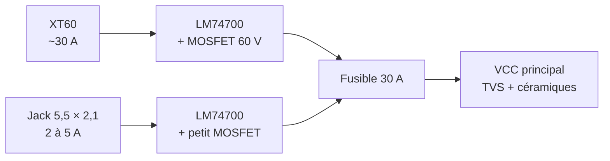
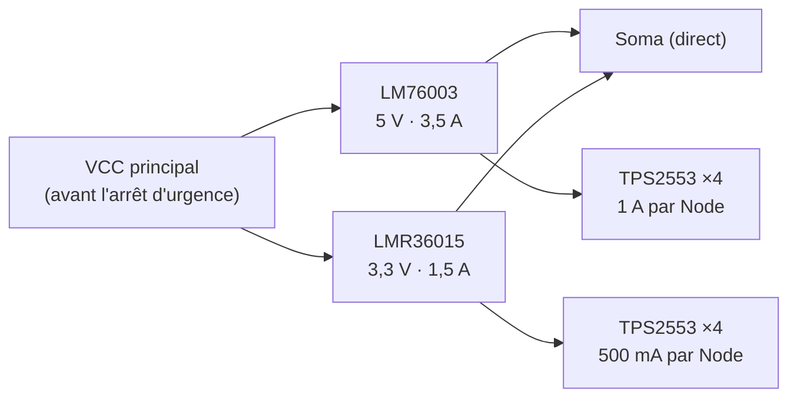
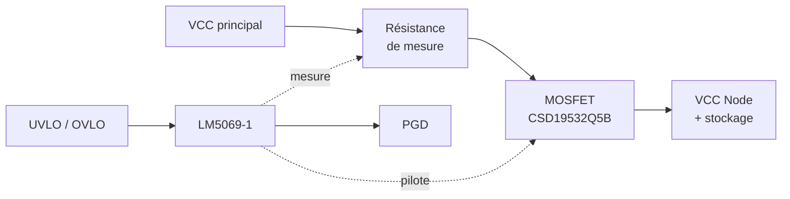
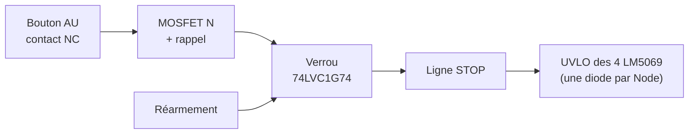
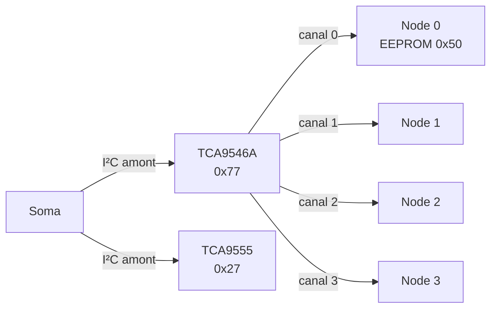
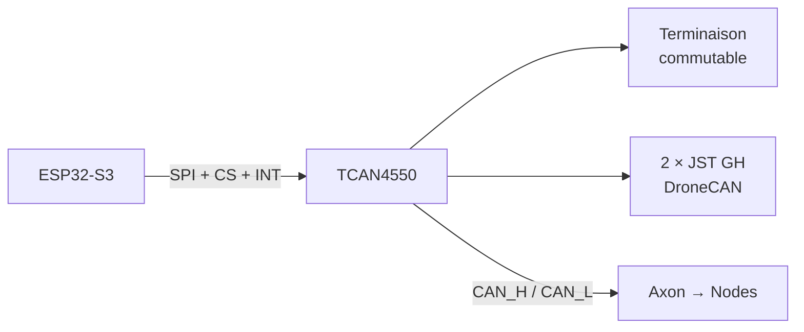

Dans la [première partie](/fr/post/axon-design/), j'ai posé l'architecture d'Axon : un fond de panier à 4 Nodes, des Synapses sans microcontrôleur pilotées par bus, un Soma interchangeable dans son propre emplacement, et un connecteur PCIe x4 au brochage maison. Il restait à transformer ce schéma de principe en électronique concrète.

Cette deuxième partie couvre tout ce qui se trouve sur le fond de panier : l'alimentation, la protection de chaque Node, l'arrêt d'urgence, la supervision et les bus. Je détaille aussi les calculs qui ont guidé les choix, et les outils qui permettent de les faire. C'est enfin l'occasion de revenir sur deux décisions de la partie 1 qui n'ont pas survécu à l'examen.

Petit rappel du vocabulaire :

- **Axon** : le fond de panier.
- **Soma** : la carte microcontrôleur, dans son emplacement dédié. Le fond de panier ne porte aucun microcontrôleur.
- **Synapses** : les cartes filles (Effectors pour les actionneurs, Receptors pour les capteurs, Relays pour la communication).
- **Nodes** : les emplacements des Synapses.

## Ce qui a changé depuis la partie 1

**La tension.** J'avais évoqué une plage de 12 à 24 V. J'ai finalement fixé **24 V nominal** : une batterie 6S (25,2 V chargée) ou une alimentation 24 V. C'est une tension standard pour beaucoup de drivers moteurs, et elle limite le courant pour une puissance donnée.

**Le CAN.** J'avais prévu un transceiver sur le fond de panier, relié au contrôleur CAN intégré de l'ESP32-S3. Problème : ce contrôleur (TWAI) ne gère que le CAN classique, et je veux du **CAN FD**. Le contrôleur CAN FD part donc sur le Soma, et le fond de panier ne transporte plus que la paire différentielle.

## Vue d'ensemble

Voici ce qu'on trouve sur le fond de panier, du connecteur d'alimentation jusqu'aux Nodes :

| Bloc | Composants |
|---|---|
| Entrées | XT60, jack 5,5 × 2,1 mm |
| Power path | 2 × LM74700 (diodes idéales) |
| Protection d'entrée | Fusible 30 A, TVS SMCJ33A |
| Rails logiques | LM76003 (5 V), LMR36015 (3,3 V) |
| Protection VCC par Node | 4 × LM5069-1 + MOSFET CSD19532Q5B |
| Protection 5 V / 3,3 V par Node | 8 × TPS2553 |
| Arrêt d'urgence | Bouton NC, verrou 74LVC1G74, ligne STOP |
| Supervision | TCA9555 (expandeur I²C 16 bits) |
| I²C | TCA9546A (un canal par Node) |
| CAN | Paire CAN_H / CAN_L vers les Nodes |
| Connecteurs | 5 × PCIe x4 (4 Nodes + Soma) |

J'ai volontairement tout choisi chez **Texas Instruments** pour la partie fond de panier : une seule source de documentation, les mêmes outils de calcul, et des composants faciles à trouver.

## L'alimentation d'entrée

Axon accepte deux sources :

- un **XT60** pour le fonctionnement réel, avec des moteurs ;
- un **jack 5,5 × 2,1 mm** pour l'établi, limité à quelques ampères.

J'avais d'abord pensé au XT30. Mais avec 4 Nodes pouvant tirer 8 A chacun, le fond de panier peut demander plus de 30 A, alors qu'un XT30 est prévu pour environ 15 A en continu. Le XT60, avec ses 30 A, est le bon calibre.

### Des diodes idéales plutôt que des diodes

Chaque entrée passe par un **LM74700**, un contrôleur de diode idéale qui pilote un MOSFET externe. Il fait deux choses à la fois :

- il protège contre l'**inversion de polarité** ;
- il empêche le courant de **repartir vers l'autre entrée**.

Les deux sorties sont reliées, et c'est la source la plus haute qui alimente le système. Pourquoi ne pas utiliser de simples diodes Schottky ? Parce qu'à 30 A, une Schottky avec une chute de 0,5 V dissiperait **15 W**. Avec un MOSFET de 2 mΩ piloté par le LM74700, on tombe à :

$$
P = I^2 \times R_{DS(on)} = 30^2 \times 0{,}002 = 1{,}8\,\mathrm{W}
$$

C'est encore sensible : côté XT60, il faudra un MOSFET à très faible résistance (ou deux en parallèle) et une bonne surface de cuivre. Côté jack, un petit MOSFET suffit.

### Fusible et TVS

Derrière les diodes idéales, on trouve un **fusible général de 30 A**, un fusible automobile à lame, facile à trouver et à remplacer, puis une **diode TVS SMCJ33A** qui écrête les surtensions.

### Pourquoi tout en 60 V ?

Un bus 24 V qui alimente des moteurs n'est jamais vraiment à 24 V. Quand un moteur freine, il renvoie de l'énergie et fait monter la tension ; les commutations créent des pointes. La TVS limite ces pointes, mais une TVS adaptée à un bus 24 V (tension de veille de 33 V) écrête autour de **50 V**. Tout ce qui est branché sur VCC doit donc tenir cette tension.

C'est ce qui m'a fait abandonner les convertisseurs que j'avais d'abord retenus :

| Convertisseur | Tension max | Verdict |
|---|---|---|
| AP63203 / AP63205 | 32 V | Trop juste |
| LMR33620 / LMR33630 | 36 V | Trop juste |
| **LM76003 / LMR36015** | **60 V** | **Retenus** |

L'écart de prix est minime, la marge est confortable. Même logique pour les MOSFET (60 V minimum, 100 V sur les Nodes) et les condensateurs sur VCC (50 V minimum, 63 V de préférence).

### L'étincelle au branchement

Tous ceux qui ont branché une grosse batterie sur un XT60 connaissent l'étincelle. Elle vient des **condensateurs de stockage** : déchargés, ils se comportent un instant comme un court-circuit, et le courant d'appel atteint des dizaines d'ampères. À la longue, ça abîme les contacts.

On pourrait ajouter un circuit anti-étincelle, ou passer à un connecteur XT90-S avec résistance de précharge intégrée. J'ai choisi plus simple : **aucun condensateur de stockage sur le VCC principal**. Seuls y restent les petits condensateurs céramiques des convertisseurs et la TVS. Le stockage est déplacé derrière la protection de chaque Node, où il est chargé en douceur. On y vient juste après.

## Des rails logiques volontairement modestes

Première intuition : mettre de gros convertisseurs sur le fond de panier pour alimenter tout le monde, servos compris. Mauvaise idée, pour deux raisons.

**Le connecteur ne suit pas.** Le 5 V et le 3,3 V n'ont que deux contacts chacun, soit environ 2 A par rail et par Node.

**Les servos perturbent la logique.** Un servo standard type MG996R consomme 0,5 à 1 A en mouvement et environ 2,5 A bloqué. Quelques servos qui démarrent ensemble sur le 5 V logique créent des chutes de tension et du bruit capables de faire redémarrer l'ESP32 du Soma.

Le principe retenu : **le 5 V et le 3,3 V du fond de panier ne servent qu'à la logique**. Toute charge lourde génère sa propre tension sur sa Synapse, à partir de VCC, qui dispose de 6 à 8 A par Node. Une Synapse servos embarquera donc son propre convertisseur de 5 à 10 A.

Du coup, le bilan est léger :

| Rail | Consommateurs | Bilan réaliste | Convertisseur |
|---|---|---|---|
| 3,3 V | ESP32-S3 (pics Wi-Fi ~500 mA), logique des Synapses | < 1 A | LMR36015 (1,5 A) |
| 5 V | Capteurs et modules 5 V (lidar, GPS…) | 1 à 2 A | LM76003 (3,5 A) |

### Le piège du rapport cyclique

Un convertisseur abaisseur conduit pendant une fraction du temps égale au rapport des tensions. Avec 24 V en entrée et 3,3 V en sortie :

$$
D = \frac{V_{out}}{V_{in}} = \frac{3{,}3}{24} \approx 14\,\%
$$

À 2,1 MHz, la période dure 476 ns, et le temps de conduction ne serait plus que d'environ **65 ns**. C'est de l'ordre du temps de conduction minimal de ce genre de composant : le convertisseur risquerait de sauter des cycles et de mal réguler. À 400 kHz, le même rapport donne environ **340 ns**, avec une marge confortable. Les deux convertisseurs travailleront donc autour de **400 à 500 kHz**, ce qui améliore aussi le rendement (moins de pertes de commutation), au prix d'une inductance un peu plus grosse.

Deux autres choix de conception :

- les deux convertisseurs sont alimentés **directement par VCC** : le 3,3 V ne dépend pas du 5 V, une panne de l'un n'emporte pas l'autre ;
- ils sont alimentés **avant la coupure d'arrêt d'urgence** : le Soma reste toujours en vie. Il est d'ailleurs le seul à ne pas passer par une protection de Node : il ne doit jamais pouvoir se couper lui-même.

## Protéger chaque Node

Une Synapse en court-circuit ne doit pas faire tomber tout le robot. Chaque Node a donc sa propre protection, sur chacun de ses trois rails.

### VCC : un LM5069 par Node

J'ai hésité entre une eFuse intégrée, plus simple mais limitée à 6 A, et un contrôleur à MOSFET externe. J'ai choisi le **LM5069**, un contrôleur d'insertion à chaud de TI qui pilote un MOSFET 100 V. Le courant maximal ne dépend alors que du MOSFET et de la résistance de mesure : le système peut évoluer.

Voici ses réglages :

| Réglage | Valeur | Pourquoi |
|---|---|---|
| Limite de courant | 8 A | Seuil de protection du Node |
| Courant continu des Synapses | 6 A max | Marge sur le connecteur |
| UVLO | ~19 V avec hystérésis | ≈ 3,2 V par élément en 6S |
| OVLO | ~28 V | Protège les drivers limités à 26–29 V |
| Variante | -1 (verrouillée) | Pas de redémarrage sur court-circuit |
| MOSFET | CSD19532Q5B, 100 V | Marge et zone de fonctionnement sûre |

**La résistance de mesure.** Le LM5069 limite le courant quand la tension aux bornes de cette résistance atteint son seuil, de l'ordre de 50 mV. Pour 8 A :

$$
R = \frac{50\,\mathrm{mV}}{8\,\mathrm{A}} \approx 6\,\mathrm{m\Omega}
$$

Une résistance de puissance en boîtier 2512, routée en mesure 4 fils (Kelvin) pour que la résistance des pistes ne fausse pas la mesure. La valeur exacte sortira du tableur de TI, avec le seuil précis de la datasheet.

**La dissipation du MOSFET.** En régime établi, à 8 A et avec environ 4 mΩ de résistance à l'état passant :

$$
P = 8^2 \times 0{,}004 \approx 0{,}26\,\mathrm{W}
$$

Rien d'inquiétant. Le vrai risque est ailleurs : pendant le démarrage ou un court-circuit, le MOSFET voit à la fois une forte tension et un fort courant, pendant un court instant. Il doit rester dans sa **zone de fonctionnement sûre** (SOA). C'est le rôle de la limitation de puissance du LM5069 et de sa temporisation de défaut, et c'est le critère principal pour choisir le MOSFET.

**Pourquoi 8 A de limite mais 6 A en continu ?** Les 8 contacts VCC du connecteur supportent environ 1 A chacun, et le courant ne s'y répartit jamais parfaitement. À 8 A continus, certains contacts dépasseraient leur valeur nominale et chaufferaient. La règle pour les Synapses est donc de **6 A en continu au maximum**, les 8 A servant à absorber les pointes, comme le démarrage des moteurs.

**Pourquoi un OVLO à 28 V ?** Certains drivers de moteurs pas à pas ne supportent pas plus de 26 à 29 V : le TMC5072 plafonne à 26 V, le TMC2209 à 29 V. Le fond de panier encaisse des pointes bien plus hautes grâce à ses composants 60 V, mais coupe les Nodes avant qu'elles n'atteignent les Synapses. Les Synapses n'ont pas à se protéger elles-mêmes.

**Pourquoi la variante -1 ?** Après un défaut, le LM5069-1 reste coupé jusqu'à un réarmement volontaire. La variante -2 retente automatiquement, ce qui est pratique pour un défaut passager, mais provoque des cycles de redémarrage sur un vrai court-circuit. Sur un robot, je préfère qu'un Node en défaut reste éteint.

### Le stockage, derrière la protection

C'est ici que se trouvent les condensateurs de stockage retirés de l'entrée : **après le MOSFET de chaque LM5069**, et sur les Synapses elles-mêmes, au plus près des drivers moteurs. Le démarrage progressif du LM5069 les charge en douceur : plus d'étincelle, et pas de chute de tension sur le VCC principal quand un Node démarre.

Contrepartie : la capacité totale d'un Node (fond de panier plus Synapse) entre dans le calcul du démarrage du LM5069. Il faudra fixer une **capacité maximale par Synapse**.

### 5 V et 3,3 V : des TPS2553

Pour les rails logiques, un simple interrupteur de charge à limitation de courant suffit. Un **TPS2553** par rail et par Node :

| Rail | Limite par Node |
|---|---|
| 5 V | 1 A |
| 3,3 V | 500 mA |

Il limite l'appel de courant quand une carte démarre, coupe en cas de court-circuit, et signale le défaut sur une sortie à collecteur ouvert. La somme théorique des limites dépasse la capacité des convertisseurs (4 A pour 3,5 A sur le 5 V, 2 A pour 1,5 A sur le 3,3 V), mais la consommation réelle en reste très loin, et le convertisseur a sa propre protection en dernier recours.

## Un arrêt d'urgence sans composant de puissance supplémentaire

Mon premier réflexe était un gros MOSFET en tête de VCC. Mais à 24 V et plus de 30 A, c'est un composant coûteux, qui demande un pilote dédié et beaucoup de cuivre. Or chaque Node a déjà son MOSFET, piloté par un LM5069… qui se coupe dès que sa broche UVLO passe à la masse.

L'arrêt d'urgence utilise donc une ligne **STOP** qui tire toutes les broches UVLO à la masse, à travers une diode par Node. Les quatre LM5069 coupent en quelques microsecondes, sans aucune intervention logicielle.

Deux règles de sécurité complètent le dispositif.

**Sécurité positive.** Le bouton a un contact **normalement fermé**, qui maintient la grille d'un petit MOSFET à la masse. Si on appuie sur le bouton, mais aussi si un fil est coupé ou le connecteur débranché, le contact s'ouvre, le MOSFET conduit et déclenche l'arrêt. Une panne de câblage ne rend jamais l'arrêt inopérant : au pire, elle arrête le robot.

**Pas de redémarrage au relâchement.** Une bascule D (**74LVC1G74**) mémorise l'arrêt. Relâcher le bouton ne suffit pas : il faut un réarmement volontaire, par le Soma ou par un bouton dédié. Et tant que le bouton d'arrêt est enfoncé, le réarmement est sans effet.

Le déroulé complet :

1. Appui sur le bouton : STOP passe à l'état bas, les 4 Nodes sont coupés en quelques microsecondes.
2. Le Soma, prévenu par interruption, coupe aussi tous ses signaux d'activation des Nodes.
3. On relâche le bouton : rien ne se passe, le verrou maintient l'arrêt.
4. Réarmement volontaire : STOP se libère, ce qui réarme au passage les LM5069-1.
5. Les Nodes restent coupés jusqu'à ce que le Soma les réactive un par un.

Comme les rails logiques ne sont pas concernés, le Soma reste en vie pendant tout ce temps et peut signaler l'état du robot.

## La supervision : un expandeur pour tout surveiller

Avec des PGD de LM5069, des sorties de défaut de TPS2553, l'état de l'arrêt d'urgence et des commandes d'activation, le Soma aurait eu besoin d'une quinzaine de GPIO supplémentaires. Il ne lui en restait que deux.

La solution est un expandeur d'E/S I²C **TCA9555** sur le fond de panier :

| E/S | Rôle |
|---|---|
| 4 sorties | NODE_EN : active ou coupe entièrement chaque Node |
| 4 entrées | PGD des LM5069 |
| 4 entrées | Défauts des TPS2553 (5 V et 3,3 V reliés par Node) |
| 1 entrée | État de l'arrêt d'urgence |
| 1 sortie | Réarmement de l'arrêt d'urgence |
| 2 libres | LED, évolutions |

Le signal **NODE_EN** est l'astuce qui a rendu le budget possible : un seul bit par Node agit à la fois sur les deux TPS2553 et sur l'UVLO du LM5069. Il coupe entièrement un Node, et le même geste réarme le LM5069 après un défaut.

La sortie d'interruption du TCA9555 prévient le Soma dès qu'un état change. On pourrait objecter qu'un expandeur I²C est lent. Pour des chip selects SPI, ce serait rédhibitoire, et je l'ai d'ailleurs écarté pour cet usage. Ici, ça n'a aucune importance : **la protection elle-même est entièrement matérielle**, le Soma n'est qu'informé, quelques centaines de microsecondes plus tard.

## La séquence de démarrage

La supervision permet une mise sous tension ordonnée :

1. Branchement de l'alimentation : les convertisseurs démarrent, le Soma s'allume.
2. Les sorties du TCA9555 sont en haute impédance au démarrage ; des résistances de rappel maintiennent les **NODE_EN à l'état inactif**. Aucune Synapse n'est alimentée.
3. Le Soma active les Nodes **un par un**, lit l'EEPROM de chaque Synapse et vérifie qu'il connaît la carte.
4. Chaque Node démarre seul : pas d'appel de courant simultané, et les condensateurs de stockage se chargent Node par Node.

Un point reste à affiner : l'EEPROM d'une Synapse est alimentée par la logique du Node, donc elle n'est lisible qu'une fois le Node activé. Idéalement, le Soma devrait pouvoir allumer la logique d'un Node, lire son descripteur, et n'envoyer VCC qu'à une carte reconnue. Je trancherai ce point au moment du schéma.

## Retour sur les bus

### I²C : un canal par Node et un piège d'adresses

Chaque Node a son propre canal I²C grâce au multiplexeur **TCA9546A**. Deux Synapses identiques peuvent ainsi utiliser les mêmes adresses, et une carte qui bloquerait son bus ne paralyse que son canal.

Mais un canal ouvert partage l'espace d'adresses avec le bus amont, où se trouvent le multiplexeur et le TCA9555. Or le **PCA9685**, que j'utiliserai pour les servos, répond par défaut à une adresse commune : **0x70**. Exactement l'adresse par défaut du TCA9546A.

| Adresse | Composant | Où |
|---|---|---|
| 0x27 | TCA9555 (supervision) | Fond de panier, amont |
| 0x77 | TCA9546A (multiplexeur) | Fond de panier, amont |
| 0x50 | EEPROM d'identification | Chaque Synapse |
| 0x70 | ALLCALL du PCA9685 | Synapse servos (désactivé) |

J'ai donc placé le multiplexeur et l'expandeur aux adresses les plus hautes de leurs plages, et ajouté une règle pour toutes les Synapses : **0x27 et 0x77 sont interdites**, et l'adresse commune du PCA9685 est désactivée à l'initialisation. Le genre de conflit qu'on préfère découvrir sur papier.

**Les résistances de rappel.** Chaque canal a ses propres rappels, en plus de l'amont. Leur valeur est encadrée par deux contraintes, décrites dans la note d'application TI SLVA689 :

- **valeur minimale**, pour que les composants puissent tirer la ligne à l'état bas (3 mA max à 0,4 V en mode rapide) :

$$
R_{min} = \frac{3{,}3 - 0{,}4}{3\,\mathrm{mA}} \approx 1\,\mathrm{k\Omega}
$$

- **valeur maximale**, pour que le front montant reste assez rapide (300 ns à 400 kHz), avec une capacité de bus estimée à 100 pF :

$$
R_{max} = \frac{300\,\mathrm{ns}}{0{,}8473 \times 100\,\mathrm{pF}} \approx 3{,}5\,\mathrm{k\Omega}
$$

Une valeur de **2,2 kΩ** tombe au milieu de la plage.

### SPI : des chip selects directs

SCK, MOSI et MISO sont partagés, et chaque Node reçoit son propre chip select, directement depuis le Soma. J'ai étudié un décodeur 74HC138 et un expandeur I²C pour économiser des broches, mais avec 4 Nodes, les CS directs sont plus simples et plus rapides.

Deux détails :

- les **résistances série de 22 à 33 Ω** sur SCK et MOSI, qui amortissent les réflexions sur les lignes, doivent être au plus près de l'émetteur, donc **sur le Soma** et non sur le fond de panier ;
- chaque Synapse doit libérer MISO (haute impédance) quand son CS est inactif.

### CAN FD sur le Soma

Pour le CAN FD, j'ai retenu le **TCAN4550** de TI : un contrôleur CAN FD et son transceiver dans un seul boîtier, pilotés en SPI. Il se branche sur le SPI partagé avec son propre chip select et une interruption, soit exactement les deux GPIO libérés par l'abandon du TWAI.

Sur le Soma, on trouvera :

- **deux connecteurs JST GH 4 broches** en haut de la carte, au brochage DroneCAN, le standard des périphériques CAN pour drones et robots. Branchés en parallèle, ils permettent de chaîner le bus sans répartiteur ;
- une **terminaison scindée commutable** par interrupteur ;
- une protection ESD dédiée (ESD2CAN24).

| Broche JST GH | Signal |
|---|---|
| 1 | 5 V |
| 2 | CAN_H |
| 3 | CAN_L |
| 4 | GND |

**La terminaison scindée.** Un bus CAN doit être terminé à ses deux extrémités par 120 Ω. Plutôt qu'une seule résistance, on en met deux de 60 Ω en série, avec un condensateur d'environ 4,7 nF entre leur point milieu et la masse. Le condensateur filtre le mode commun, ce qui réduit les émissions et améliore la tenue au bruit : utile avec des moteurs à proximité. Le Soma forme une extrémité du bus ; l'autre doit être terminée au bout du câble externe.

Le fond de panier, lui, ne transporte plus que CAN_H et CAN_L vers les Nodes, en paire différentielle et en dérivations courtes : en CAN FD, la phase de données rapide y est plus sensible qu'en CAN classique. Et un futur Soma avec un microcontrôleur qui gère nativement le CAN FD n'aura besoin que d'un transceiver.

## Les signaux de chaque Node

| Signal | Type | Détail |
|---|---|---|
| CS | Dédié | Chip select SPI, direct depuis le Soma |
| SDA / SCL | Dédié | Canal du TCA9546A |
| INT | Dédié | Collecteur ouvert, rappel sur le fond de panier |
| DIO0 / DIO1 | Dédiés | GPIO, PWM, codeur, analogique ou UART |
| SCK, MOSI, MISO | Partagés | Bus SPI |
| CAN_H / CAN_L | Partagés | Bus CAN FD |
| RST | Partagé | Actif bas |
| SYNC | Partagé | Déclenchement simultané |
| SLOT_ID0–2 | Câblés | Position du Node |

## Le budget GPIO final

| Fonction | GPIO |
|---|---|
| SPI (SCK, MOSI, MISO) | 3 |
| CS des Nodes | 4 |
| TCAN4550 (CS + INT) | 2 |
| I²C amont | 2 |
| RST, SYNC | 2 |
| INT des Nodes | 4 |
| DIO des Nodes | 8 |
| INT du TCA9555 | 1 |
| **Total** | **26** |

26 GPIO sur les 27 réellement disponibles d'un module ESP32-S3 avec PSRAM, une fois écartées les broches de démarrage, de flash, de PSRAM et d'USB. Ça passe, de justesse.

## L'identification des Synapses

Chaque Synapse porte une EEPROM 24C02 à l'adresse 0x50, avec un descripteur minimal :

| Octets | Contenu |
|---|---|
| 2 | Signature « AX » |
| 1 | Version du format |
| 2 | Type de carte |
| 1 | Révision matérielle |
| 4 | Numéro de série |
| 1 | Usage des DIO |
| 1 | CRC-8 |

Soit 12 octets. Les 244 octets restants sont libres pour de la calibration ou des paramètres propres à chaque exemplaire.

## Le PCB

| Couche | Rôle |
|---|---|
| 1 | Signaux et composants |
| 2 | Masse pleine |
| 3 | Plans de puissance (VCC, 5 V, 3,3 V) |
| 4 | Signaux |

Le cuivre sera en **2 oz** sur les couches externes (et sur la couche de puissance si le fabricant le permet) pour encaisser les 30 A de VCC, distribués en larges plans jusqu'à chaque LM5069. Une LED par rail et une LED par Node, pilotée par son PGD, permettront de voir d'un coup d'œil ce qui est alimenté.

## Les règles pour concevoir une Synapse

Toutes ces décisions se traduisent en règles simples pour les cartes filles :

- EEPROM 24C02 à 0x50 sur l'I²C du Node.
- Toutes les sorties en haute impédance au démarrage.
- MISO en haute impédance quand CS est inactif.
- INT uniquement en collecteur ouvert.
- Résistances série de 100 à 330 Ω sur les sorties.
- Pas de rappels I²C forts (ils sont sur le fond de panier).
- Adresses I²C 0x27 et 0x77 interdites.
- 6 A en continu au maximum sur VCC, et VCC garanti sous 28 V.
- Charges lourdes alimentées par un convertisseur local depuis VCC.
- Condensateurs de stockage près des drivers, avec une capacité maximale à respecter.

## Les composants retenus

| Fonction | Composant | Fabricant |
|---|---|---|
| Diode idéale | LM74700 | TI |
| Convertisseur 5 V | LM76003 | TI |
| Convertisseur 3,3 V | LMR36015 | TI |
| Protection VCC | LM5069-1 | TI |
| MOSFET de protection | CSD19532Q5B | TI |
| Protection 5 V / 3,3 V | TPS2553 | TI |
| Multiplexeur I²C | TCA9546A | TI |
| Supervision | TCA9555 | TI |
| Verrou d'arrêt d'urgence | 74LVC1G74 | TI |
| TVS | SMCJ33A | Divers |
| CAN FD (Soma) | TCAN4550 | TI |
| ESD CAN (Soma) | ESD2CAN24 | TI |
| µC (Soma) | ESP32-S3 | Espressif |

## Les outils de calcul

Beaucoup de ces choix reposent sur des outils gratuits qu'il faut connaître :

| Élément | Outil |
|---|---|
| Convertisseurs | TI WEBENCH Power Designer |
| Protection des Nodes | Tableur de conception du LM5069 (TI) |
| Simulation | PSpice for TI, LTspice |
| Pistes et courant | KiCad PCB Calculator, Saturn PCB Toolkit |
| Rappels I²C | Note d'application TI SLVA689 |
| CAN FD | Calculateur de bit timing CAN |
| Drivers Trinamic | TMCL-IDE |
| Logique d'arrêt d'urgence | Falstad Circuit Simulator |

## Ce que j'ai écarté en chemin

- **Des convertisseurs 36 V ou 32 V** : pas assez de marge sur un bus 24 V moteurs.
- **Le XT30** : trop juste pour 4 Nodes à 8 A.
- **Une eFuse intégrée** : limitée à 6 A.
- **Un MOSFET global d'arrêt d'urgence** : remplacé par les LM5069 déjà présents.
- **Un connecteur anti-étincelle XT90-S** : inutile une fois le stockage déplacé.
- **Un expandeur pour les chip selects** : trop lent sur le chemin des données.
- **Le contrôleur CAN de l'ESP32-S3** : pas de CAN FD.
- **Un équivalent TI du PCA9685** : les contrôleurs PWM de TI sont des drivers de LED, inadaptés aux servos. Le PCA9685 de NXP reste la bonne référence pour la Synapse servos.

## La suite

L'électronique du fond de panier est presque figée. Il reste à définir le brochage du connecteur du Soma (je le fixerai au moment du routage), à affiner la séquence d'activation des Nodes, à faire tourner les outils de calcul pour obtenir les valeurs définitives, puis à dessiner le schéma dans KiCad. Viendront ensuite le premier Soma et les deux Synapses de test : une Effector stepper à base de TMC5072 et une Effector servos à base de PCA9685.

Prochaine étape : le schéma, et le premier prototype.