PaperFlux is a small connected object that, once a week, prints a summary of my GitHub activity on a receipt: stars, followers, commits from the last seven days, top languages and repositories. No screen, no notification: just a strip of paper that comes out on its own, like a bank statement for my open-source work.

Behind this receipt lies a complete project spanning four disciplines: designing a custom electronic board, developing embedded firmware, running a web service in production, and modeling a 3D-printed enclosure. This article walks through the project step by step, in the logical order it was built.

| | |
|---|---|
| **Period** | October 2024 to September 2026, with breaks |
| **Disciplines** | Electronics, firmware, web, mechanical |
| **Tools** | KiCad, PlatformIO, Ruby / Sinatra, Docker, Kamal, GitHub Actions, FreeCAD |
| **Hardware** | ESP32-C3, AP33772S USB-C Power Delivery controller, 58 mm thermal printer |
| **License** | MIT |

---

## 1. The idea

GitHub dashboards are handy, but you only look at them when you remember to. I wanted the opposite: information that comes to me, at a calm pace, on a physical medium. A thermal receipt ticks every box: no ink, no maintenance, fast to print, and its high-contrast black-and-white rendering has real charm.

The requirements fit in a few lines:
- **A single plug.** The object must run off a simple USB-C charger, with no dedicated power supply for the printer.
- **Autonomous.** It connects to Wi-Fi, knows what day it is, and prints when it's time, with no intervention.
- **Reliable.** A reboot or power loss must never trigger a reprint, and a failure must not waste paper in a loop.
- **Simple on the board side.** The receipt layout is computed on a server: the board only has to download an image and send it to the printer.

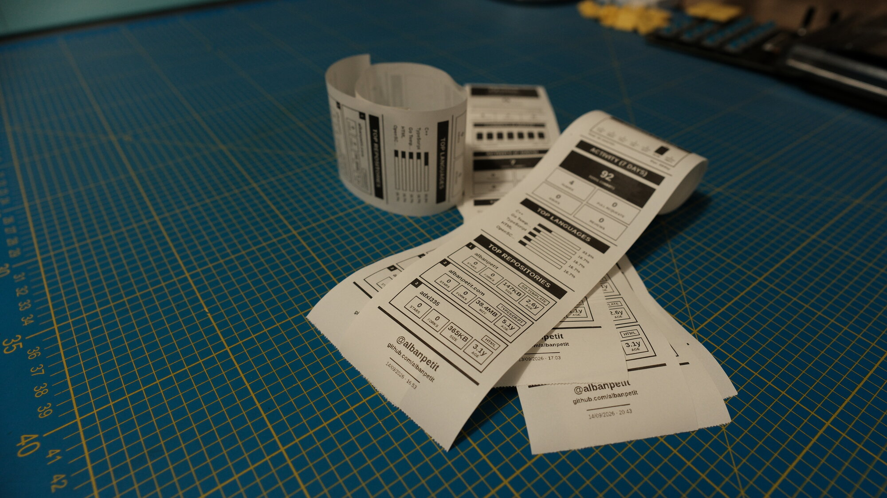

## 2. System overview

The project splits into two main parts that talk over a simple HTTPS request: a **web service** that builds the receipt image, and an **electronic board** that downloads and prints it.

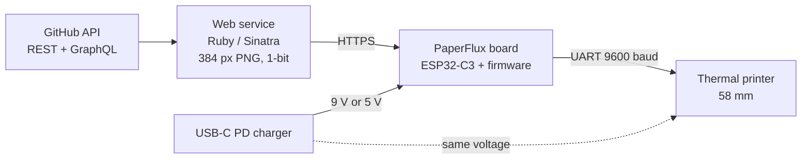

The behavior comes down to four steps:

1. **Power.** The board is plugged into a USB-C Power Delivery charger. It negotiates a 9 V voltage (or 5 V as a fallback) that powers both the electronics and the printer.
2. **Scheduling.** The firmware connects to Wi-Fi, syncs its clock over NTP, and checks every minute whether a receipt is due. By default, a receipt is due once a week.
3. **Rendering.** When it's time, the board calls `https://paperflux.albanpetit.com/ticket/<username>`. The server collects GitHub statistics, lays out an HTML template in a headless Chromium, then converts the screenshot into a black-and-white PNG exactly as wide as the print head.
4. **Printing.** The firmware decodes the PNG on the fly and streams it to the printer line by line.

The repository mirrors this split:

| Folder | Content | Tools |
|---|---|---|
| `ecad/` | Schematic, 4-layer PCB, Gerbers, interactive BOM | KiCad |
| `fw/` | Board firmware | PlatformIO, Arduino on ESP32-C3 |
| `web/` | Receipt rendering service and its deployment | Ruby 3.3, Sinatra, Ferrum, ImageMagick, Kamal |
| `mcad/` | Enclosure model | FreeCAD |
| `doc/` | BOM, datasheets, photos | |

## 3. Project timeline

The project was built in successive layers, with long pauses between phases. The Git history makes it possible to trace its evolution precisely.

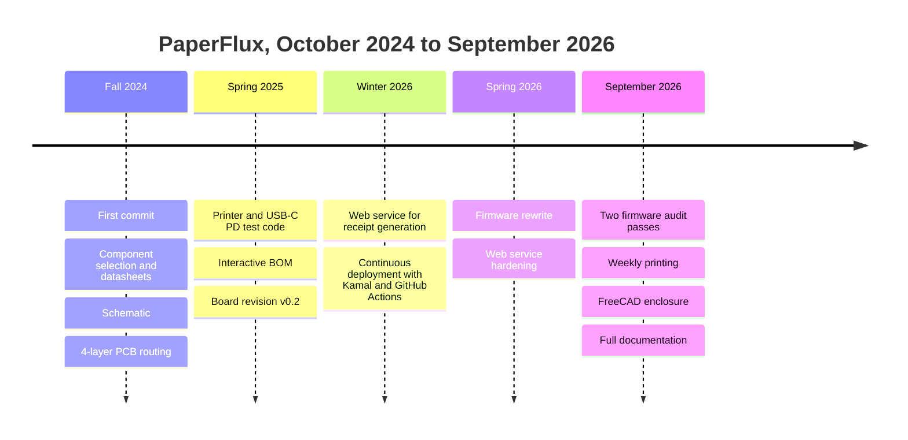

## 4. Choosing the components

Everything starts from one constraint: **a single USB-C plug must power a thermal printer**. A thermal head draws a lot of current when it heats an entire line of black dots. The 5 V and 500 mA of a plain USB port aren't enough. So the charger needs to be asked for more power, which means going through the **USB Power Delivery** protocol.

I started by gathering datasheets for candidates for each function, then settled on the following components:

| Function | Chosen component | Why |
|---|---|---|
| Microcontroller | **Espressif ESP32-C3-MINI-1** | Built-in 2.4 GHz Wi-Fi, native USB (flashing and console without a USB-serial chip), certified and compact module |
| USB-C PD negotiation | **Diodes AP33772S** | A USB PD 3.1 "sink" controller driven over I²C: it reads the profiles offered by the charger, requests the desired voltage, and switches the output |
| Output switch | **2 × DMN3009SFG** | Back-to-back 30 V N-channel MOSFETs, driven by the AP33772S |
| 3.3 V rail | **Diodes AP63203** | 2 A fixed-output buck converter, few external components |
| Inductor | **Würth WE-MAPI 3015**, 3.9 µH | Compact power inductor for the AP63203 |
| I²C level shifting | **TI PCA9306** | The ESP32-C3 runs at 3.3 V, the AP33772S's I²C side at 5 V |
| ESD protection | **TI TPD4E02B04** | Protects D+, D−, CC1 and CC2 on the USB-C connector |
| USB-C connector | **JAE DX07S016JA1R1500** | USB 2.0 receptacle, enough for PD and data |
| Printer | **DP-EH400/2** | 58 mm thermal printer with a TTL interface, 384-dot print width |

A few alternatives were studied and dropped, with their datasheets still sitting in the `doc/` folder: the previous-generation **AP33772**, the **ESP32-C3-WROOM-02** module, the **TPD4E05U06** protection, and the **GCT USB4110** connector.

Why **9 V** rather than 5 V? For the same power, nearly doubling the voltage nearly halves the current flowing through the cable, connector, and traces. That matters most right when the print head draws the most. 5 V stays configured as a fallback if the charger doesn't offer a 9 V profile.

## 5. Drawing the schematic

The schematic fits on a single KiCad sheet. It's organized around two paths: **power** and **logic**.

### 5.1 The power path

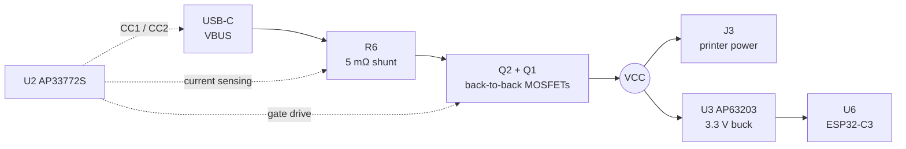

- **The AP33772S (U2)** talks to the charger over the CC1 and CC2 lines to negotiate the contract. It measures current through the 5 mΩ shunt R6, monitors temperature via the NTC1 thermistor, and closes the two MOSFETs Q1 and Q2 once the voltage is established. The back-to-back arrangement blocks current in both directions when the output is off.
- **VCC**, the switched output, feeds the printer's J3 terminal block directly, along with the **AP63203 (U3)** converter that produces the 3.3 V rail.
- **Important consequence**: the ESP32-C3 is powered **through** the AP33772S's switch. If a protection trips and cuts the output, the microcontroller powers off along with the printer. This detail has direct consequences for the firmware design.
- **R4 and R5 (5.1 kΩ)** are the pull-down resistors on CC1 and CC2 that tell the charger the board is a sink.

### 5.2 The logic side

- **The ESP32-C3-MINI-1 (U6)** has its native USB wired directly to the USB-C connector's data lines. The same connector therefore carries the PD contract, flashing, and the serial console.
- **The I²C bus** connects the ESP32-C3 (GPIO5 for SDA, GPIO6 for SCL) to the AP33772S (address `0x52`) through the **PCA9306 (U4)**, which translates between the microcontroller's 3.3 V and the AP33772S's internal 5 V regulator.
- **The TPD4E02B04 (U1) ESD protection** sits as close as possible to the connector, on D+, D−, CC1, and CC2.
- **Two buttons**: SW1 (RESET) pulls `EN` to ground, SW2 (BOOT) pulls GPIO9 to ground to enter the bootloader. GPIO2 and GPIO8 are pulled up to 3.3 V to guarantee a normal boot, as recommended by Espressif's design guide.

### 5.3 Connectors and LEDs

| Reference | Role | Pinout |
|---|---|---|
| J1 | USB-C | VBUS, CC1/CC2, D+/D− |
| J2 | 5-pin JST PH "Printer" | 1 GND, 2 NC, 3 TX (GPIO4), 4 RX (GPIO10), 5 NC |
| J3 | 5.08 mm "POWER" terminal block | 1 VCC (negotiated voltage), 2 GND |

| LED | Lit when |
|---|---|
| D1 | VBUS is present on the USB-C connector |
| D2 | The AP33772S's `LED` pin indicates it (PD negotiation status) |
| D3 | The 3.3 V rail is present |

These three LEDs form an instant visual diagnostic: at a glance you know whether the cable is delivering power, whether negotiation succeeded, and whether the logic is powered.

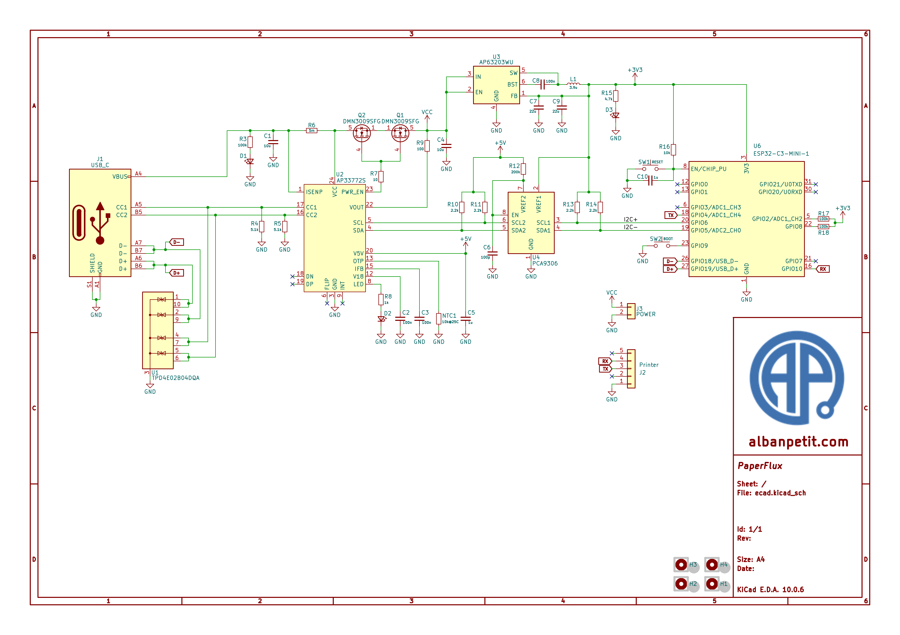

## 6. Routing the PCB and getting it manufactured

### 6.1 A 4-layer stack-up

The board measures **33.55 × 50.05 mm** and has four M2 mounting holes. I chose a **4-layer** stack-up rather than 2, for three reasons: a continuous ground plane under the switching converter and signals, a dedicated 3.3 V power plane, and enough routing area on such a small board.

| Layer | Role |
|---|---|
| F.Cu (top) | Components and nearly all routing |
| In1.Cu | Ground plane (GND) |
| In2.Cu | +3V3 power plane |
| B.Cu (bottom) | A few jumper traces |

Total thickness is 1.58 mm, with an **ENIG** (electroless nickel immersion gold) finish that gives nice flat pads, valuable for soldering the AP33772S's WQFN-24 package at 0.5 mm pitch. Routing totals a bit over 300 segments on the front, around thirty on the back, and about a hundred vias.

A few rules guided placement:
- **The AP63203 converter** and its inductor L1 sit side by side, to keep the switching loop as short as possible.
- **The shunt R6 and the MOSFETs Q1 and Q2** are grouped near the AP33772S, on the current path between the USB-C connector and the terminal block, and connected with copper pours rather than thin traces.
- **The ESP32-C3 module's antenna** sits at the board edge. A keep-out zone forbids traces, vias, and copper pours under the antenna, on all four layers, as Espressif recommends.

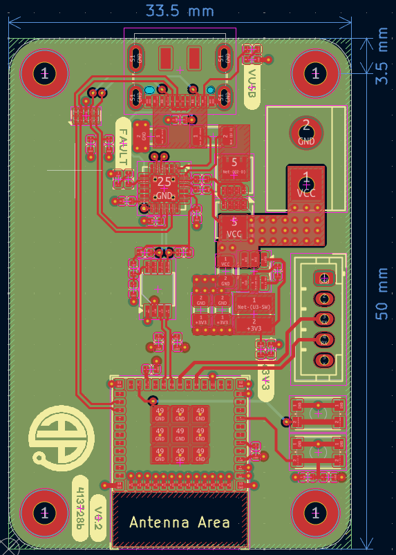

### 6.2 Manufacturing and assembly

The boards were manufactured by **AISLER**. A first revision surfaced two issues, fixed in **v0.2**: a bad connection on the USB connector and reset-circuit resistor values that didn't match the datasheet. A net error on the schematic was fixed early in 2026.

For hand assembly, I generated an **interactive BOM** with the InteractiveHtmlBom plugin: an HTML page that highlights each component on the board view as you check it off the list. On a board this dense, with 0402s everywhere, it's a real time- and error-saver.

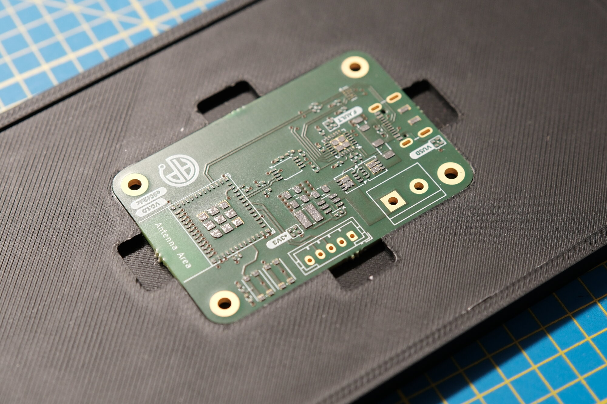
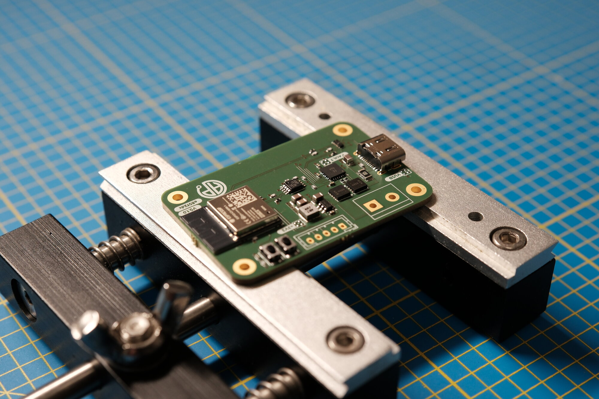

Once the three building blocks were validated, they were merged into the main firmware, and those test projects were removed from the repository to keep a single codebase.

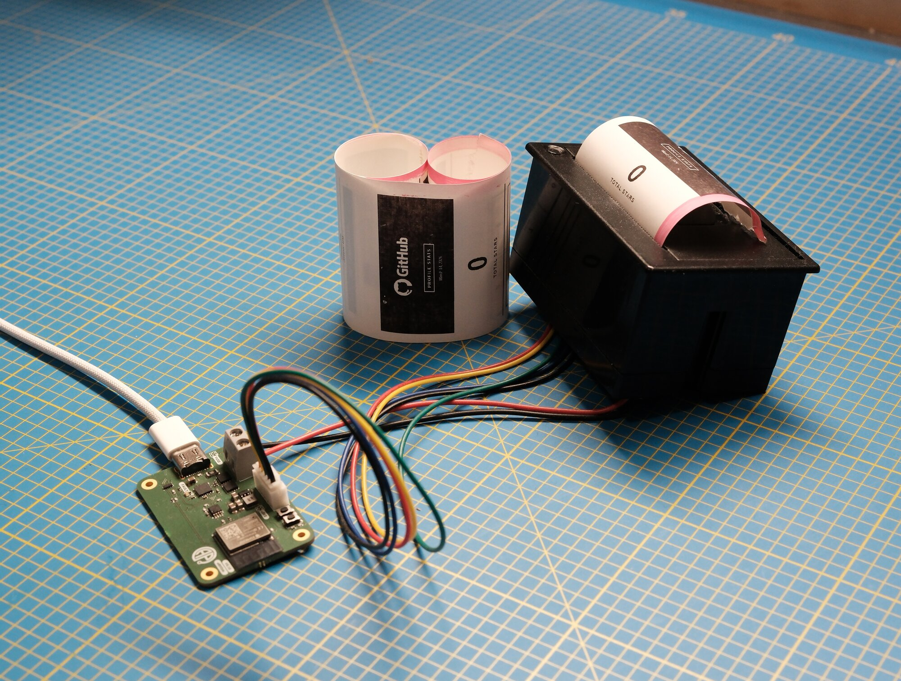

## 7. Key points of the electronic design

Five blocks deserve a closer look, because they decide whether the board works on the first try or spends its time rebooting.

### 7.1 The 3.3 V buck regulator

The **AP63203WU (U3)** turns the negotiated voltage, usually 9 V, into a clean 3.3 V rail for the ESP32-C3. It's a switching converter, and its wiring follows the fixed-output version:

- **FB is wired directly to the +3V3 rail**, with no divider. That's the whole point of the fixed-output part: one less component to calculate, and above all two fewer precision resistors to place on an already dense board.
- **EN is wired to VCC**, the input itself. The regulator therefore starts as soon as the power switch closes, with no sequencing to manage.
- **C8 (100 nF)** links BST to SW: it's the bootstrap capacitor that generates the high-side transistor's gate voltage, above the input voltage.
- **L1 (3.9 µH, Würth MAPI-3015)** sits between SW and the output, with **C4 (10 µF)** on the input and **C7 + C9 (2 × 22 µF)** on the output. The output is deliberately well decoupled: it's the same rail that has to absorb Wi-Fi current spikes while the printer heats up.

The sensitive spot is the **switching loop**: the path between the input capacitor, the chip, and ground switches several hundred thousand times per second. The larger this loop, the more it radiates, and the Wi-Fi antenna sits two centimeters away. Hence the tight placement of U3, L1, and the capacitors, and the continuous ground plane running right underneath, on the internal In1 layer.

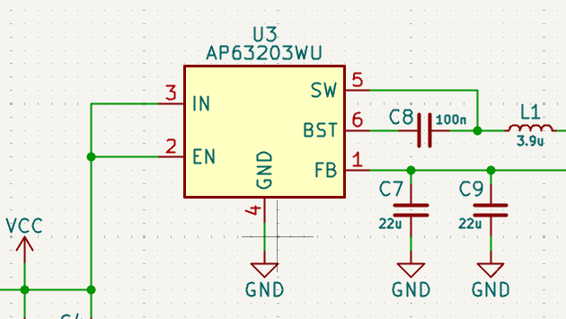
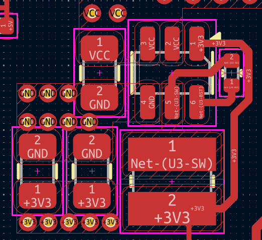

### 7.2 The power switch and its measurements

The AP33772S doesn't switch current itself: it drives two external MOSFETs. What matters is how they're wired.

- **Q1 and Q2 share their source and gate**, mounted back-to-back. A single MOSFET would let current leak through its body diode even with the gate closed; with two in opposition, the cutoff is clean in both directions.
- **R7 (10 Ω)** sits between the controller's PWR_EN pin and the gates, to damp switching rather than make it abrupt.
- **The controller connects on the input side**, upstream of the switch: it stays powered and keeps talking over I²C even when the output is off. The ESP32-C3, on the other hand, is downstream, which is why it powers off along with the printer.
- **R6 (5 mΩ)** is the shunt resistor that measures current, placed ahead of the switch, on the VBUS side.
- **R9 (100 Ω)** connects the VCC output to the controller's VOUT pin. This is exactly the voltage the firmware rereads before and after each print job to check that the printer is still powered.
- **NTC1 (10 kΩ at 25 °C)** on the OTP pin gives the controller a picture of the board's temperature, and triggers its thermal protection.

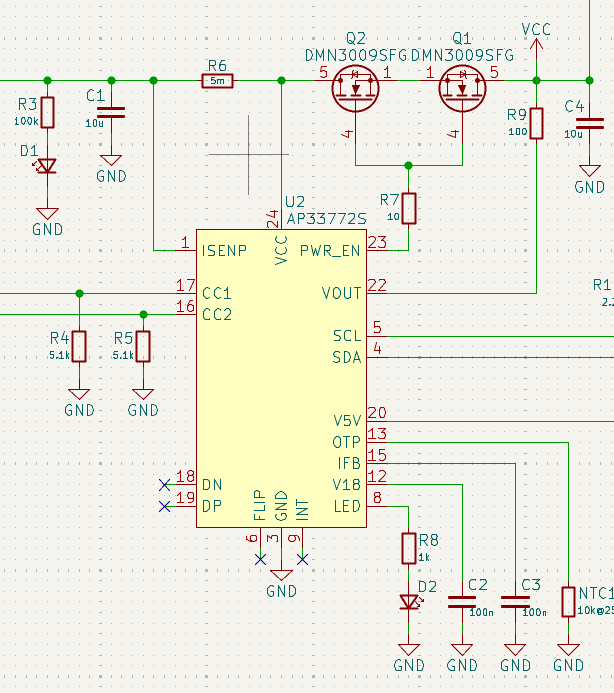
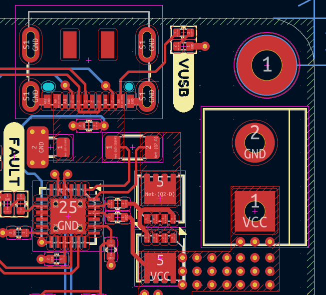

### 7.3 The I²C link between two voltage worlds

The ESP32-C3 speaks 3.3 V, the AP33772S speaks 5 V produced by its internal regulator. The **PCA9306 (U4)** does the translation, and its wiring follows the application note:

- **VREF1 on 3.3 V, VREF2 on the 5 V side**, which sets the two reference levels.
- **EN and VREF2 are tied together**, pulled up to 5 V by **R12 (200 kΩ)** with **C6 (100 pF)** to ground. This time constant lets the rail settle before the translator becomes active.
- **Pull-up resistors on each side**: R13 and R14 (2.2 kΩ) on the 3.3 V side, R10 and R11 (2.2 kΩ) on the 5 V side. An I²C bus has no active high output; these resistors are what pull the lines back to a high level.

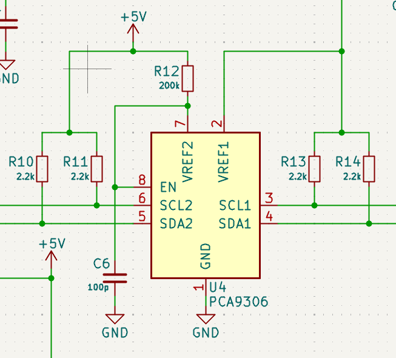

### 7.4 The USB path, data and power on the same connector

- **The connector is wired to be reversible**: all four VBUS pins are tied together, and so are both D+/D− pairs. No matter which way the cable is plugged in, with no multiplexer at all.
- **The ESD protection is in-line, not tapped off**: D+, D−, CC1, and CC2 go into the TPD4E02B04 and come back out toward the module and the PD controller. A discharge is intercepted before it reaches anything.
- **The D+/D− pair is routed as a single run on the top layer**, with no layer change, at 0.2 mm, for **47.35 mm and 47.69 mm** respectively. A third of a millimeter of mismatch between the two, well within tolerance for USB 2.0.
- **Current itself doesn't travel over traces** but over solid copper pours. VBUS and VCC don't even show up in the project's routed-trace list: they're planes, sized for the negotiated 2 A.

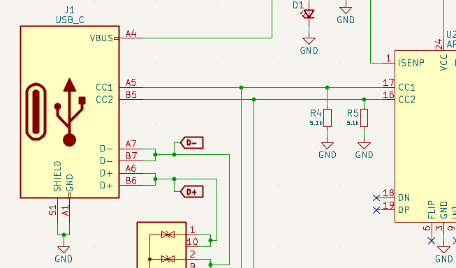

### 7.5 ESP32-C3 startup

An ESP32-C3 module only boots correctly if a few pins are in the right state at power-up:

- **R16 (10 kΩ) and C10 (1 µF)** form a delay network on the EN pin: the microcontroller only leaves reset once its supply is established. SW1 simply pulls this point to ground to force a reboot.
- **R17 and R18 (100 kΩ)** hold GPIO2 and GPIO8 high, a condition for a normal boot from flash.
- **SW2 pulls GPIO9 to ground**, which makes the chip enter its recovery bootloader on the next reset. That's the BOOT button used when automatic flashing fails.

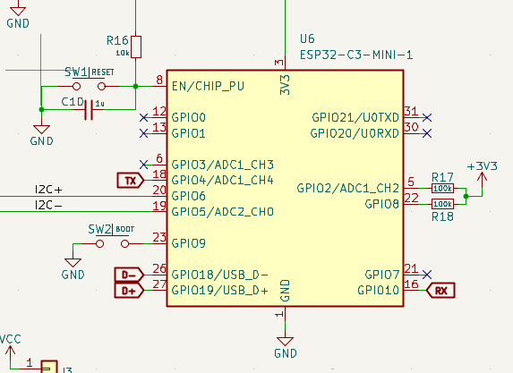

## 8. Generating the receipt server-side

### 8.1 Why render the image on a server?

Laying out a receipt with headers, bar charts, and lists directly on a microcontroller would be slow and rigid. I preferred to offload that work to a server and reduce the board to a very simple role: download an image and print it. Changing the layout then just means editing an HTML file and redeploying, without ever reflashing the board.

### 8.2 What's on the receipt

From top to bottom, the receipt shows:

1. A header with the GitHub logo, "Profile Stats", and the date
2. The profile bio, truncated to 100 characters
3. The **total star count** across all public repositories, with a progress bar toward a goal set at 1.5× the current total (minimum 100)
4. Followers, public repository count, and total forks
5. A **7-day commit histogram**, including today
6. The week's **activity**: commits, pushes, pull requests, issues, reviews
7. The **top 5 languages** across repositories
8. The **top 3 starred repositories**, with stars, forks, size, and age
9. A footer with `@username`, the profile URL, and the generation time

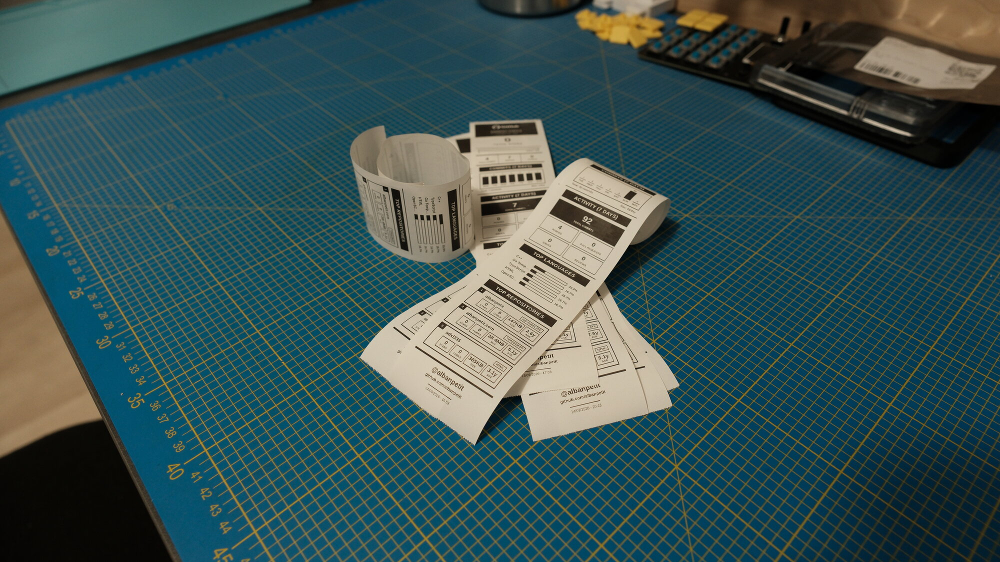

### 8.3 The rendering pipeline

The service is a small **Sinatra** app (Ruby 3.3) served by **Puma**. Here's what happens when a board requests its receipt:

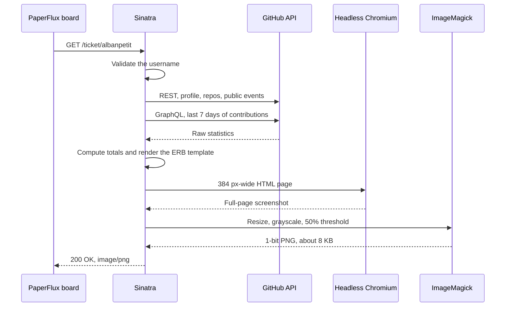

Each step earns its place:
- **The statistics** combine two APIs. The REST API provides the profile, all repositories (fully paginated), and up to 300 public events. The **GraphQL** API provides the contribution calendar, since public events don't always report the number of commits contained in a push. If GraphQL fails, the service falls back to counting public events, which is less precise.
- **The layout** is a plain HTML/CSS template exactly 384 px wide, with bold fonts, thick borders, and solid black fills: everything that survives a 1-bit conversion well.
- **Rendering** is handled by a headless Chromium driven through the **Ferrum** gem. The browser is launched on the first request and then reused, avoiding the startup cost on every receipt.
- **The thermal conversion** is done with **MiniMagick**:

```ruby
image.resize "384x"
image.combine_options do |c|
  c.colorspace 'Gray'
  c.threshold '50%'
  c.depth 1
  c.type 'Bilevel'
end
image.format 'png'
```

### 8.4 A strict contract between server and board

The server and firmware are bound by a simple contract, documented on both sides: **a 1-bit PNG, grayscale or palette, non-interlaced, at most 32 KB**. Anything wider than 384 px is cropped. A real receipt weighs around 8 KB for 384 × 2014 pixels, a strip of paper about 25 cm long at 203 dots per inch.

The API also exposes a few routes useful during development:

| Route | Response |
|---|---|
| `GET /ticket/:username` | The receipt as `image/png`, cached for 5 minutes |
| `GET /preview/:username` | The HTML template before conversion, to tune the layout in a browser |
| `GET /debug/:username` | Raw counters and computed figures, as JSON |
| `GET /health` | `{"status":"ok"}`, for health probes |

## 9. Putting the service into production

The service runs in production at `paperflux.albanpetit.com`. Deployment relies on **Docker** and **Kamal 2**.

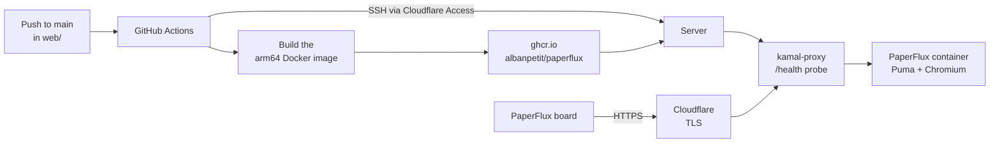

- **The Docker image** is built in two stages: a build image to compile the gems, then a lean final image bundling Chromium, fonts, and ImageMagick. The app runs as an unprivileged user.
- **Kamal** builds the image for the `arm64` architecture, pushes it to the GitHub Container Registry, and deploys it to the server. **kamal-proxy** switches traffic to the new container only once `/health` responds, giving zero-downtime deploys and a fast rollback.
- **Cloudflare** terminates TLS in front of the server, and the deployment's SSH connections go through **Cloudflare Access** with `cloudflared`, authenticated with a service token.
- **GitHub Actions** offers two workflows: `setup.yml`, run by hand to prepare the server the first time, and `deploy.yml`, triggered on every push to `main` that touches the `web/` folder. All secrets (host, SSH key, Cloudflare and GitHub tokens, session secret) live in the repository's secrets.

Getting this pipeline right took a good number of iterations: build architecture, Puma setup, listening port, log files, session secret, GitHub token. Once stabilized, every change to the service ships to production with a simple push.

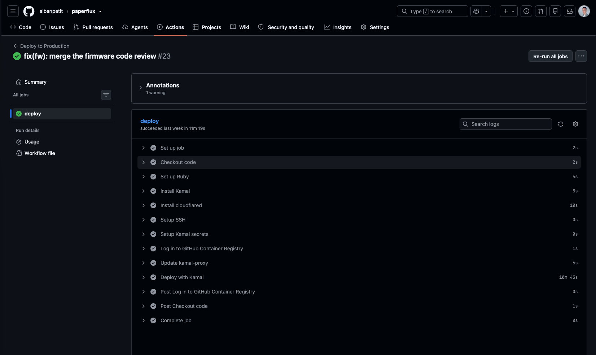

## 10. Writing the firmware

This is the densest part of the project. The firmware is written in C++ with the **Arduino** framework on **ESP-IDF**, built with **PlatformIO**.

### 10.1 Architecture

The code is split into libraries, each matching a single responsibility:

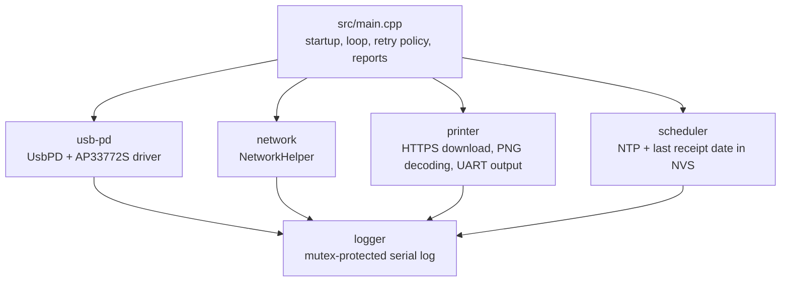

Only two external dependencies, pinned to an exact version so every build is reproducible: the **Adafruit Thermal Printer** library and **ArduinoUZlib**, a software DEFLATE decompressor.

The main configuration fits in a few lines of `main.cpp`:

```cpp
UsbPD pd({
  {9000, 2000},  // 9 V @ 2 A, preferred
  {5000, 2000},  // 5 V @ 2 A, fallback
});

Scheduler scheduler(SCHED_WEEKS(1));

#define TICKET_URL "https://paperflux.albanpetit.com/ticket/albanpetit"
```

### 10.2 Startup and main loop

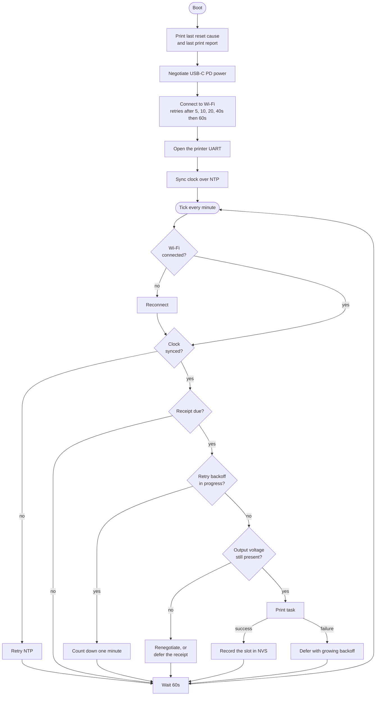

Two choices shape this loop:
- **Nothing prints until the clock is trustworthy.** NTP sync is required before any HTTPS request, since the server certificate's validity is checked against system time.
- **A slow, simple loop.** One tick per minute is plenty for a weekly receipt, and keeps the behavior easy to reason about.

### 10.3 Negotiating USB-C PD power

At startup, the `UsbPD` class reads the profiles offered by the charger via the AP33772S, then walks the list of targets in order of preference:

1. Look for a fixed profile at the desired voltage that supplies at least the requested current
2. Send the request to the controller and close the output switch
3. Wait half a second, then **actually measure the output voltage** (the `VOLTAGE` register, 80 mV per unit)
4. Accept if the reading is within ±500 mV of the target, otherwise reopen the switch and move to the next target

On a charger that offers 9 V, the serial log looks like this:

```text
[USB-PD] ..  Requesting PDO 2: 9V @ 2A
[USB-PD] ..  VREQ=9000mV  IREQ=2000mA  VOUT=9040mV
[USB-PD] OK  Voltage OK (9V)
```

The AP33772S's I²C driver is derived from CentyLab's Arduino library. It's been heavily reworked and trimmed down through several review passes: current encoding that overflowed its 4-bit field and silently requested 1 A instead of 5 A, `VREQ` and `IREQ` registers read as 16-bit as the datasheet specifies, minimum current rounded up rather than down.

Before every print job, the firmware rereads the output voltage. A failed I²C read is retried twice before concluding power was lost: a single bus glitch shouldn't trigger a full renegotiation.

### 10.4 Scheduling one receipt per week

The `Scheduler` relies on two pieces of state: NTP time and the date of the last printed receipt, stored in **NVS** (a key-value partition in flash). A reboot or power loss therefore never triggers a reprint: only a genuinely elapsed interval triggers a receipt.

A few subtleties are handled:
- **Keeping the cadence.** Each print is recorded against the **slot** it was due for, not the moment it finishes. Without this, every receipt would push the next one back by the print duration (about three minutes), week after week. A receipt more than a full interval late, however, starts a fresh cadence.
- **Surviving clock jumps.** An NTP correction can move the clock backward. Calculations use signed arithmetic, and a date stored far in the future (so written under a wrong clock) is ignored instead of blocking every future receipt.
- **Surviving a failed NVS write.** The date is kept in RAM regardless, to avoid reprinting every minute if flash refuses the write.
- **Reading flash only once.** The stored date is loaded on the first call and then kept in memory.

### 10.5 Downloading the receipt over HTTPS, safely

Downloading is where things can go wrong in a thousand ways. The code applies a series of safeguards:

- **Pinned certificates.** The `RootCA.h` file contains the five root authorities Cloudflare Universal SSL can use: GTS Root R1 and R4, ISRG Root X1 and X2, and the GlobalSign root that cross-signs the GTS roots. The certificate is actually verified, never accepted blindly.
- **Validity dates checked by hand.** The framework's mbedTLS build is compiled without date handling: the handshake verifies the chain and hostname, but not the validity period. The firmware therefore compares the certificate's dates against NTP time itself, on every connection.
- **Redirects followed manually.** Up to three, HTTPS only, with the same certificate check at every hop.
- **HTTP/1.0.** This rules out `chunked` encoding and connection reuse: the TLS session, which occupies several tens of KB, is freed before printing.
- **Bounded timeouts everywhere.** 30 s for the handshake, 60 s to receive the whole response body, whatever the server does.
- **A capped size.** 32 KB max, to fail cleanly with "too big" rather than run out of memory.
- **Integrity checked.** A PNG always ends with an `IEND` chunk. Its absence signals a truncated download, even if the HTTP layer didn't notice anything wrong.

### 10.6 Streaming the PNG decoder

The ESP32-C3 only has a few hundred KB of RAM, and the measured floor during a print job hovers around 70 KB of free memory. Decompressing the whole image in memory is out of the question, so a minimal PNG decoder was written specifically for this case.

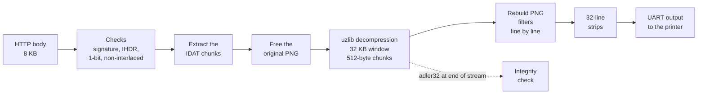

The idea: never keep more than one 32-line strip in memory. Compressed data is copied into a dedicated buffer, the original PNG is freed right away, then the stream is decompressed in small chunks. Each line is reconstructed from the previous one (the PNG `Sub`, `Up`, `Average`, and `Paeth` filters), inverted if needed so black matches heated dots, then appended to the current strip. As soon as the strip is full, it's sent to the printer.

Edge cases got particular attention: unknown filter type, data that stops before the last line, data that continues past it, an adler32 checksum that doesn't match, padding bits beyond the image width that would have left stray dots on the right edge.

### 10.7 Driving the printer

The printer receives strips through the ESC/POS bitmap command `DC2 *` (`0x12 0x2A`), followed by height and width in bytes:

```cpp
uint8_t cmd[4] = { 0x12, 0x2A, (uint8_t)h, (uint8_t)bytesPerRow };
serial.write(cmd, 4);
serial.write(strip + start * bytesPerRow, h * bytesPerRow);
delay(txMs + printMs + 5);
```

Three things took work:
- **Not blocking the CPU.** The Adafruit library's bitmap print function times itself with busy-waiting, which hogs the CPU for the whole print and starves other tasks, Wi-Fi included. The firmware therefore sends the strips itself and paces with `delay()`, which yields to the FreeRTOS scheduler.
- **An actual transmit buffer.** By default, the UART has no software buffer: every write blocked until the hardware FIFO drained, and the wait got counted twice. A 256-byte ring buffer roughly halves print time.
- **Letting the printer wake up.** The printer keeps its heat settings in RAM and loses them on every power cycle. If they're sent too soon after power-up, it ignores them and prints with factory defaults. The firmware therefore waits 2 s after voltage is established before pushing its settings.

The default heat settings (2 ms pulses, 400 µs cooling, 20 ms per line) give a solid black with no streaking. The real bottleneck remains the 9600-baud serial link: a single 48-byte line alone takes over 50 ms to transfer. A real 2014-line receipt takes about **2 min 40 s** to print.

### 10.8 Failing gracefully

An object that prints unattended has to handle failures without wasting paper. Several mechanisms stack up:

**An isolated print task.** Printing runs in a dedicated FreeRTOS task, with a statically allocated stack so it never fails to allocate after weeks of uptime. The main loop waits for the task to finish; if nothing has returned after 40 minutes, the board reboots. That limit is calculated from the worst legitimate case: the tallest accepted receipt (20,000 lines, about 25.6 minutes), behind three slow redirects.

**A growing backoff between attempts.** A failure partway through an image has already used up paper. Retrying every minute would waste meters of it. The receipt stays due, but attempts get spaced out:

| Consecutive failures | 1 | 2 | 3 | 4 | 5 | 6 | 7+ |
|---|---|---|---|---|---|---|---|
| Wait before next attempt | 1 min | 2 min | 4 min | 8 min | 16 min | 32 min | 60 min |

**A backoff level that survives a reboot.** When the head heats up on a supply that's too weak, voltage can collapse and reboot the board (a brownout). When the backoff was only kept in RAM, the board would resume printing as soon as it came back, collapse again, and each cycle would push out a fresh piece of paper. The backoff level is therefore saved to NVS with every attempt.

**Never counting an incomplete receipt as done.** The UART accepts bytes even if the printer has lost power. After every print, the firmware rereads the output voltage and the protections the AP33772S tripped during the job (undervoltage UVP, overvoltage OVP, overcurrent OCP, overtemperature OTP). If any of them fired, the receipt isn't marked as printed, even if voltage came back in the meantime.

### 10.9 Observing a print you can't watch

Choosing a single USB-C connector has an unexpected consequence: **the same port carries both power and the serial console**. To print, the board has to be plugged into a PD charger; to read its logs, it has to be plugged into a computer, whose USB port usually can't supply enough power for the head. Printing and observing are therefore mutually exclusive.

The fix: **every attempt leaves a report in NVS, read back on the next boot**. You print on the charger, plug the board back into the computer, and the last print job tells its own story:

```text
[MAIN  ] ..  Boot, last reset: power-on
[PRINT ] ..  Last attempt, 2026-09-14 16:55:51 UTC: printed after 159s
[PRINT ] ..    stack 5136 of 16384 bytes used, 11248 free
[PRINT ] ..    lowest free heap that boot: 70068 bytes
[PRINT ] ..    PD protection during the job: none
```

The report is written with the `INTERRUPTED` status **before** the first byte goes to the printer. If the board dies mid-job, the next boot shows this status right next to the reset cause (`brownout`, `panic`, `task watchdog`...), which makes it possible to diagnose a problem without having seen it happen. For software crashes, core dumps are additionally kept in a dedicated flash partition.

These measures had a very concrete effect. The print task's stack was previously fixed at 64 KB, based on a misreading of a core dump and the common belief that a TLS handshake needs tens of KB of stack. The on-device report showed that a full print job, TLS included, only uses about **5 KB**, since mbedTLS keeps its buffers on the heap. The stack was cut down to 16 KB, three times the measured peak.

### 10.10 Two audit passes

In September 2026, the firmware went through two thorough review passes, each followed by a series of atomic fixes: about sixty commits in total. Among the defects found and fixed, most of the safeguards described above show up: the weekly slot drift, a blocked download that froze the board, certificate dates that were never checked, a checksum that wasn't reached for certain image heights, an off-by-one-minute error in the retry backoff, and a race between the firmware's own Wi-Fi retries and the framework's.

Along the way, the partition table was switched to `huge_app`: with no OTA updates and no filesystem, the application gets 3 MB instead of 1.28 MB, while keeping the NVS and core dump partitions at their original addresses.

## 11. Designing the enclosure

The enclosure is modeled in **FreeCAD 1.1** around two references: a simplified volume of the printer and the board's 3D model, exported from KiCad in STEP format.

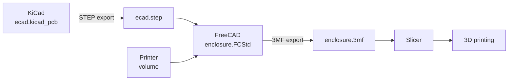

The enclosure body starts from a sketch extruded 62 mm tall, softened with 6 mm fillets and chamfers, then shelled to leave 2.3 mm walls. The printable file measures **82 × 58 × 62 mm**. Importing the real board into the assembly makes it possible to check clearances and connector access before printing anything.

The workflow is deliberately simple: after a PCB change, re-export the STEP file and swap it into FreeCAD; after an enclosure change, re-export the 3MF and commit it alongside the source file, so the printable file always matches the model.

## 12. Manufacturing the enclosure

This is the moment the project leaves the screen. The `enclosure.3mf` file committed in the repository opens directly in the slicer: no intermediate conversion, it's exactly the geometry validated in FreeCAD that goes to the machine.

The enclosure comes out **as a single piece**, with no assembly and no screws. It's by far the biggest part of the project, well beyond the electronics it houses: 82 × 58 × 62 mm with 2.3 mm walls, against a 33.55 × 50.05 mm board. The object keeps the machine busy for several hours, which leaves plenty of time to film it.

The timelapse shows what the 3D model can't tell you: the piece builds up layer by layer, the walls rise, the connector openings appear along the way, and the hollow volume takes shape around the void that will hold the printer.

The real validation comes once the piece has cooled and been removed from the bed: fitting the board and printer into the enclosure, checking that the connectors line up with their openings, and that the USB-C cable goes in without force. That's the payoff of the work done earlier in FreeCAD, where the board imported as STEP and the simplified printer volume existed precisely to avoid surprises at this stage.

[Watch the enclosure's 3D-printing timelapse on YouTube](https://youtu.be/g7p2XE0RZsE?si=O8b9UDyzDpgZAD-I)

[Watch the board fitted into the enclosure on YouTube](https://youtube.com/shorts/m-B9OKOYSVs?si=OTndaz4JzeSRzjjJ)

## 13. Enjoying it

Once the object sits on the desk, there's nothing left to do. No app to open, no notification to check, no button to press: the receipt comes out on its own, once a week, on the day the first print happened.

The video shows the whole operation. The board checked the time, negotiated its power, downloaded its image, and started printing without anyone asking it to do anything. The head moves line by line, the paper unrolls, and it takes about **2 min 40 s** to print the 25 cm receipt: the time it takes the 9600-baud serial link to deliver the image's 2014 lines.

The rest of the week, the object does exactly one thing: wake up every minute, check the time, and go back to sleep. That's exactly what I wanted from the start. Information that comes to me at a calm pace, on a medium you can hold, compare to the previous week's, or just leave lying on a corner of the desk.

Everything described in this article, the 4-layer board, the USB-C negotiation, the PNG decoder written line by line, the service running in production, all ends up fitting in this strip of paper coming out of a small 3D-printed box.

[Watch the board print a receipt on YouTube](https://youtu.be/SV1ZxY0D_t8?si=mpXSwgA-HMu9siHo)

## 14. What this project taught me

**A hardware choice gets paid for in software.** Powering the microcontroller through the PD switch and sharing a single USB-C port for power and console were sensible choices on the schematic. Yet they required a whole firmware-side infrastructure: persistent reports, backoff that survives reboots, checking protections after every print.

**Measure rather than believe.** The "necessary" stack size for TLS, print duration, available memory: several figures based on intuition or common wisdom turned out to be wrong once measured on the board. Making the system report its own numbers was one of the best investments in this project.

**A screenless object must plan for its failures.** On a desk, a bug is visible. In an unattended object, it turns into meters of wasted paper or a receipt that never shows up. Every error path had to be thought through: what happens if Wi-Fi drops, if the clock lies, if the server cuts off mid-response, if voltage collapses?

**Push complexity to where it costs the least.** Generating the receipt on a server kept the firmware focused on its job: download, verify, print. Any layout change happens without touching the board at all.

## 15. Current limitations and future directions

The project works, but several points remain improvable:

- **Configuration baked into the firmware.** Wi-Fi credentials and the receipt URL are baked into the image and stored in plaintext in flash. A first-boot configuration portal would make the object usable by someone else without recompiling.
- **No remote updates.** The partition table was chosen with no OTA slot: any update requires a USB-C data cable.
- **2.4 GHz Wi-Fi only**, a hardware limit of the ESP32-C3.
- **7-day window in UTC.** The container runs in UTC, so the histogram's days start at 1 or 2 AM French time, and a late commit can land on the wrong day.
- **Manufacturing files need regenerating.** The Gerbers in the repository date from November 2024 and no longer reflect the latest schematic and routing: they need re-exporting before any new order.

A few ideas for later:
- Use the BOOT button, already present on the board, to print an on-demand receipt
- Offer other receipt templates (monthly summary, stats for a specific repository)
- Add OTA updates by reserving a flash slot for it again

---

## 16. Resources

- **Source code**: [github.com/albanpetit/paperflux](https://github.com/albanpetit/paperflux)
- **Web service**: `https://paperflux.albanpetit.com`
- **Detailed documentation**: each repository folder (`ecad/`, `fw/`, `web/`, `mcad/`, `doc/`) has its own README
- **Main components**: [ESP32-C3-MINI-1](https://www.espressif.com/en/products/modules/esp32-c3), [AP33772S](https://www.diodes.com/part/view/AP33772S), [AP63203](https://www.diodes.com/part/view/AP63203), [PCA9306](https://www.ti.com/product/PCA9306)
- **Tools**: [KiCad](https://www.kicad.org), [InteractiveHtmlBom](https://github.com/openscopeproject/InteractiveHtmlBom), [PlatformIO](https://platformio.org), [Sinatra](https://sinatrarb.com), [Ferrum](https://github.com/rubycdp/ferrum), [Kamal](https://kamal-deploy.org), [FreeCAD](https://www.freecad.org)
- **PCB manufacturing**: [AISLER](https://aisler.net)
