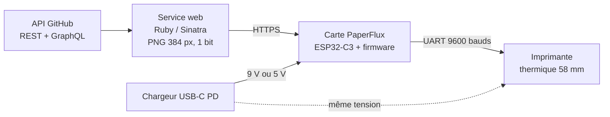
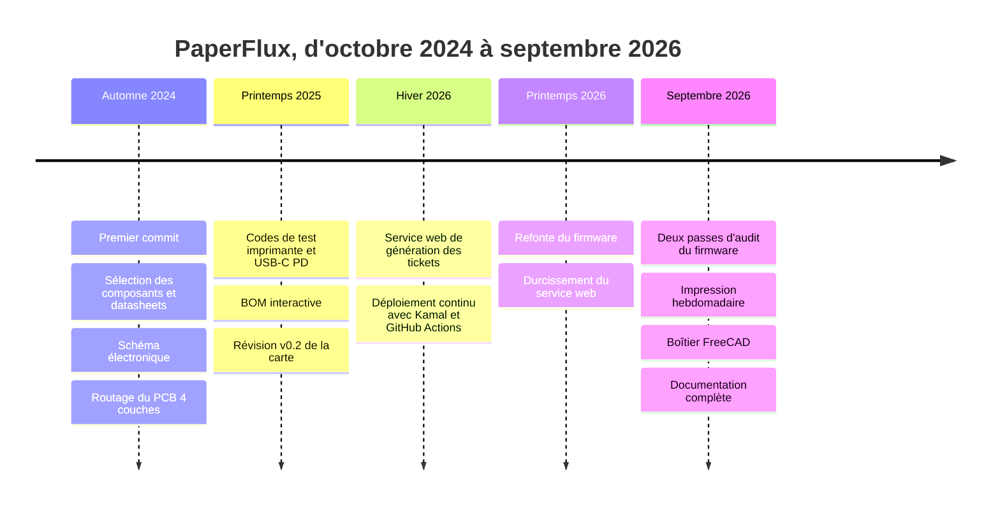
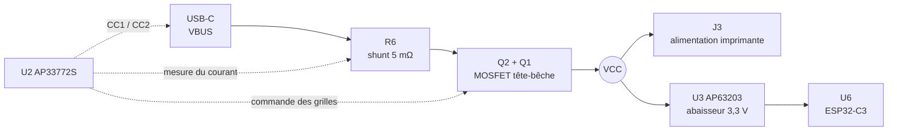
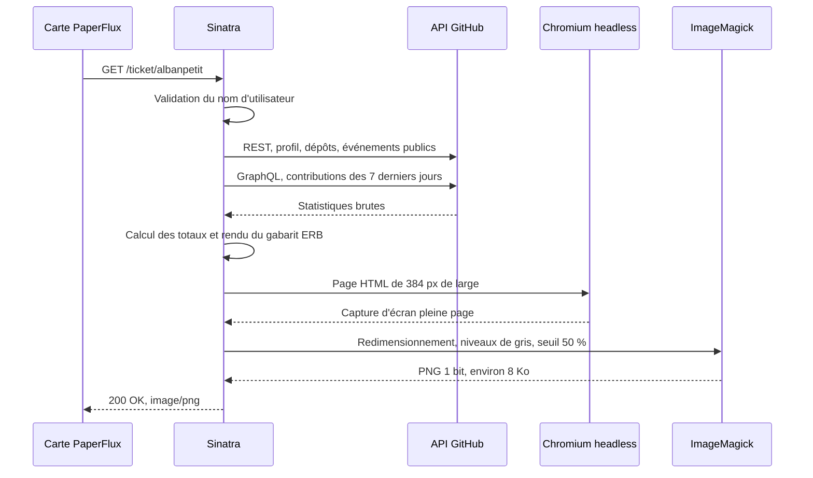
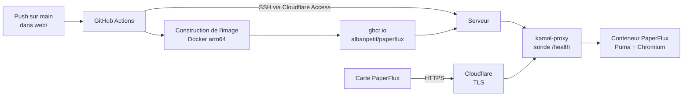
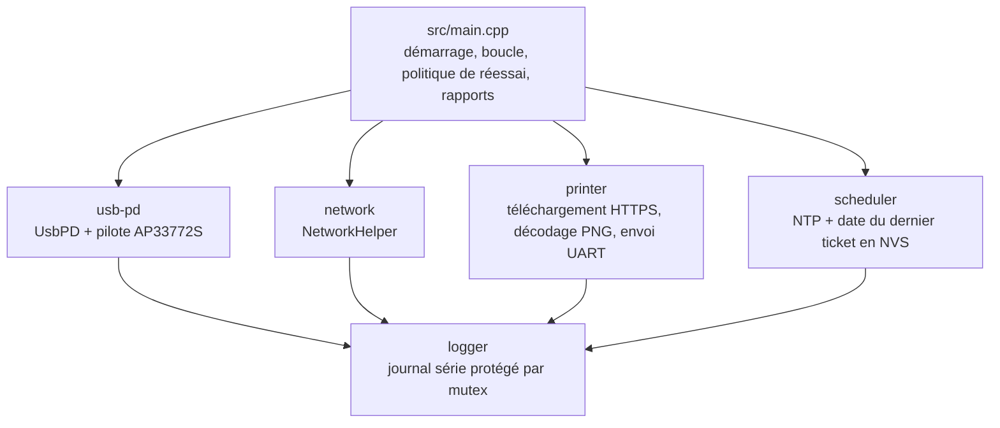
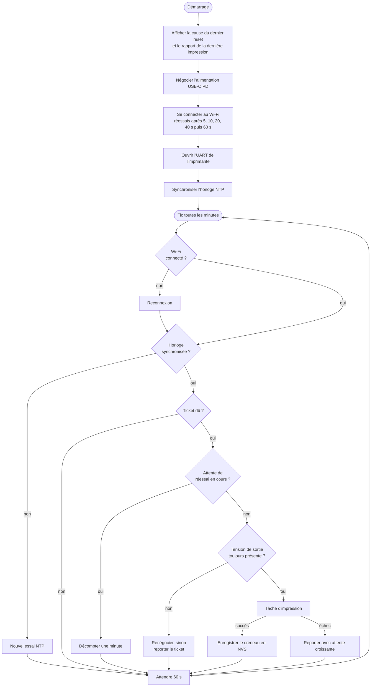
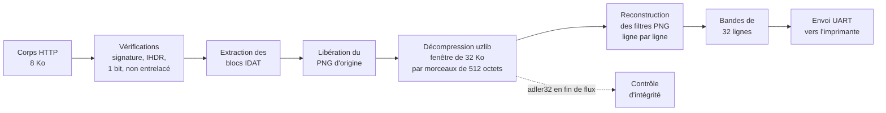
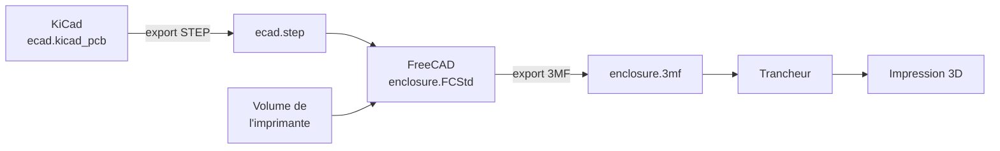

[PaperFlux](https://youtube.com/shorts/C_qkXi_1vpE?si=sbbnYrKRebQKxX2-)

PaperFlux est un petit objet connecté qui, une fois par semaine, imprime sur un ticket de caisse le résumé de mon activité GitHub : étoiles, abonnés, commits des sept derniers jours, langages et dépôts les plus populaires. Aucun écran, aucune notification : juste un bout de papier qui sort tout seul, comme un relevé bancaire de mon travail open source.

Derrière ce ticket se cache un projet complet qui touche à quatre disciplines : la conception électronique d'une carte sur mesure, le développement d'un firmware embarqué, un service web déployé en production et la modélisation d'un boîtier imprimé en 3D. Cet article retrace le projet étape par étape, dans l'ordre logique de sa construction.

<a class="repo-card" href="https://github.com/albanpetit/paperflux" target="_blank" rel="noopener noreferrer">
  <svg class="repo-card-icon" viewBox="0 0 16 16" fill="currentColor" aria-hidden="true"><path d="M8 0C3.58 0 0 3.58 0 8c0 3.54 2.29 6.53 5.47 7.59.4.07.55-.17.55-.38 0-.19-.01-.82-.01-1.49-2.01.37-2.53-.49-2.69-.94-.09-.23-.48-.94-.82-1.13-.28-.15-.68-.52-.01-.53.63-.01 1.08.58 1.23.82.72 1.21 1.87.87 2.33.66.07-.52.28-.87.51-1.07-1.78-.2-3.64-.89-3.64-3.95 0-.87.31-1.59.82-2.15-.08-.2-.36-1.02.08-2.12 0 0 .67-.21 2.2.82.64-.18 1.32-.27 2-.27.68 0 1.36.09 2 .27 1.53-1.04 2.2-.82 2.2-.82.44 1.1.16 1.92.08 2.12.51.56.82 1.27.82 2.15 0 3.07-1.87 3.75-3.65 3.95.29.25.54.73.54 1.48 0 1.07-.01 1.93-.01 2.2 0 .21.15.46.55.38A8.013 8.013 0 0 0 16 8c0-4.42-3.58-8-8-8z"/></svg>
  <span class="repo-card-body">
    <span class="repo-card-name">albanpetit/paperflux</span>
    <span class="repo-card-desc">Code source complet : ecad, firmware, service web et boîtier 3D</span>
  </span>
  <svg class="repo-card-arrow" viewBox="0 0 24 24" fill="none" stroke="currentColor" stroke-width="2" stroke-linecap="round" stroke-linejoin="round" aria-hidden="true"><path d="M9 6l6 6-6 6"/></svg>
</a>

| | |
|---|---|
| **Période** | Octobre 2024 à septembre 2026, avec des pauses |
| **Disciplines** | Électronique, firmware, web, mécanique |
| **Outils** | KiCad, PlatformIO, Ruby / Sinatra, Docker, Kamal, GitHub Actions, FreeCAD |
| **Matériel** | ESP32-C3, contrôleur USB-C Power Delivery AP33772S, imprimante thermique 58 mm |
| **Licence** | MIT |

---

## 1. L'idée

Les tableaux de bord GitHub sont pratiques, mais on ne les regarde que lorsqu'on y pense. Je voulais l'inverse : une information qui vient à moi, à un rythme calme, sur un support physique. Le ticket thermique coche toutes les cases : il ne demande ni encre ni entretien, il est rapide à imprimer et son rendu noir et blanc très contrasté a un vrai charme.

Le cahier des charges tenait en quelques lignes :
- **Une seule prise.** L'objet doit fonctionner avec un simple chargeur USB-C, sans bloc d'alimentation dédié à l'imprimante.
- **Autonome.** Il se connecte au Wi-Fi, sait quel jour on est et imprime quand c'est le moment, sans intervention.
- **Fiable.** Un redémarrage ou une coupure de courant ne doit jamais provoquer une réimpression, et un échec ne doit pas gaspiller du papier en boucle.
- **Simple côté carte.** La mise en page du ticket est calculée sur un serveur : la carte n'a qu'à télécharger une image et l'envoyer à l'imprimante.


## 2. Vue d'ensemble du système

Le projet se découpe en deux grandes parties qui communiquent par une simple requête HTTPS : un **service web** qui fabrique l'image du ticket, et une **carte électronique** qui la télécharge puis l'imprime.



Le fonctionnement se résume en quatre temps :

1. **Alimentation.** La carte est branchée sur un chargeur USB-C Power Delivery. Elle négocie une tension de 9 V (ou 5 V à défaut) qui alimente à la fois l'électronique et l'imprimante.
2. **Planification.** Le firmware se connecte au Wi-Fi, synchronise son horloge par NTP et vérifie chaque minute si un ticket est dû. Par défaut, un ticket est dû chaque semaine.
3. **Rendu.** Quand c'est le moment, la carte appelle `https://paperflux.albanpetit.com/ticket/<utilisateur>`. Le serveur collecte les statistiques GitHub, met en page un gabarit HTML dans un Chromium sans interface, puis convertit la capture en PNG noir et blanc de la largeur exacte de la tête d'impression.
4. **Impression.** Le firmware décode le PNG à la volée et l'envoie à l'imprimante ligne par ligne.

Le dépôt reflète ce découpage :

| Dossier | Contenu | Outils |
|---|---|---|
| `ecad/` | Schéma, PCB 4 couches, Gerbers, BOM interactive | KiCad |
| `fw/` | Firmware de la carte | PlatformIO, Arduino sur ESP32-C3 |
| `web/` | Service de rendu des tickets et son déploiement | Ruby 3.3, Sinatra, Ferrum, ImageMagick, Kamal |
| `mcad/` | Modèle du boîtier | FreeCAD |
| `doc/` | Nomenclature, datasheets, photos | |

## 3. Chronologie du projet

Le projet s'est construit par couches successives, avec de longues pauses entre les phases. L'historique Git permet de retracer précisément son évolution.



## 4. Choisir les composants

Tout part d'une contrainte : **une seule prise USB-C doit alimenter une imprimante thermique**. Or une tête thermique consomme beaucoup lorsqu'elle chauffe une ligne entière de points noirs. Les 5 V et 500 mA d'un port USB classique ne suffisent pas. Il faut donc demander au chargeur davantage de puissance, ce qui passe par le protocole **USB Power Delivery**.

J'ai commencé par rassembler les datasheets des candidats pour chaque fonction, puis j'ai retenu les composants suivants :

| Fonction | Composant retenu | Pourquoi |
|---|---|---|
| Microcontrôleur | **Espressif ESP32-C3-MINI-1** | Wi-Fi 2,4 GHz intégré, USB natif (flashage et console sans puce USB-série), module certifié et compact |
| Négociation USB-C PD | **Diodes AP33772S** | Contrôleur « sink » USB PD 3.1 piloté en I²C : il lit les profils proposés par le chargeur, demande la tension voulue et commute la sortie |
| Interrupteur de sortie | **2 × DMN3009SFG** | MOSFET canal N 30 V montés tête-bêche, commandés par l'AP33772S |
| Rail 3,3 V | **Diodes AP63203** | Convertisseur abaisseur 2 A à sortie fixe 3,3 V, peu de composants externes |
| Inductance | **Würth WE-MAPI 3015**, 3,9 µH | Inductance de puissance compacte pour l'AP63203 |
| Adaptation de niveaux I²C | **TI PCA9306** | L'ESP32-C3 travaille en 3,3 V, le côté I²C de l'AP33772S en 5 V |
| Protection ESD | **TI TPD4E02B04** | Protège D+, D−, CC1 et CC2 du connecteur USB-C |
| Connecteur USB-C | **JAE DX07S016JA1R1500** | Réceptacle USB 2.0, suffisant pour la PD et les données |
| Imprimante | **DP-EH400/2** | Imprimante thermique 58 mm à interface TTL, largeur d'impression de 384 points |

Quelques alternatives ont été étudiées puis écartées, et leurs datasheets sont restées dans le dossier `doc/` : l'**AP33772** de génération précédente, le module **ESP32-C3-WROOM-02**, la protection **TPD4E05U06** et le connecteur **GCT USB4110**.

Pourquoi **9 V** plutôt que 5 V ? À puissance égale, doubler presque la tension réduit presque de moitié le courant qui circule dans le câble, le connecteur et les pistes. C'est précieux au moment où la tête d'impression tire le plus. Le 5 V reste configuré comme solution de repli si le chargeur ne propose pas de profil 9 V.

## 5. Dessiner le schéma électronique

Le schéma tient sur une seule feuille KiCad. Il s'organise autour de deux chemins : celui de la **puissance** et celui de la **logique**.

### 5.1 Le chemin de puissance



- **L'AP33772S (U2)** dialogue avec le chargeur sur les lignes CC1 et CC2 pour négocier le contrat. Il mesure le courant grâce à la résistance de shunt R6 de 5 mΩ, surveille la température avec la thermistance NTC1 et ferme les deux MOSFET Q1 et Q2 une fois la tension établie. Le montage tête-bêche bloque le courant dans les deux sens lorsque la sortie est coupée.
- **VCC**, la sortie commutée, alimente directement le bornier J3 de l'imprimante et le convertisseur **AP63203 (U3)** qui produit le 3,3 V.
- **Conséquence importante** : l'ESP32-C3 est alimenté **à travers** l'interrupteur de l'AP33772S. Si une protection coupe la sortie, le microcontrôleur s'éteint avec l'imprimante. Ce détail aura des conséquences directes sur la conception du firmware.
- **R4 et R5 (5,1 kΩ)** sont les résistances de rappel sur CC1 et CC2 qui signalent au chargeur que la carte est un consommateur.

### 5.2 La partie logique

- **L'ESP32-C3-MINI-1 (U6)** a son USB natif câblé directement sur les lignes de données du connecteur USB-C. Le même connecteur transporte donc le contrat PD, le flashage et la console série.
- **Le bus I²C** relie l'ESP32-C3 (GPIO5 pour SDA, GPIO6 pour SCL) à l'AP33772S (adresse `0x52`) à travers le **PCA9306 (U4)**, qui fait la conversion entre le 3,3 V du microcontrôleur et le 5 V du régulateur interne de l'AP33772S.
- **La protection ESD TPD4E02B04 (U1)** est placée au plus près du connecteur, sur D+, D−, CC1 et CC2.
- **Deux boutons** : SW1 (RESET) tire `EN` à la masse, SW2 (BOOT) tire GPIO9 à la masse pour entrer dans le bootloader. GPIO2 et GPIO8 sont tirés au 3,3 V pour garantir un démarrage normal, conformément au guide de conception d'Espressif.

### 5.3 Connecteurs et voyants

| Repère | Rôle | Brochage |
|---|---|---|
| J1 | USB-C | VBUS, CC1/CC2, D+/D− |
| J2 | JST PH 5 broches « Printer » | 1 GND, 2 NC, 3 TX (GPIO4), 4 RX (GPIO10), 5 NC |
| J3 | Bornier 5,08 mm « POWER » | 1 VCC (tension négociée), 2 GND |

| LED | Allumée quand |
|---|---|
| D1 | VBUS est présent sur le connecteur USB-C |
| D2 | La broche `LED` de l'AP33772S l'indique (état de la négociation PD) |
| D3 | Le rail 3,3 V est présent |

Ces trois LED forment un diagnostic visuel immédiat : on sait d'un coup d'œil si le câble apporte du courant, si la négociation a abouti et si la logique est alimentée.


## 6. Router le PCB et le faire fabriquer

### 6.1 Un empilement 4 couches

La carte mesure **33,55 × 50,05 mm** et possède quatre trous de fixation M2. J'ai choisi un empilement **4 couches** plutôt que 2, pour trois raisons : un plan de masse continu sous le convertisseur à découpage et les signaux, un plan d'alimentation 3,3 V dédié et une surface de routage suffisante sur une carte aussi petite.

| Couche | Rôle |
|---|---|
| F.Cu (dessus) | Composants et quasiment tout le routage |
| In1.Cu | Plan de masse (GND) |
| In2.Cu | Plan d'alimentation +3V3 |
| B.Cu (dessous) | Quelques pistes de liaison |

L'épaisseur totale est de 1,58 mm, avec une finition **ENIG** (or chimique) qui offre des pastilles bien planes, appréciables pour souder le boîtier WQFN-24 de l'AP33772S et ses 0,5 mm de pas. Le routage compte un peu plus de 300 segments sur la face avant, une trentaine sur la face arrière et une centaine de vias.

Quelques règles guident le placement :
- **Le convertisseur AP63203** et son inductance L1 sont placés côte à côte, pour garder la boucle de découpage la plus courte possible.
- **Le shunt R6 et les MOSFET Q1 et Q2** sont regroupés près de l'AP33772S, sur le trajet du courant entre le connecteur USB-C et le bornier, et reliés par des zones de cuivre plutôt que par des pistes fines.
- **L'antenne du module ESP32-C3** est placée en bord de carte. Une zone d'exclusion interdit pistes, vias et plans de cuivre sous l'antenne, sur les quatre couches, comme le recommande Espressif.


### 6.2 Fabrication et assemblage

Les cartes ont été fabriquées par **AISLER**. Une première révision a permis de repérer deux erreurs, corrigées dans la **v0.2** : une mauvaise connexion sur le connecteur USB et des valeurs de résistances du circuit de reset non conformes à la datasheet. Une erreur de net sur le schéma a ensuite été corrigée début 2026.

Pour l'assemblage à la main, j'ai généré une **BOM interactive** avec le plugin InteractiveHtmlBom : une page HTML qui surligne chaque composant sur la vue de la carte au fur et à mesure qu'on le coche dans la liste. Sur une carte de cette densité, avec des 0402 partout, c'est un vrai gain de temps et d'erreurs.


Une fois les trois briques validées, elles ont été fusionnées dans le firmware principal, puis ces projets de test ont été retirés du dépôt pour ne garder qu'une seule base de code.


## 7. Les points clés du design électronique

Cinq blocs méritent qu'on s'y arrête, parce que ce sont eux qui décident si la carte fonctionne du premier coup ou si elle passe son temps à redémarrer.

### 7.1 Le régulateur abaisseur 3,3 V

L'**AP63203WU (U3)** transforme la tension négociée, 9 V le plus souvent, en un rail 3,3 V propre pour l'ESP32-C3. C'est un convertisseur à découpage, et son câblage suit la version à sortie fixe :

- **FB est relié directement au rail +3V3**, sans pont diviseur. C'est tout l'intérêt de la référence à sortie fixe : un composant de moins à calculer, et surtout deux résistances de précision en moins à poser sur une carte déjà dense.
- **EN est relié à VCC**, l'entrée elle-même. Le régulateur démarre donc dès que l'interrupteur de puissance se ferme, sans séquencement à piloter.
- **C8 (100 nF)** relie BST à SW : c'est le condensateur d'amorçage qui fabrique la tension de grille du transistor haut, au-dessus de la tension d'entrée.
- **L1 (3,9 µH, Würth MAPI-3015)** entre SW et la sortie, avec **C4 (10 µF)** en entrée et **C7 + C9 (2 × 22 µF)** en sortie. La sortie est volontairement bien découplée : c'est le même rail qui doit encaisser les appels de courant du Wi-Fi pendant que l'imprimante chauffe.

Le point sensible est la **boucle de commutation** : le chemin entre le condensateur d'entrée, la puce et la masse commute plusieurs centaines de milliers de fois par seconde. Plus cette boucle est grande, plus elle rayonne, et l'antenne Wi-Fi est à deux centimètres. D'où le placement serré de U3, L1 et des condensateurs, et le plan de masse continu qui court juste en dessous, sur la couche interne In1.


### 7.2 L'interrupteur de puissance et ses mesures

L'AP33772S ne coupe pas le courant lui-même : il commande deux MOSFET externes. Le détail qui compte est leur câblage.

- **Q1 et Q2 partagent leur source et leur grille**, montés tête-bêche. Un seul MOSFET laisserait passer le courant par sa diode de corps même grille fermée ; avec deux en opposition, la coupure est franche dans les deux sens.
- **R7 (10 Ω)** s'intercale entre la broche PWR_EN du contrôleur et les grilles, pour amortir la commutation plutôt que de la rendre brutale.
- **Le contrôleur se raccorde côté entrée**, en amont de l'interrupteur : il reste alimenté et dialogue toujours en I²C même quand la sortie est coupée. L'ESP32-C3, lui, est en aval, ce qui explique qu'il s'éteigne avec l'imprimante.
- **R6 (5 mΩ)** est la résistance de shunt qui mesure le courant, placée avant l'interrupteur, côté VBUS.
- **R9 (100 Ω)** relie la sortie VCC à la broche VOUT du contrôleur. C'est précisément la tension que le firmware relit avant et après chaque impression pour vérifier que l'imprimante est toujours alimentée.
- **NTC1 (10 kΩ à 25 °C)** sur la broche OTP donne au contrôleur une image de la température de la carte, et déclenche sa protection thermique.


### 7.3 Le lien I²C entre deux mondes de tension

L'ESP32-C3 parle en 3,3 V, l'AP33772S en 5 V produits par son régulateur interne. Le **PCA9306 (U4)** fait la traduction, et son câblage suit la note d'application :

- **VREF1 sur le 3,3 V, VREF2 côté 5 V**, ce qui fixe les deux niveaux de référence.
- **EN et VREF2 sont reliés**, tirés au 5 V par **R12 (200 kΩ)** avec **C6 (100 pF)** vers la masse. Cette constante de temps laisse le rail s'établir avant que le translateur ne devienne actif.
- **Des résistances de rappel de chaque côté** : R13 et R14 (2,2 kΩ) sur le 3,3 V, R10 et R11 (2,2 kΩ) sur le 5 V. Un bus I²C n'a pas de sortie haute active, ce sont ces résistances qui ramènent les lignes au niveau haut.


### 7.4 Le chemin USB, données et puissance sur le même connecteur

- **Le connecteur est câblé pour être réversible** : les quatre broches VBUS sont reliées entre elles, et les deux paires D+/D− aussi. Peu importe le sens dans lequel on branche le câble, sans aucun multiplexeur.
- **La protection ESD est traversée, pas branchée en dérivation** : D+, D−, CC1 et CC2 entrent dans le TPD4E02B04 et en ressortent vers le module et le contrôleur PD. Une décharge est ainsi interceptée avant d'avoir atteint quoi que ce soit.
- **La paire D+/D− est routée d'un seul tenant sur la couche du dessus**, sans changement de couche, en 0,2 mm, pour **47,35 mm et 47,69 mm** respectivement. Un tiers de millimètre d'écart entre les deux, largement suffisant pour de l'USB 2.0.
- **Le courant, lui, ne passe pas par des pistes** mais par des zones de cuivre pleines. VBUS et VCC n'apparaissent même pas dans la liste des pistes routées du projet : ce sont des plages, dimensionnées pour les 2 A négociés.


### 7.5 Le démarrage de l'ESP32-C3

Un module ESP32-C3 ne démarre correctement que si quelques broches sont dans le bon état à la mise sous tension :

- **R16 (10 kΩ) et C10 (1 µF)** forment un réseau de retard sur la broche EN : le microcontrôleur ne sort de reset qu'une fois son alimentation établie. SW1 met simplement ce point à la masse pour forcer un redémarrage.
- **R17 et R18 (100 kΩ)** maintiennent GPIO2 et GPIO8 au niveau haut, condition d'un démarrage normal depuis la flash.
- **SW2 tire GPIO9 à la masse**, ce qui fait entrer la puce dans son bootloader de secours au reset suivant. C'est le bouton BOOT utilisé quand le flashage automatique échoue.


## 8. Générer le ticket côté serveur

### 8.1 Pourquoi rendre l'image sur un serveur ?

Mettre en page un ticket avec des titres, des histogrammes et des listes directement sur un microcontrôleur serait long et rigide. J'ai préféré déporter tout ce travail sur un serveur et réduire la carte à un rôle très simple : télécharger une image et l'imprimer. Changer la mise en page revient alors à modifier un fichier HTML et à redéployer, sans jamais reflasher la carte.

### 8.2 Le contenu du ticket

De haut en bas, le ticket affiche :

1. Un en-tête avec le logo GitHub, « Profile Stats » et la date
2. La bio du profil, tronquée à 100 caractères
3. Le **nombre total d'étoiles** sur tous les dépôts publics, avec une barre de progression vers un objectif fixé à 1,5 fois le total actuel (100 au minimum)
4. Les abonnés, le nombre de dépôts publics et le total des forks
5. Un **histogramme des commits** des 7 derniers jours, aujourd'hui inclus
6. L'**activité** de la semaine : commits, pushes, pull requests, issues, reviews
7. Les **5 langages** les plus fréquents parmi les dépôts
8. Les **3 dépôts** les plus étoilés, avec étoiles, forks, taille et âge
9. Un pied de page avec `@utilisateur`, l'URL du profil et l'heure de génération


### 8.3 Le pipeline de rendu

Le service est une petite application **Sinatra** (Ruby 3.3) servie par **Puma**. Voici ce qui se passe lorsqu'une carte demande son ticket :



Chaque étape a sa raison d'être :
- **Les statistiques** combinent deux API. L'API REST fournit le profil, tous les dépôts (pagination complète) et jusqu'à 300 événements publics. L'API **GraphQL** fournit le calendrier de contributions, car les événements publics ne donnent pas toujours le nombre de commits contenus dans un push. Si GraphQL échoue, le service se rabat sur le comptage des événements publics, moins précis.
- **La mise en page** est un gabarit HTML/CSS classique d'exactement 384 px de large, avec des polices grasses, des bordures épaisses et des aplats noirs : tout ce qui survit bien à une conversion en 1 bit.
- **Le rendu** est confié à un Chromium sans interface piloté par la gem **Ferrum**. Le navigateur est lancé à la première requête puis réutilisé, ce qui évite de payer son démarrage à chaque ticket.
- **La conversion thermique** est faite par **MiniMagick** :

```ruby
image.resize "384x"
image.combine_options do |c|
  c.colorspace 'Gray'
  c.threshold '50%'
  c.depth 1
  c.type 'Bilevel'
end
image.format 'png'
```

### 8.4 Un contrat strict entre le serveur et la carte

Le serveur et le firmware sont liés par un contrat simple, documenté des deux côtés : **un PNG 1 bit, en niveaux de gris ou en palette, non entrelacé, de 32 Ko au maximum**. Tout ce qui dépasse 384 px de large est rogné. Un ticket réel pèse environ 8 Ko pour 384 × 2014 pixels, soit une bande de papier d'environ 25 cm à 203 points par pouce.

L'API expose aussi quelques routes utiles au développement :

| Route | Réponse |
|---|---|
| `GET /ticket/:username` | Le ticket en `image/png`, mis en cache 5 minutes |
| `GET /preview/:username` | Le gabarit HTML avant conversion, pour régler la mise en page dans un navigateur |
| `GET /debug/:username` | Les compteurs bruts et les chiffres calculés, en JSON |
| `GET /health` | `{"status":"ok"}`, pour les sondes de santé |

## 9. Mettre le service en production

Le service tourne en production sur `paperflux.albanpetit.com`. Le déploiement repose sur **Docker** et **Kamal 2**.



- **L'image Docker** est construite en deux étapes : une image de build pour compiler les gems, puis une image finale légère qui embarque Chromium, les polices et ImageMagick. L'application tourne sous un utilisateur non privilégié.
- **Kamal** construit l'image pour l'architecture `arm64`, la pousse sur le GitHub Container Registry et la déploie sur le serveur. **kamal-proxy** bascule le trafic vers le nouveau conteneur uniquement quand `/health` répond, ce qui donne des déploiements sans coupure et un retour arrière rapide.
- **Cloudflare** termine le TLS devant le serveur, et les connexions SSH de déploiement passent par **Cloudflare Access** avec `cloudflared`, authentifiées par un jeton de service.
- **GitHub Actions** propose deux workflows : `setup.yml`, lancé à la main pour préparer le serveur la première fois, et `deploy.yml`, déclenché à chaque push sur `main` qui touche le dossier `web/`. Tous les secrets (hôte, clé SSH, jetons Cloudflare et GitHub, secret de session) sont stockés dans les secrets du dépôt.

La mise au point de cette chaîne a demandé une bonne série d'itérations : architecture de build, installation de Puma, port d'écoute, fichiers de logs, secret de session, jeton GitHub. Une fois stabilisée, chaque modification du service part en production par un simple push.


## 10. Écrire le firmware

C'est la partie la plus dense du projet. Le firmware est écrit en C++ avec le framework **Arduino** sur **ESP-IDF**, compilé avec **PlatformIO**.

### 10.1 Architecture

Le code est découpé en bibliothèques qui correspondent chacune à une responsabilité :



Deux dépendances externes seulement, épinglées à une version exacte pour que chaque build soit reproductible : la bibliothèque **Adafruit Thermal Printer** et **ArduinoUZlib**, un décompresseur DEFLATE logiciel.

La configuration principale tient en quelques lignes de `main.cpp` :

```cpp
UsbPD pd({
  {9000, 2000},  // 9 V @ 2 A, préféré
  {5000, 2000},  // 5 V @ 2 A, repli
});

Scheduler scheduler(SCHED_WEEKS(1));

#define TICKET_URL "https://paperflux.albanpetit.com/ticket/albanpetit"
```

### 10.2 Démarrage et boucle principale



Deux choix structurent cette boucle :
- **Rien ne s'imprime tant que l'horloge n'est pas fiable.** La synchronisation NTP est indispensable avant toute requête HTTPS, car la validité du certificat du serveur est vérifiée par rapport à l'heure système.
- **Une boucle lente et simple.** Un tic par minute suffit largement pour un ticket hebdomadaire, et garde le comportement facile à raisonner.

### 10.3 Négocier l'alimentation USB-C PD

Au démarrage, la classe `UsbPD` lit les profils proposés par le chargeur via l'AP33772S, puis parcourt la liste des cibles par ordre de préférence :

1. Chercher un profil fixe à la tension voulue qui fournit au moins le courant demandé
2. Envoyer la requête au contrôleur et fermer l'interrupteur de sortie
3. Attendre une demi-seconde puis **mesurer réellement la tension de sortie** (registre `VOLTAGE`, 80 mV par unité)
4. Accepter si la mesure est à ±500 mV de la cible, sinon rouvrir l'interrupteur et passer à la cible suivante

Sur un chargeur qui propose du 9 V, le journal série ressemble à ceci :

```text
[USB-PD] ..  Requesting PDO 2: 9V @ 2A
[USB-PD] ..  VREQ=9000mV  IREQ=2000mA  VOUT=9040mV
[USB-PD] OK  Voltage OK (9V)
```

Le pilote I²C de l'AP33772S est dérivé de la bibliothèque Arduino de CentyLab. Il a été fortement retravaillé et allégé au fil des relectures : encodage du courant qui débordait de son champ de 4 bits et demandait silencieusement 1 A au lieu de 5 A, registres `VREQ` et `IREQ` lus sur 16 bits comme l'indique la datasheet, arrondi du courant minimal vers le haut plutôt que vers le bas.

Avant chaque impression, le firmware relit la tension de sortie. Une lecture I²C ratée est réessayée deux fois avant de conclure à une perte d'alimentation : un simple parasite sur le bus ne doit pas déclencher une renégociation complète.

### 10.4 Planifier un ticket par semaine

Le `Scheduler` s'appuie sur deux éléments : l'heure NTP et la date du dernier ticket imprimé, stockée dans la mémoire **NVS** (une partition clé-valeur de la flash). Un redémarrage ou une coupure ne provoque donc jamais de réimpression : seul un intervalle réellement écoulé déclenche un ticket.

Plusieurs subtilités sont gérées :
- **Garder la cadence.** Chaque impression est enregistrée sur le **créneau** où elle était due, et non à l'instant où elle se termine. Sans cela, chaque ticket décalait le suivant de la durée de l'impression (environ trois minutes), semaine après semaine. Un ticket en retard de plus d'un intervalle complet démarre en revanche une nouvelle cadence.
- **Résister aux sauts d'horloge.** Une correction NTP peut faire reculer l'heure. Les calculs se font en arithmétique signée, et une date enregistrée loin dans le futur (donc écrite sous une horloge fausse) est ignorée au lieu de bloquer tous les tickets.
- **Survivre à une écriture NVS ratée.** La date est conservée en RAM quoi qu'il arrive, pour éviter de réimprimer à chaque minute si la flash refuse l'écriture.
- **Lire la flash une seule fois.** La date stockée est chargée au premier appel puis gardée en mémoire.

### 10.5 Télécharger le ticket en HTTPS, de façon sûre

Le téléchargement est l'endroit où les choses peuvent mal tourner de mille façons. Le code applique une série de garde-fous :

- **Certificats épinglés.** Le fichier `RootCA.h` contient les cinq autorités racines que Cloudflare Universal SSL peut utiliser : GTS Root R1 et R4, ISRG Root X1 et X2, ainsi que la racine GlobalSign qui contre-signe les racines GTS. Le certificat est réellement vérifié, jamais accepté aveuglément.
- **Dates de validité vérifiées à la main.** La build mbedTLS du framework est compilée sans gestion de la date : la poignée de main vérifie la chaîne et le nom d'hôte, mais pas la période de validité. Le firmware compare donc lui-même les dates du certificat à l'horloge NTP, à chaque connexion.
- **Redirections suivies manuellement.** Jusqu'à trois, uniquement en HTTPS, avec la même vérification de certificat à chaque saut.
- **HTTP/1.0.** Cela exclut l'encodage `chunked` et la réutilisation de connexion : la session TLS, qui occupe plusieurs dizaines de Ko, est libérée avant l'impression.
- **Délais bornés partout.** 30 s pour la poignée de main, 60 s pour recevoir tout le corps de la réponse, quoi que fasse le serveur.
- **Taille plafonnée.** 32 Ko au maximum, pour échouer proprement avec « trop gros » plutôt que par manque de mémoire.
- **Intégrité vérifiée.** Un PNG se termine toujours par un bloc `IEND`. Son absence signale un téléchargement tronqué, même si la couche HTTP n'a rien remarqué.

### 10.6 Décoder le PNG en flux

L'ESP32-C3 ne dispose que de quelques centaines de Ko de RAM, et le plancher mesuré pendant une impression tourne autour de 70 Ko de mémoire libre. Décompresser l'image entière en mémoire est hors de question : un décodeur PNG minimal a donc été écrit spécialement pour ce cas.



Le principe : on ne garde jamais plus d'une bande de 32 lignes en mémoire. Les données compressées sont copiées dans un tampon dédié, le PNG d'origine est libéré aussitôt, puis le flux est décompressé par petits morceaux. Chaque ligne est reconstruite à partir de la précédente (les filtres PNG `Sub`, `Up`, `Average` et `Paeth`), inversée si nécessaire pour que le noir corresponde aux points chauffés, puis ajoutée à la bande en cours. Dès que la bande est pleine, elle part vers l'imprimante.

Les cas limites ont fait l'objet d'une attention particulière : type de filtre inconnu, données qui s'arrêtent avant la dernière ligne, données qui continuent après, somme de contrôle adler32 qui ne correspond pas, bits de remplissage au-delà de la largeur de l'image qui auraient laissé des points parasites sur le bord droit.

### 10.7 Piloter l'imprimante

L'imprimante reçoit les bandes par la commande bitmap ESC/POS `DC2 *` (`0x12 0x2A`), suivie de la hauteur et de la largeur en octets :

```cpp
uint8_t cmd[4] = { 0x12, 0x2A, (uint8_t)h, (uint8_t)bytesPerRow };
serial.write(cmd, 4);
serial.write(strip + start * bytesPerRow, h * bytesPerRow);
delay(txMs + printMs + 5);
```

Trois points ont demandé du travail :
- **Ne pas bloquer le processeur.** La fonction d'impression bitmap de la bibliothèque Adafruit temporise par attente active, ce qui monopolise le CPU pendant toute l'impression et affame les autres tâches, Wi-Fi compris. Le firmware envoie donc lui-même les bandes et temporise avec `delay()`, qui rend la main à l'ordonnanceur FreeRTOS.
- **Un vrai tampon de transmission.** Par défaut, l'UART n'a pas de tampon logiciel : chaque écriture bloquait jusqu'à ce que le FIFO matériel se vide, et l'attente était comptée deux fois. Un tampon circulaire de 256 octets divise le temps d'impression presque par deux.
- **Laisser l'imprimante démarrer.** L'imprimante garde ses réglages de chauffe en RAM et les perd à chaque coupure. Si on les envoie trop tôt après la mise sous tension, elle les ignore et imprime avec ses réglages d'usine. Le firmware attend donc 2 s après l'établissement de la tension avant de pousser ses réglages.

Le réglage de chauffe par défaut (impulsions de 2 ms, 400 µs de refroidissement, 20 ms par ligne) donne un noir franc sans traînées blanches. Le vrai goulot d'étranglement reste la liaison série à 9600 bauds : une ligne de 48 octets met à elle seule plus de 50 ms à transiter. Le ticket réel de 2014 lignes sort en **environ 2 min 40 s**.

### 10.8 Échouer proprement

Un objet qui imprime sans surveillance doit gérer ses échecs sans gâcher de papier. Plusieurs mécanismes s'empilent :

**Une tâche d'impression isolée.** L'impression tourne dans une tâche FreeRTOS dédiée, avec une pile allouée statiquement pour ne jamais échouer à l'allocation après des semaines de fonctionnement. La boucle principale attend la fin de la tâche ; si rien n'est revenu au bout de 40 minutes, la carte redémarre. Cette limite est calculée à partir du pire cas légitime : le ticket le plus haut accepté (20 000 lignes, environ 25,6 minutes), derrière trois redirections lentes.

**Une attente croissante entre deux tentatives.** Un échec au milieu d'une image a déjà consommé du papier. Réessayer à chaque minute en gaspillerait des mètres. Le ticket reste dû, mais les tentatives sont espacées :

| Échecs consécutifs | 1 | 2 | 3 | 4 | 5 | 6 | 7 et plus |
|---|---|---|---|---|---|---|---|
| Attente avant la tentative suivante | 1 min | 2 min | 4 min | 8 min | 16 min | 32 min | 60 min |

**Un niveau d'attente qui survit au redémarrage.** Lorsque la tête chauffe sur une alimentation trop faible, la tension peut s'effondrer et faire redémarrer la carte (brownout). Quand l'attente n'était gardée qu'en RAM, la carte relançait l'impression dès son retour, s'effondrait de nouveau, et chaque cycle faisait sortir un nouveau morceau de papier. Le niveau d'attente est donc enregistré en NVS avec chaque tentative.

**Ne jamais compter un ticket incomplet.** L'UART accepte les octets même si l'imprimante n'est plus alimentée. Après chaque impression, le firmware relit donc la tension de sortie et les protections déclenchées par l'AP33772S pendant la tâche (sous-tension UVP, surtension OVP, surintensité OCP, surchauffe OTP). Si l'une d'elles s'est déclenchée, le ticket n'est pas marqué comme imprimé, même si la tension est revenue entre-temps.

### 10.9 Observer une impression qu'on ne peut pas regarder

Le choix d'un seul connecteur USB-C a une conséquence inattendue : **le même port transporte l'alimentation et la console série**. Pour imprimer, la carte doit être branchée sur un chargeur PD ; pour lire ses logs, elle doit être branchée sur un ordinateur, dont le port USB ne fournit généralement pas assez de puissance pour la tête. Imprimer et observer sont donc mutuellement exclusifs.

La solution : **chaque tentative laisse un rapport en NVS, relu au démarrage suivant**. On imprime sur le chargeur, on rebranche la carte sur l'ordinateur, et la dernière impression se raconte d'elle-même :

```text
[MAIN  ] ..  Boot, last reset: power-on
[PRINT ] ..  Last attempt, 2026-09-14 16:55:51 UTC: printed after 159s
[PRINT ] ..    stack 5136 of 16384 bytes used, 11248 free
[PRINT ] ..    lowest free heap that boot: 70068 bytes
[PRINT ] ..    PD protection during the job: none
```

Le rapport est écrit avec l'état `INTERRUPTED` **avant** que le premier octet parte vers l'imprimante. Si la carte meurt en cours de route, le démarrage suivant affiche ce statut juste à côté de la cause du reset (`brownout`, `panic`, `task watchdog`...), ce qui permet de diagnostiquer un problème sans l'avoir vu se produire. Pour les plantages logiciels, les core dumps sont en plus conservés dans une partition dédiée de la flash.

Ces mesures ont eu un effet très concret. La pile de la tâche d'impression était auparavant fixée à 64 Ko, sur la foi d'une lecture erronée d'un core dump et de l'idée répandue qu'une poignée de main TLS demande des dizaines de Ko de pile. Le rapport embarqué a montré qu'une impression complète, TLS compris, n'en utilise qu'environ **5 Ko**, car mbedTLS garde ses tampons sur le tas. La pile a été ramenée à 16 Ko, soit trois fois le pic mesuré.

### 10.10 Deux passes d'audit

En septembre 2026, le firmware a traversé deux passes de relecture approfondie, chacune suivie d'une série de correctifs atomiques : une soixantaine de commits au total. Parmi les défauts trouvés et corrigés, on retrouve la plupart des garde-fous décrits plus haut : la dérive du créneau hebdomadaire, le téléchargement bloqué qui figeait la carte, les dates de certificat jamais vérifiées, la somme de contrôle qui n'était pas atteinte pour certaines hauteurs d'image, le décalage d'une minute dans l'attente entre deux tentatives, ou encore la course entre les réessais Wi-Fi du firmware et ceux du framework.

Au passage, la table de partitions a été changée pour `huge_app` : sans mise à jour OTA ni système de fichiers, l'application dispose de 3 Mo au lieu de 1,28 Mo, tout en conservant les partitions NVS et core dump à leur adresse d'origine.

## 11. Concevoir le boîtier

Le boîtier est modélisé dans **FreeCAD 1.1** autour de deux références : un volume simplifié de l'imprimante et le modèle 3D de la carte exporté depuis KiCad au format STEP.



Le corps du boîtier part d'une esquisse extrudée sur 62 mm de haut, adoucie par des congés et des chanfreins de 6 mm, puis évidée pour laisser des parois de 2,3 mm. Le fichier imprimable mesure **82 × 58 × 62 mm**. Importer la carte réelle dans l'assemblage permet de vérifier l'encombrement et l'accès aux connecteurs avant de lancer la moindre impression.

Le flux de travail est volontairement simple : après une modification du PCB, on réexporte le STEP et on le remplace dans FreeCAD ; après une modification du boîtier, on réexporte le 3MF et on le commite avec le fichier source, pour que le fichier imprimable corresponde toujours au modèle.

## 12. Fabriquer le boîtier

C'est le moment où le projet quitte l'écran. Le fichier `enclosure.3mf` commité dans le dépôt s'ouvre directement dans le trancheur : aucune conversion intermédiaire, c'est exactement la géométrie validée dans FreeCAD qui part vers la machine.

Le boîtier sort **d'une seule pièce**, sans assemblage ni visserie. C'est de loin la plus grosse partie du projet, très au-dessus de l'électronique qu'elle abrite : 82 × 58 × 62 mm pour des parois de 2,3 mm, contre une carte de 33,55 × 50,05 mm. L'objet occupe donc la machine plusieurs heures, ce qui laisse largement le temps de filmer.

Le timelapse montre bien ce que le modèle 3D ne raconte pas : la pièce se construit couche par couche, les parois montent, les ouvertures des connecteurs apparaissent en cours de route, et le volume creux prend forme autour du vide qui recevra l'imprimante.

La vraie validation vient une fois la pièce refroidie et retirée du plateau : présenter la carte et l'imprimante dans le boîtier, vérifier que les connecteurs tombent en face de leurs ouvertures et que le câble USB-C entre sans forcer. C'est la contrepartie du travail fait en amont dans FreeCAD, où la carte importée au format STEP et le volume simplifié de l'imprimante servaient précisément à éviter les mauvaises surprises à cette étape.

[Voir le timelapse de l'impression 3D du boîtier sur YouTube](https://youtu.be/g7p2XE0RZsE?si=O8b9UDyzDpgZAD-I)

[Voir le montage de la carte dans le boîtier sur YouTube](https://youtube.com/shorts/m-B9OKOYSVs?si=OTndaz4JzeSRzjjJ)

## 13. Profiter

Une fois l'objet posé sur le bureau, il n'y a plus rien à faire. Pas d'application à ouvrir, pas de notification à consulter, aucun bouton à presser : le ticket sort tout seul, une fois par semaine, le jour où la première impression a eu lieu.

La vidéo montre l'opération complète. La carte a vérifié l'heure, négocié son alimentation, téléchargé son image et lancé l'impression sans que personne ne lui demande quoi que ce soit. La tête avance ligne par ligne, le papier se déroule, et il faut environ **2 min 40 s** pour sortir les 25 cm de ticket : le temps que la liaison série à 9600 bauds livre les 2014 lignes de l'image.

Le reste de la semaine, l'objet ne fait qu'une seule chose : se réveiller chaque minute, regarder l'heure, et se rendormir. C'est exactement ce que je voulais au départ. Une information qui vient à moi à un rythme calme, sur un support que l'on peut prendre en main, comparer à celui de la semaine précédente, ou simplement laisser traîner sur un coin de table.

Tout ce qui précède dans cet article, la carte 4 couches, la négociation USB-C, le décodeur PNG écrit ligne par ligne, le service déployé en production, tient finalement dans ce bout de papier qui sort d'une petite boîte imprimée en 3D.

[Voir la carte imprimer un ticket sur YouTube](https://youtu.be/SV1ZxY0D_t8?si=mpXSwgA-HMu9siHo)

## 14. Ce que ce projet m'a appris

**Un choix matériel se paie dans le logiciel.** Alimenter le microcontrôleur à travers l'interrupteur PD et partager un seul port USB-C pour la puissance et la console étaient des choix sensés sur le schéma. Ils ont pourtant imposé toute une infrastructure côté firmware : rapports persistants, attente qui survit aux redémarrages, contrôle des protections après chaque impression.

**Mesurer plutôt que croire.** La taille de pile « nécessaire » pour TLS, le temps d'impression, la mémoire disponible : plusieurs chiffres issus d'une intuition ou d'une règle répandue ont été démentis par la mesure sur la carte. Faire en sorte que le système rapporte lui-même ses chiffres a été l'un des meilleurs investissements du projet.

**Un objet sans écran doit prévoir ses échecs.** Sur un bureau, un bug se voit. Dans un objet autonome, il se traduit par des mètres de papier gâché ou par un ticket qui n'arrive jamais. Chaque chemin d'erreur a dû être pensé : que se passe-t-il si le Wi-Fi tombe, si l'horloge ment, si le serveur s'arrête au milieu de la réponse, si la tension s'effondre ?

**Déporter la complexité là où elle coûte le moins.** Générer le ticket sur un serveur a gardé le firmware centré sur sa mission : télécharger, vérifier, imprimer. Toute évolution de la mise en page se fait sans toucher à la carte.

## 15. Limites actuelles et pistes d'évolution

Le projet fonctionne, mais plusieurs points restent perfectibles :

- **Configuration compilée dans le firmware.** Les identifiants Wi-Fi et l'URL du ticket sont inscrits dans l'image et stockés en clair dans la flash. Un portail de configuration au premier démarrage rendrait l'objet utilisable par quelqu'un d'autre sans recompiler.
- **Pas de mise à jour à distance.** La table de partitions a été choisie sans emplacement OTA : toute mise à jour passe par un câble USB-C de données.
- **Wi-Fi 2,4 GHz uniquement**, limite matérielle de l'ESP32-C3.
- **Fenêtre de 7 jours en UTC.** Le conteneur tourne en UTC : les journées de l'histogramme commencent donc à 1 h ou 2 h du matin, heure française, et un commit tardif peut tomber sur le mauvais jour.
- **Fichiers de fabrication à régénérer.** Les Gerbers présents dans le dépôt datent de novembre 2024 et ne reflètent plus la dernière version du schéma et du routage : il faut les réexporter avant toute nouvelle commande.

Quelques idées pour la suite :
- Utiliser le bouton BOOT, déjà présent sur la carte, pour imprimer un ticket à la demande
- Proposer d'autres modèles de tickets (bilan mensuel, statistiques d'un dépôt précis)
- Ajouter la mise à jour OTA en réservant de nouveau un emplacement dans la flash

---

## 16. Ressources

- **Code source** : [github.com/albanpetit/paperflux](https://github.com/albanpetit/paperflux)
- **Service web** : `https://paperflux.albanpetit.com`
- **Documentation détaillée** : chaque dossier du dépôt (`ecad/`, `fw/`, `web/`, `mcad/`, `doc/`) possède son propre README
- **Composants principaux** : [ESP32-C3-MINI-1](https://www.espressif.com/en/products/modules/esp32-c3), [AP33772S](https://www.diodes.com/part/view/AP33772S), [AP63203](https://www.diodes.com/part/view/AP63203), [PCA9306](https://www.ti.com/product/PCA9306)
- **Outils** : [KiCad](https://www.kicad.org), [InteractiveHtmlBom](https://github.com/openscopeproject/InteractiveHtmlBom), [PlatformIO](https://platformio.org), [Sinatra](https://sinatrarb.com), [Ferrum](https://github.com/rubycdp/ferrum), [Kamal](https://kamal-deploy.org), [FreeCAD](https://www.freecad.org)
- **Fabrication PCB** : [AISLER](https://aisler.net)
