The 10-inch rack is assembled (building it is covered in [the project overview](/post/rack-10inch/)), now it needs filling. The first machine to go in is an **M1 Mac mini**. Small, quiet and frugal, it makes an excellent home server. But it is nothing like rack equipment: no ears, no front panel, and a square body 19.7 cm wide and 3.6 cm tall.

So it needs a mount. This one fits in **1U**, prints in a single piece and solves the two small problems a Mac mini raises in a rack: pressing its power button, and holding its power cable.

<!-- TO COMPLETE: the Mac mini's role in the home lab (hosted services, operating system, etc.). -->

<a class="repo-card" href="https://github.com/albanpetit/rack-10inch" target="_blank" rel="noopener noreferrer">
  <svg class="repo-card-icon" viewBox="0 0 16 16" fill="currentColor" aria-hidden="true"><path d="M8 0C3.58 0 0 3.58 0 8c0 3.54 2.29 6.53 5.47 7.59.4.07.55-.17.55-.38 0-.19-.01-.82-.01-1.49-2.01.37-2.53-.49-2.69-.94-.09-.23-.48-.94-.82-1.13-.28-.15-.68-.52-.01-.53.63-.01 1.08.58 1.23.82.72 1.21 1.87.87 2.33.66.07-.52.28-.87.51-1.07-1.78-.2-3.64-.89-3.64-3.95 0-.87.31-1.59.82-2.15-.08-.2-.36-1.02.08-2.12 0 0 .67-.21 2.2.82.64-.18 1.32-.27 2-.27.68 0 1.36.09 2 .27 1.53-1.04 2.2-.82 2.2-.82.44 1.1.16 1.92.08 2.12.51.56.82 1.27.82 2.15 0 3.07-1.87 3.75-3.65 3.95.29.25.54.73.54 1.48 0 1.07-.01 1.93-.01 2.2 0 .21.15.46.55.38A8.013 8.013 0 0 0 16 8c0-4.42-3.58-8-8-8z"/></svg>
  
    albanpetit/rack-10inch
    FreeCAD model and STEP, STL, DXF and 3MF exports
  
  <svg class="repo-card-arrow" viewBox="0 0 24 24" fill="none" stroke="currentColor" stroke-width="2" stroke-linecap="round" stroke-linejoin="round" aria-hidden="true"><path d="M9 6l6 6-6 6"/></svg>
</a>

| | |
|---|---|
| **Format** | 1U, 10-inch front panel |
| **Dimensions** | 255 × 205 × 44 mm |
| **Parts** | The mount, a button relay and two cable clamp halves |
| **Printing** | White and blue PLA, on a Bambu Lab A1, tree supports |
| **Design** | FreeCAD, a model of its own in the rack repository |

## The idea: the Mac mini backwards

On a Mac mini, all the ports are at the back: power, Ethernet, HDMI, Thunderbolt, USB. In a rack, the back is hard to reach. So I turned the problem around: the Mac mini sits **backwards**, its rear face towards the front of the rack. The front of the mount is a 1U plate cut to the shape of the ports, and every port stays reachable without taking anything apart.

Behind the front plate, a tray holds the Mac mini. Its floor has a ring of openings right under the machine's air intake, so it can still breathe.

The mount has its own FreeCAD model, in the [`mac-m1-rack-mount` folder](https://github.com/albanpetit/rack-10inch/tree/main/mcad/mac-m1-rack-mount) of the rack repository, with its STEP, STL and 3MF exports. The viewer below shows its STEP file.

  <a href="https://github.com/albanpetit/rack-10inch/blob/main/mcad/mac-m1-rack-mount/step/assembly.step">STEP file of the mount on GitHub</a>

## Printing

The mount prints in a single piece, in white PLA. The front plate overhangs the tray by a wide margin: while printing, it rests on tree supports.

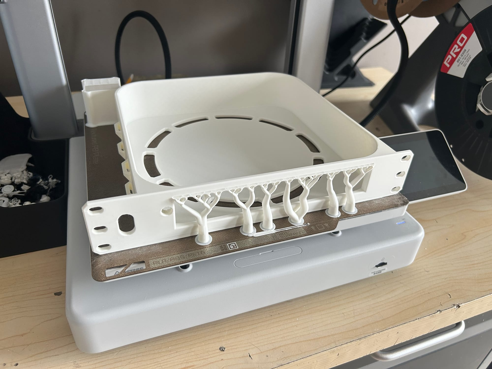 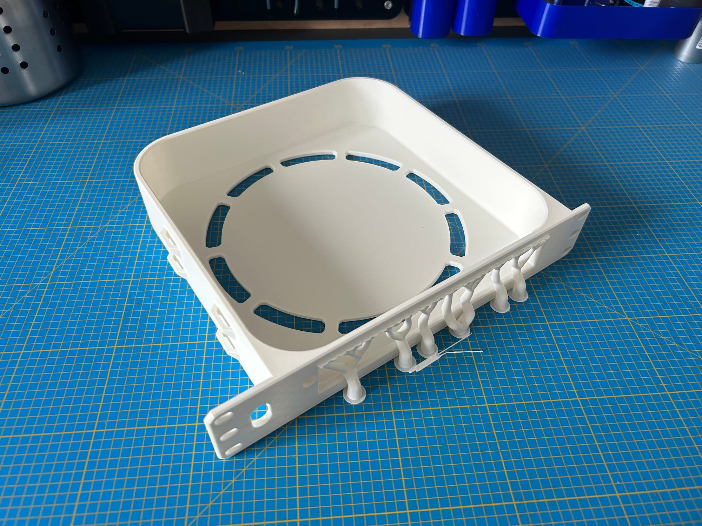

## The power button

The Mac mini's power button is on its rear face, so at the front once the machine is turned around. But it ends up recessed behind the plate, out of reach of a finger. A small blue printed part acts as a **relay**: it slides in a hole in the front plate and presses the real button. The blue dot visible on the front is that part.

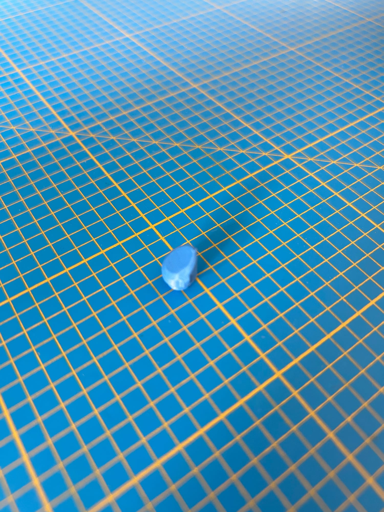 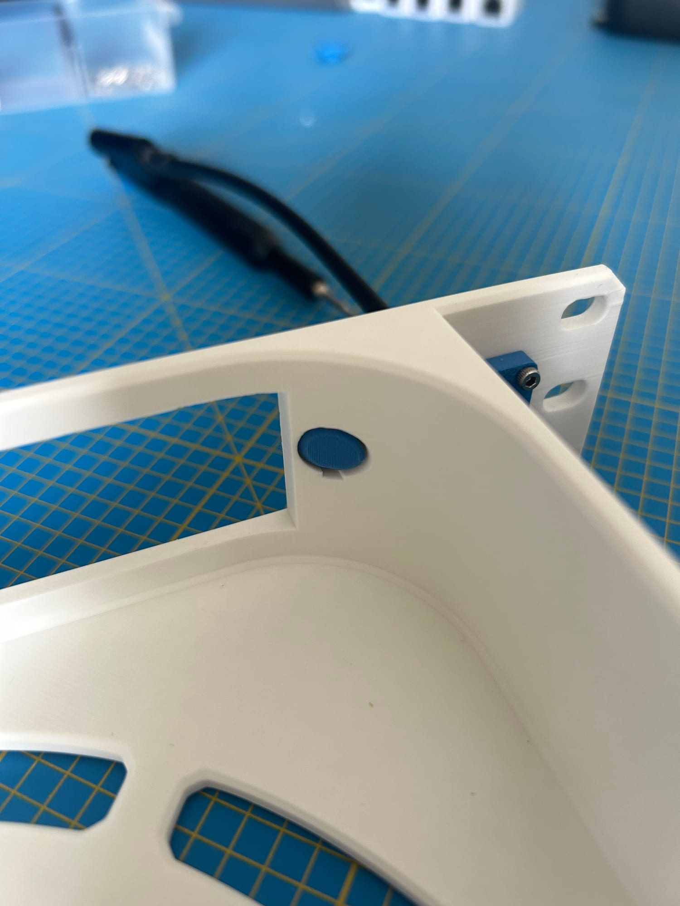

## The cable clamp

The power cable leaves through a slot in the front plate. So that a clumsy move never pulls on the Mac mini's socket, two blue clamp halves screw on either side of the slot and grip the cable.

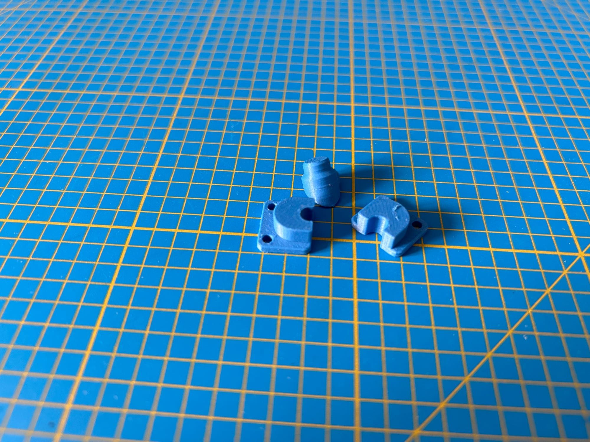

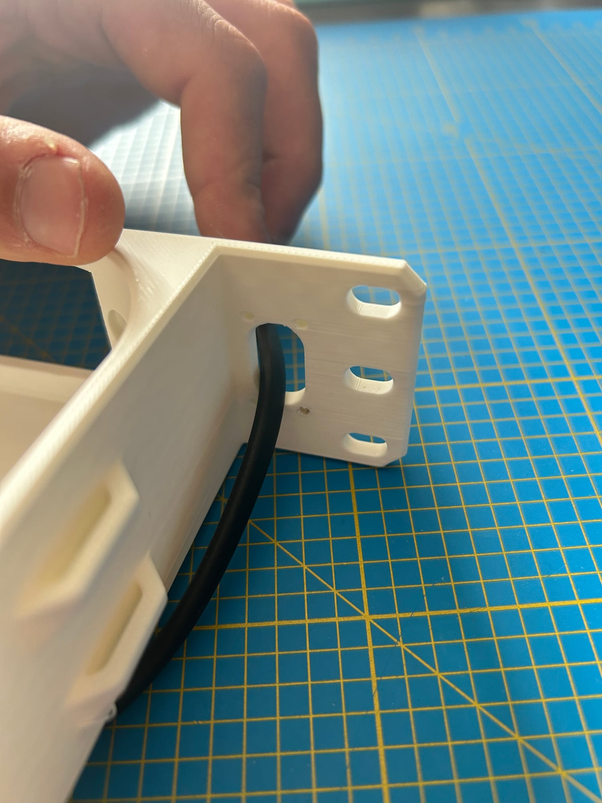 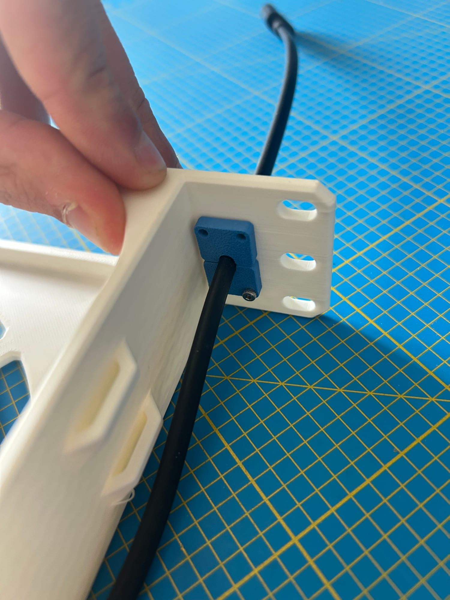 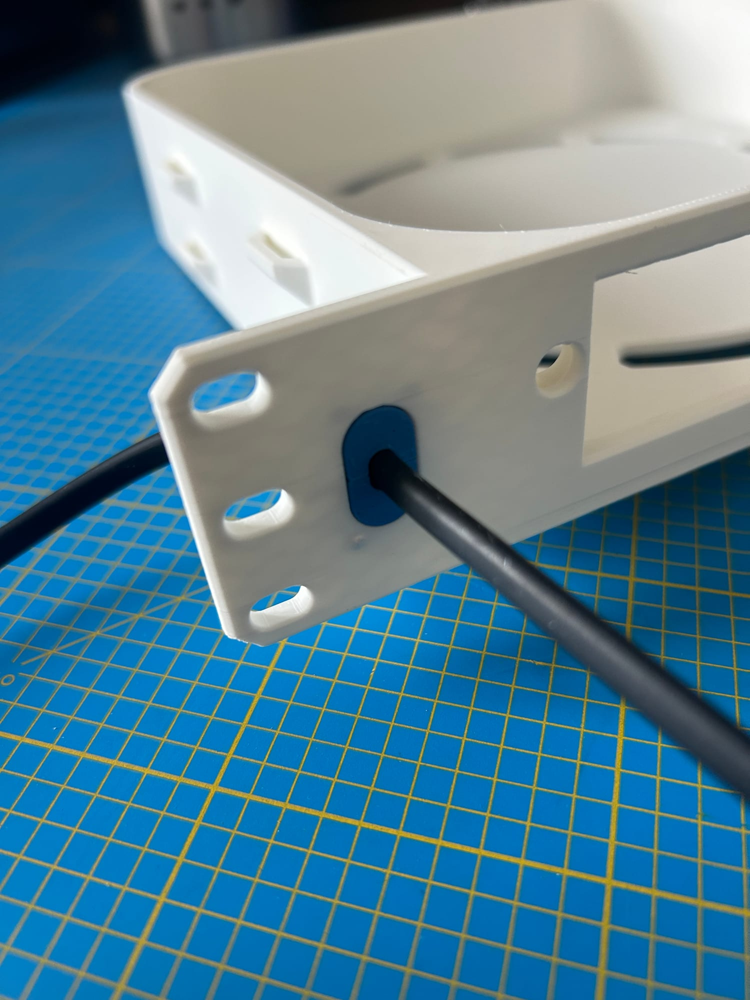

## Mounting

The Mac mini goes into the tray, cable plugged in, then the mount screws onto the rack rails with M5 screws, straight into the T-nuts of the uprights.

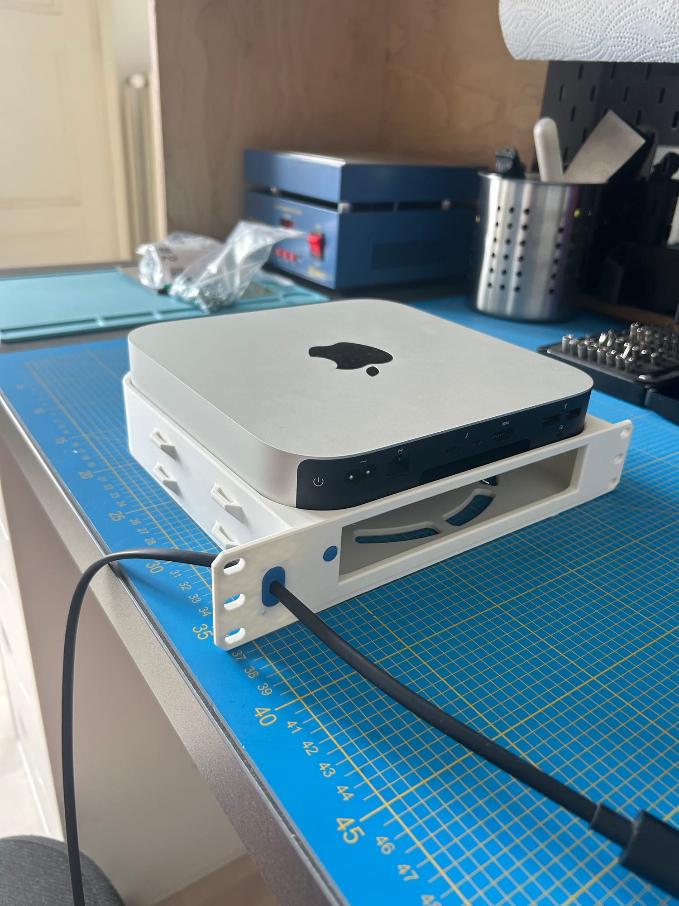 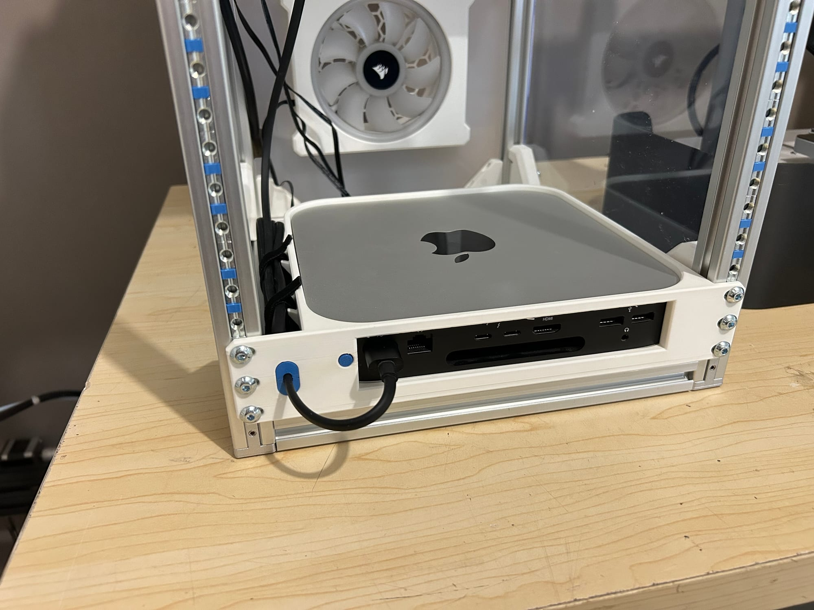

<!-- PHOTO TO ADD: close-up of the front with the Ethernet and HDMI cables plugged in. -->

## Same idea for the USB-C charger

A few days later, the same idea served for a six-port 140 W USB-C charger: a 1U front plate cut to the shape of its ports, and a tray that holds it. It sits right above the Mac mini.

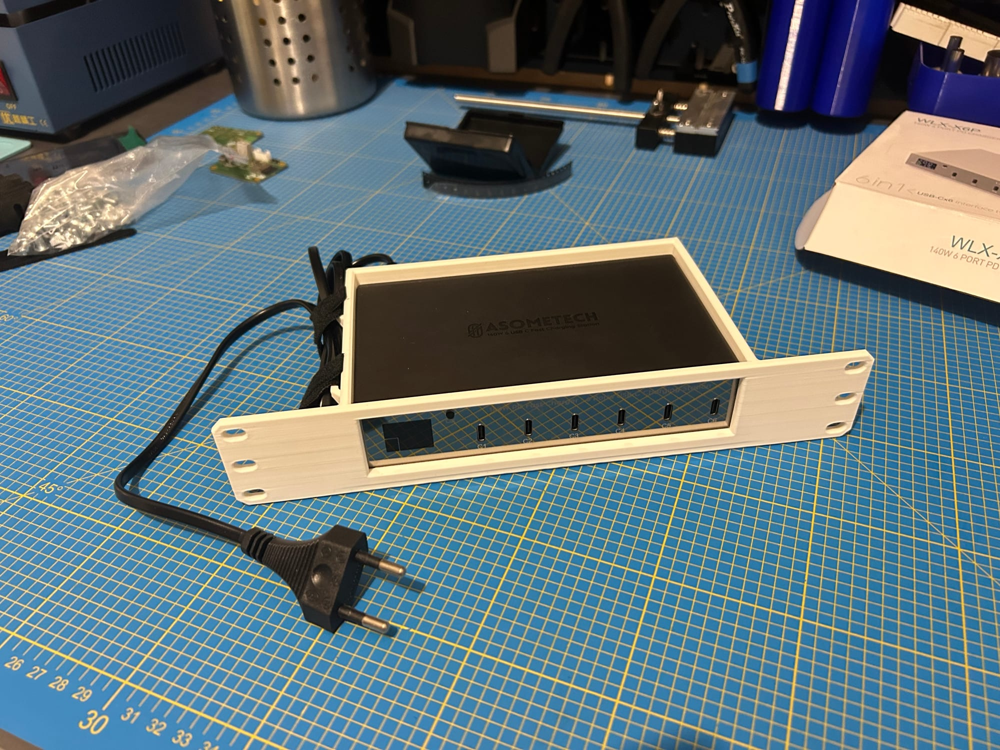 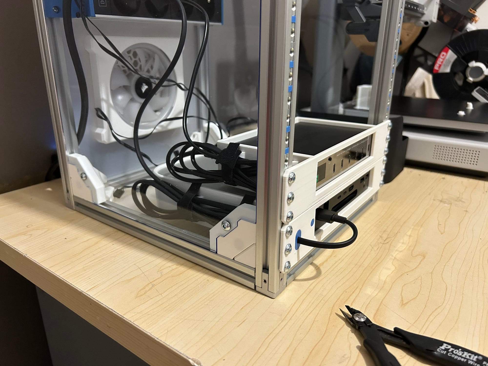

<!-- TO COMPLETE: add the charger mount model to the rack-10inch repository, then mention it here. -->

## What's next

The rack now has its first machine and what it takes to power the next ones. Next step: installing the home lab services on it.
